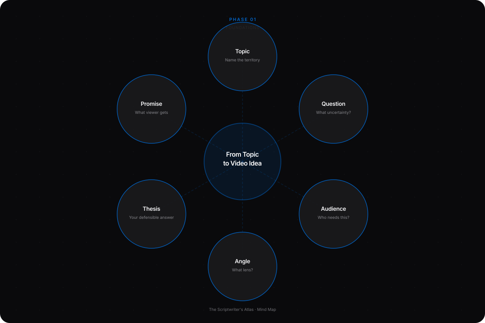
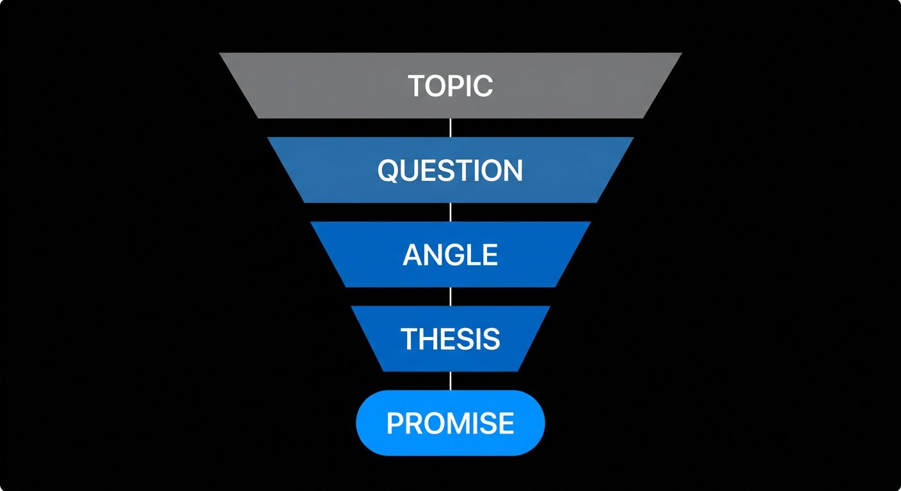
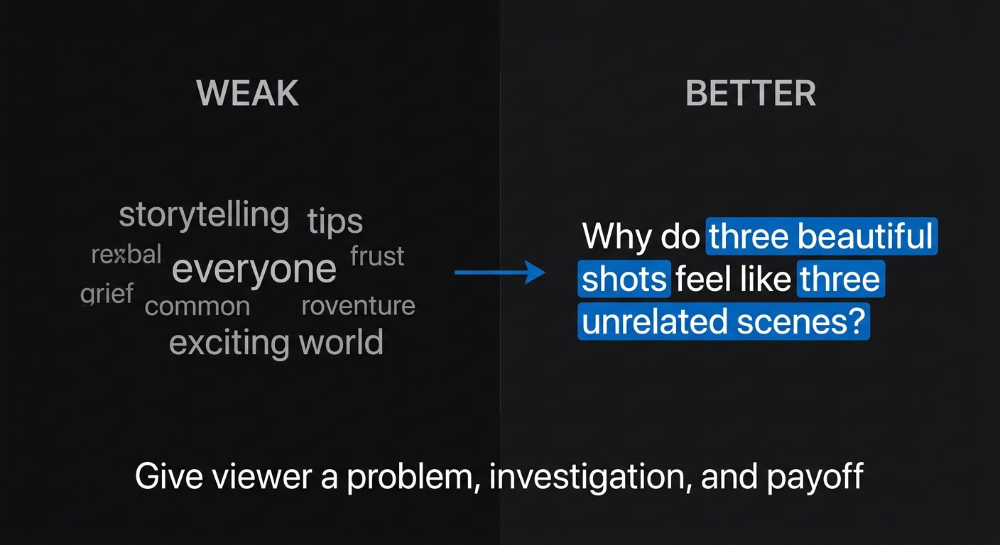
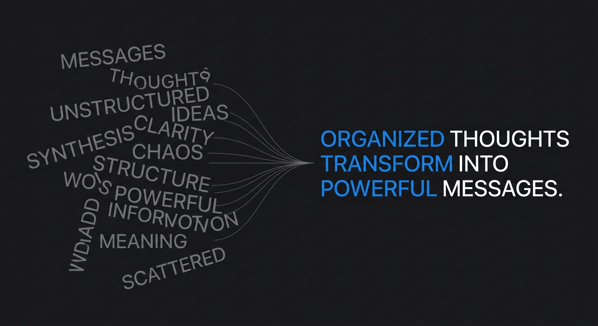
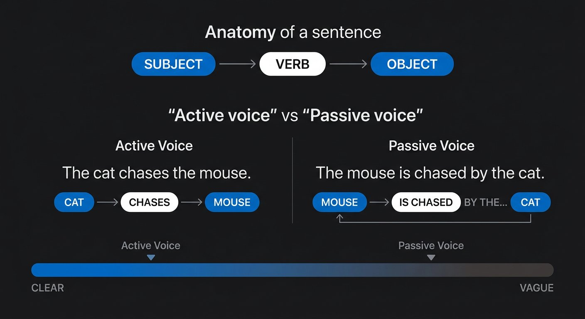

# Phase 1 — Foundations

## YOU ARE HERE
You may have a subject you care about, but not yet know how to turn it into a video a particular person would choose to watch. You do not need advanced English or a memorized format to begin.

## YOU ARE LEARNING
You will shape a topic into a viewer-facing idea, then express that idea in clear English. You will learn the difference between a topic, question, angle, thesis, and promise—and how a sentence carries a thought from you to a listener.

## BY THE END
You will have one specific video idea, one honest promise, and a short paragraph that a stranger can understand without you standing beside them to explain it.

---

# Lesson 1 — From a Broad Topic to a Video Idea a Viewer Can Understand

**Estimated voiceover:** 10–12 minutes · **Practice:** 25 minutes

## What You Will Learn

- Tell the difference between a topic, a question, an angle, a thesis, and a promise.
- Define one viewer by what they know and need—not only by age or job title.
- Choose an idea that can lead to a real answer, example, test, or story.
- Write a one-sentence promise that the finished video can actually fulfill.

## Core Idea

A topic names a territory. A video idea makes a specific promise about one useful question inside that territory—and has a credible way to answer it.

## Why This Matters

“Productivity,” “AI,” or “storytelling” is not yet a script. A broad topic makes it easy to collect information and hard to decide what belongs. A defined question gives the writer a direction; a defined viewer gives the information a reason to matter; evidence gives the promise a boundary.

## Deep Explanation

Use these five terms as five different decisions:

1. **Topic** — the general subject. Example: AI filmmaking.
2. **Question** — the uncertainty the video will address. Example: Why can a character look consistent across three shots while the scene still feels disconnected?
3. **Audience** — the person for whom that question matters. Example: a creator who can generate attractive clips but cannot make the action between them clear.
4. **Angle** — the particular lens you choose. Example: the problem may be the character’s changing intention, not the image generator.
5. **Thesis** — your answer or position, stated so evidence could support, narrow, or change it. Example: consistent appearance helps, but each shot also needs to change what the character knows or chooses.
6. **Promise** — what the viewer can expect to understand or do by the end. Example: watch one three-shot scene get rebuilt, then use four questions to plan your next scene.

The angle is not a clever title. It is a choice about what to investigate and what to leave out. The thesis is not a slogan. It is the answer you are willing to test. The promise is the viewer-facing contract. They should agree, but they are not interchangeable.

A useful idea often contains a question, a reason to care, a path to evidence, and a meaningful change. That change can be small: a confused viewer can now name the missing step; a creator can decide which shot to remove; a beginner can compare two options. The change does not need to be a dramatic life transformation.

### Professional Example — An Idea, Not a Topic

**Topic:** writing video openings.

**Weak idea:** “Everything you need to know about hooks.” It has no boundary. “Everything” is too large to prove in one video.

**More useful question:** “Why does this opening sound slow even though I speak quickly?”

**Angle:** the issue may be delayed clarity, not speaking speed.

**Thesis:** a viewer can tolerate a quiet opening when the scene carries a clear question; a fast opening can still feel slow when it delays the point.

**Promise:** compare two versions of one introduction and use a three-question test to revise your own.

The evidence is visible: two openings and the wording that changes. If the writer has no actual drafts, the script must call them demonstrations—not personal before-and-after results.

### Before / After

**WEAK**  
“Today, we’re going to explore the exciting world of storytelling and share some powerful tips.”

**BETTER**  
“Why do three beautiful shots sometimes feel like three unrelated scenes? We’ll compare two edits and find the missing change between them.”

**WHY**  
The second version gives a viewer a recognizable problem, an investigation, and an observable payoff. It does not promise that one technique will fix every story.

## Common Mistakes

- Treating a topic as if it were already a video idea.
- Writing for “everyone interested in this subject,” then defining nothing.
- Choosing an angle because it sounds surprising, without evidence to support it.
- Making the promise bigger than the footage, research, or time can support.
- Choosing a title first and forcing the research to defend it.
- Confusing a personal opinion with a tested conclusion.

## How to Apply It

1. Write the topic in two or three words.
2. List five real questions a viewer might ask about it.
3. Circle the question you can answer with material you can access.
4. Describe one viewer’s existing knowledge and immediate problem.
5. Write one angle and one thesis. Add what could change your mind.
6. Draft the promise. Name the proof or example the video will use.
7. Cross out any word like “everything,” “always,” or “guaranteed” unless the evidence truly supports it.

## Practice Exercise — Five Questions, One Defensible Idea

Choose a topic you can film, demonstrate, or research. Write five genuinely different questions about it. For each, write one possible source or piece of proof. Choose the question with the clearest audience need and the most honest evidence path. Complete this sentence:

> This video is for **[viewer]** who wants to know **[question]**. I will show **[proof]** so they can **[useful change]**. My current answer is **[thesis]**, but I would revise it if **[counterevidence]**.

Stop here and write your version before opening the model answer.

Model check — open only after you try

**Topic:** making short films with generated footage.  
**Viewer:** a beginner who has several attractive shots but cannot explain why they belong together.  
**Question:** what makes the action between the shots understandable?  
**Proof:** compare two versions of the same three-shot sequence.  
**Thesis:** visual consistency helps, but the sequence also needs a change in information or intention.  
**Possible counterevidence:** the first version may already read clearly to unfamiliar viewers.  
**Promise:** watch the comparison and leave with a four-question scene test.

Other answers can be stronger if their evidence path is real and their promise is narrower. Do not copy the subject if it is not yours; copy the quality of the decisions.

## Mini Checkpoint

1. What would you still need before “personal finance” became a scriptable idea?
2. How is a thesis different from a title?
3. If your test can only show what happened in one project, how should that limit the promise?
4. Which is a more useful first question: “Do you want to be successful?” or “What keeps this viewer from finishing the first draft?” Why?

Checkpoint reasoning — reveal after answering

1. A viewer-facing question, an angle, and an evidence path. 2. A title packages the promise; a thesis states the answer or position the video will support and qualify. 3. Scope the claim to that project and avoid universal conclusions. 4. The second can uncover a specific obstacle and lead to observable evidence; the first invites a nearly automatic yes.

## Assignment

Complete one idea card from the [workbook](../WORKBOOK.md). Bring it to Lesson 3. Your card passes if a new reader can name the viewer, question, promise, evidence, and one limitation without asking you to explain them verbally.

## Takeaway

**Do not start with “What can I say about this topic?” Start with “Which viewer has which question, and what honest evidence can I use to answer it?”**

### VOICEOVER SCRIPT

Let’s begin with a problem almost every new writer has. You have a topic. Maybe it is AI, money, editing, studying, or storytelling. You sit down to write—and suddenly there are fifty possible directions. You collect notes, watch more videos, and keep delaying the first sentence. That does not mean you lack discipline. It may mean the idea has not yet become specific enough to guide a script.

Here is the first important distinction: a topic is a territory. A video idea is a route through that territory. “Storytelling” is a topic. “Why do these three attractive shots feel like three unrelated scenes?” is a question. The question gives us a place to begin because it contains uncertainty. Something is not yet understood.

Now imagine a real viewer. Not “everyone who likes stories.” Picture a creator who has made several beautiful shots and still cannot tell what the character is doing. What does this person already know? They know how to generate or film an image. What do they need next? They need to understand the relationship between shots. That existing knowledge matters. If we start with a long definition of a camera shot, we may be teaching a person who already knows it.

The next decision is the angle. The topic is the territory; the angle is your chosen view of it. We could make a video about tools, prompt writing, color, sound, or story logic. One video cannot responsibly cover everything. So perhaps our angle is: visual consistency does not automatically create a story. Notice that we have not proven this yet. It is a direction for investigation.

A thesis is the answer we currently believe the evidence can support. Try this: “Consistent appearance helps, but the shots also need to change what the character knows or chooses.” That is more useful than “Story is important,” because we can test it. We can show a sequence, change one element, and ask whether the action reads more clearly. If the comparison does not support the claim, the writer must revise the thesis—not hide the failed test.

And then comes the promise. The promise is what the viewer can expect to understand or do. “Watch one three-shot scene get rebuilt, then use four questions to plan your next scene” is a promise with boundaries. It does not promise a perfect film, a viral result, or a universal method. The limit is not a weakness. The limit tells the audience what the evidence actually covers.

Let’s compare two openings. First: “Today, we’re exploring the exciting world of storytelling and sharing powerful tips.” What does the viewer know? They know the category—storytelling—but they do not know which problem we will solve or why this video is different. Now listen to the second: “Why do three beautiful shots sometimes feel like three unrelated scenes? We’ll compare two edits and find the missing change between them.” The second opening creates a question, names the method, and previews proof. It does not need a shouting voice. It needs a useful contract.

Pause for a second and write down a topic you care about. Now turn it into five questions. Do not write five versions of the same question. If your topic is productivity, your questions might involve choosing a task, remembering tasks, interruptions, or ending the workday. If your topic is investing, you might ask what a beginner needs to understand before comparing options. The goal is not to find the most dramatic question. It is to find the one you can answer honestly for a particular viewer.

Here is a simple selection test. Can you name the viewer? Can you state the uncertainty? Can you point to the evidence you will show? Can the viewer do or understand something different at the end? And what would make you change your mind? If you cannot answer these, the idea may need more research—or a smaller promise.

A common trap is choosing the title first. The title says, “The One Method That Always Works.” Then the writer searches for support. That reverses the task. The evidence should influence the claim. A more professional approach is to keep several possible angles open until you see what the sources, footage, or experiment can actually show.

Another trap is believing that a narrow idea is less valuable. It is often more valuable because it gives the viewer something they can recognize and test. “Everything about storytelling” is too big to remember. “The face matched, but the character’s choice disappeared” gives us one concrete problem to follow. Small does not mean shallow. A small question can reveal a deep principle.

Let’s use the workbook sentence together: “This video is for a viewer who wants to know this question. I will show this evidence so they can make this change. My current answer is this, but I would revise it if this counterevidence appears.” Every blank does a job. The viewer field protects you from writing for no one. The evidence field protects you from empty promises. The counterevidence field protects you from becoming attached to a conclusion before you test it.

Now your turn. Write five questions from one topic. Choose one. State the audience, the angle, the thesis, and the promise. Then ask yourself: if I had to shoot the first proof tomorrow, what would I show? If the answer is only “some cinematic B-roll,” keep thinking. A proof shot must help us see, compare, or understand something—not simply fill the screen.

Before we close, try a quick prediction. Imagine the first test shows that the face matches, but both viewers still think the character is walking away. Does that prove the idea was bad? No. It tells you which part of the original thesis needs attention. Perhaps the audience understood the movement but not the reason. You can change the angle from visual continuity to motivation, or add a clearer clue. The key is to let the result update the script.

Now compare two promises: “I’ll show you the best AI filmmaking workflow,” and “I’ll test whether one clue makes this three-shot scene easier to follow.” The first sounds bigger, but it needs a much wider comparison and a stronger basis for “best.” The second is smaller, observable, and still useful to the right viewer. A narrow promise is not a small ambition. It is a promise you can keep.

One more decision: what if you do not have the footage yet? Then your script is a plan, not a report. Write “I’m going to test…” or create a clearly labeled demonstration. The tense of your sentence is part of its truth. This is one of the simplest ways to keep a polished script from becoming a polished lie.

The key idea to carry forward is this: a script begins before the first line. It begins when the writer chooses a question worth answering and accepts the limits of the evidence. Once you can do that, you are no longer staring at a topic. You are looking at a video.

---

# Lesson 2 — From Thought to Clear Sentence

**Estimated voiceover:** 8–10 minutes · **Practice:** 20 minutes · **Audio:** [listen to Lesson 2](../audio/phase-01-lesson-02.m3u)

## What You Will Learn

- Move from a private thought to a sentence another person can understand.
- Use concrete subjects and strong verbs without making every sentence sound identical.
- Build a paragraph around one change in knowledge.
- Use everyday English accurately, including active/passive voice and useful punctuation.
- Read for meaning and natural speech—not for fancy vocabulary.

## Core Idea

A sentence is a small handoff: you put a thought into words so another person can recover it without guessing.

## Why This Matters

A polished phrase cannot rescue an unclear thought. In a video, listeners usually cannot rewind every sentence. They need to know who did what, how we know, and why the next thought follows.

## Deep Explanation

Start with **who or what + did what + what changed**. “There was an improvement in clarity” hides the actor and result. “I moved the example before the definition” names the action. If the result is known, add it: “I moved the example before the definition so a new viewer could see the problem first.” If you did not test the result, say what the change is meant to do—not what it proved.

A useful paragraph often has four moves: **point → evidence → meaning → bridge**. For example:

> The first draft was too broad. It explained three tools before showing the problem. A new viewer had no reason to remember any of them. So I rebuilt the opening around one failed scene.

The paragraph progresses. It does not repeat “the draft was too broad” four times.

Use concrete detail when it clarifies the idea. “The workflow was inefficient” gives a judgment. “I edited the thumbnail before I knew the title” gives a cause a writer can change. Specificity is not invented precision: if you do not know the number or time, do not make one up.

English has many correct sentence shapes. A short sentence can land a result. A longer sentence can carry context and cause. A fragment can create a deliberate spoken pause—“No sound. Just the room.”—when the listener already understands the scene. Fragments are not a reason to leave every thought unfinished. Listen for rhythm and meaning together.

Grammar is a tool for accuracy, not a school exam. Keep the tense stable when events share a timeline. Make pronouns clear. Use the article or preposition that makes the sentence natural. Prefer common collocations such as “make a decision,” “run a test,” and “meet a deadline” to a literal translation or a fancier but unnatural phrase. Use active voice when the actor matters; use passive voice when the event matters more than the actor. Neither is automatically better.

## Professional Example

**Idea in the writer’s head:** “The opening needs to feel less slow.”

**Sentence with a vague judgment:** “The introduction was improved to make it more engaging.”

**Clear action:** “I moved the first example ahead of the background.”

**Clear action plus purpose:** “I moved the first example ahead of the background so viewers could see the problem before I named it.”

**Evidence-aware version:** “In this draft, the example now appears first. I still need a read-through to learn whether a new viewer understands it.”

The last version is less triumphant—and more professional—because it separates a change from evidence of its effect.

## Before / After

**WEAK**  
“The utilization of innovative methods resulted in a significant improvement to the overall effectiveness of the process.”

**BETTER**  
“I tested the new order. The example made the problem easier to see, but I have not tested it with viewers yet.”

**WHY**  
The revision names an actor, action, and observable limit. “Better” is not simply shorter; it is more precise about what is known.

## Common Mistakes

- Using abstract nouns where a person and action would be clearer.
- Adding adjectives to cover for missing evidence.
- Making every sentence short, then producing a choppy voice.
- Replacing repeated useful terms with unnatural synonyms.
- Hiding who acted behind passive phrasing when responsibility matters.
- Reading punctuation as decoration instead of thought, relation, and breath.

## How to Apply It

1. Underline the main verb in each sentence.
2. Circle the person or thing doing the action.
3. Mark any claim that needs proof or qualification.
4. Find the sentence that changes the reader’s understanding; cut or combine repeated sentences.
5. Read the paragraph aloud. Rewrite any phrase you would not say to one person.

## Practice Exercise — Observation to Five Sentences

Observe a real task, edit, or decision for five minutes. Write exactly five sentences: **action, obstacle, choice, outcome, remaining uncertainty**. Do not use “amazing,” “very,” or numbers you did not record. Read it aloud once. Mark where a stranger might ask, “Why did that happen?”

Try first. Then open the model.

Model response — open after writing

> I exported the scene. The character’s bag changed hands between two shots. I moved the middle shot instead of hiding the jump with a faster cut. The choice became easier to follow, but the bag still jumps. I need a pickup shot.

Each sentence moves the event forward; the last one preserves uncertainty instead of pretending the fix is complete.

## Mini Checkpoint

1. What is the hidden problem in “An analysis of the video was conducted”?
2. Why is “I used four shots instead of eleven” not automatically a stronger sentence?
3. When could passive voice be the better choice?
4. What does a paragraph’s “bridge” do?

Checkpoint reasoning — reveal after answering

1. It hides who analyzed the video; that may matter to the point. 2. The count must be real, relevant, and understood; precision without evidence is false confidence. 3. When the event or procedure matters more than the actor, or the actor is unknown and naming one would be misleading. 4. It creates a real reason for the next idea, such as consequence, contrast, or a question—not merely “moving on.”

## Assignment

Write a 100-word explanation of a real decision you made. Make one pass for grammar and meaning, then a second pass for spoken naturalness. Keep the factual meaning constant. Save both versions; the difference is a record of your developing voice.

## Takeaway

**Clear writing is not complicated writing. Give the listener an action, a reason, and enough context to understand what changed.**

### VOICEOVER SCRIPT

Before we talk about hooks or story structure, let’s make one sentence carry a thought. Think about the last time someone misunderstood an instruction. The idea may have been clear in your head, but the listener did not have access to the picture you were imagining. Writing is the bridge between those two minds.

Here’s a useful starting pattern: who or what, did what, and what changed. “There was an improvement in clarity” gives us a result-shaped noun but no action. Who improved it? What did they change? “I moved the example before the definition” gives us a person and an action. It is already easier to picture. If we know the reason, we can add it: “I moved the example before the definition so a new viewer could see the problem first.”

Notice the difference between naming an intention and claiming an outcome. “I moved the example so the problem would be easier to see” describes my purpose. “The example made the problem easier to see” describes an effect. That second statement needs evidence—a read-through, a viewer test, or at least a clearly identified observation. Small wording choices change how much certainty you claim.

Let’s build a paragraph. First, the point: “The first draft was too broad.” Next, evidence: “It explained three tools before showing the problem.” Then meaning: “A new viewer had no reason to remember any of them.” Finally, the bridge: “So I rebuilt the opening around one failed scene.” Point, evidence, meaning, bridge. This is not a fixed paragraph length. It is a way to make sure each sentence earns the next one.

Now imagine the paragraph instead says: “The draft was too broad. It was not focused enough. The opening needed greater clarity. The video needed a more specific idea.” Four sentences, but one movement repeated four times. The question is not “How many lines should a paragraph have?” The question is “What changes from the first line to the last?” If nothing changes, combine or cut.

Concrete language helps us see the action. “My workflow was inefficient” is a judgment. “I edited the thumbnail before I knew the title” gives us a cause that can be changed. A concrete example should not replace every general idea; it should give the viewer a place to test the idea. And specificity must be honest. If you did not time the process, do not invent a number because numbers sound authoritative.

English sentence variety matters for the ear. Listen to this sequence: “The export failed. I opened the file. I checked the settings. I tried again. It failed.” It is clear, but it can sound like a list of taps. We can compress the routine and hold on the meaningful moment: “The export failed twice. On the third attempt, I noticed the audio was missing from the timeline.” One sentence carries the pattern; the next gives the turn. Short sentences are useful. So are longer sentences. The goal is not to make every line short; it is to let the syntax follow the thought.

Punctuation also carries thought. A period can make two results feel separate: “The image matched. The intention did not.” A comma can connect information, but it cannot repair a broken relationship on its own. A colon can introduce an explanation. An em dash can create a genuine interruption. In spoken copy, a semicolon often asks the speaker to do more work than a clean period would. Let the punctuation serve meaning and breath.

You do not need to use the most advanced word available. “Use” is often clearer than “utilize.” “Make a decision” is natural English; translating a phrase word by word may create a sentence a native speaker would never say. When you are learning, check whether the phrase is a common combination, then read it aloud. Your goal is accuracy first, naturalness second—not fancy language.

Active and passive voice are choices. “I deleted the scene” tells us who made the decision. “The scene was deleted before the team arrived” foregrounds timing. If responsibility matters, passive voice can hide it. If the actor is unknown and the event matters, passive voice may be exactly right. Ask what the sentence needs the listener to notice.

Let’s practice a short real observation. Write one sentence for the action. One for the obstacle. One for the choice. One for the result. One for what remains unresolved. This structure forces you to distinguish what happened from what you hope happened. Read it aloud. If you stumble, do not just repeat the same line louder. Find the phrase your mouth rejected and write the thought in a more natural order.

The most common beginner mistake is decorating before clarifying. A sentence can sound elegant and still make us ask, “Who did what?” First make the meaning recoverable. Then adjust rhythm, emphasis, and tone. Do not confuse simplicity with childishness. A precise sentence can carry a complex thought if the relationships are clear.

Your assignment is to write one hundred words about a real decision. First edit grammar without changing the meaning. Then make it sound like you are explaining the decision to one thoughtful person. Compare the two versions. If the second is full of slang you do not use, you have not found your voice—you have borrowed a costume. If the second is clearer and easier to say, you are making progress.

Here is one last way to hear the difference. Try reading a sentence that contains two separate decisions: “I moved the example before the definition because the viewer needed context, and I removed the sponsor mention because it interrupted the proof, although the sponsor segment still has to appear later.” The thought is accurate, but it asks the listener to hold too much at once. You might split it: “I moved the example before the definition because the viewer needed context. I moved the sponsor mention, too. It interrupted the proof, but it still needs a clear place later.” The revision creates small steps in the reasoning, not just shorter lines.

When you read, do not mark every pause with punctuation. Listen for the thought itself. Where does the decision change? Where does one reason end and another begin? Let those boundaries shape the sentence. You can use a fragment after the listener knows the scene—“No sound. Just the room.”—but if a fragment hides who acted or what happened, complete the thought.

Carry this with you: the best sentence is not the one that impresses another writer. It is the one that helps your viewer understand the right thing at the right moment.

---

## MASTERED

- You can name the viewer, question, angle, thesis, promise, and evidence path for one idea.
- You can write a clear paragraph about a real action without leaning on inflated adjectives.
- You can point to what you know, what you infer, and what remains uncertain.

## NEXT

The next phase moves from a clear idea to a writer’s decision system: audience needs, proof, order, stakes, and what to remove.
