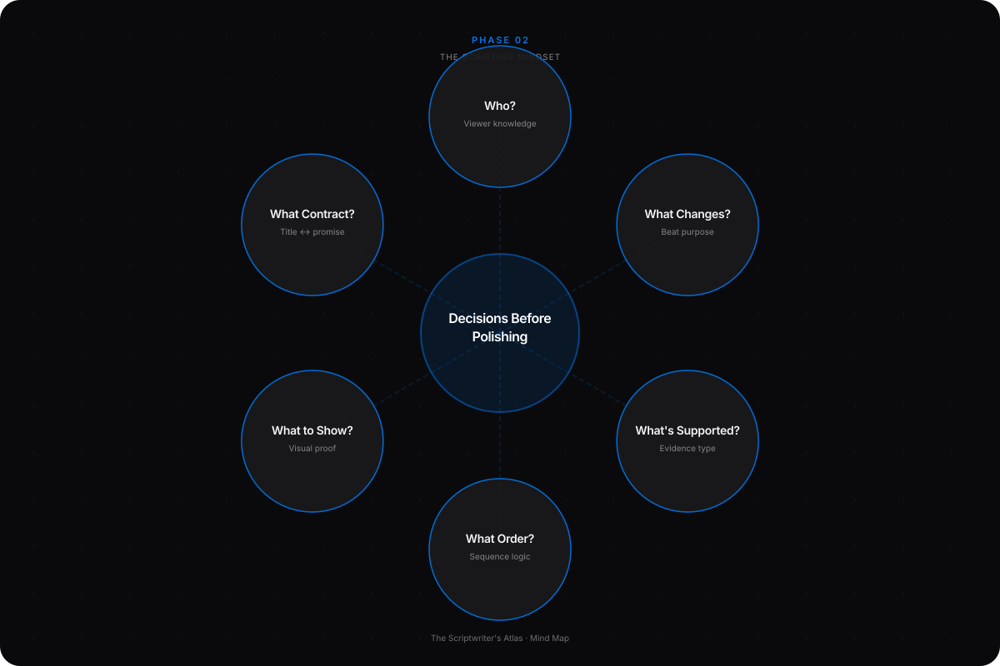
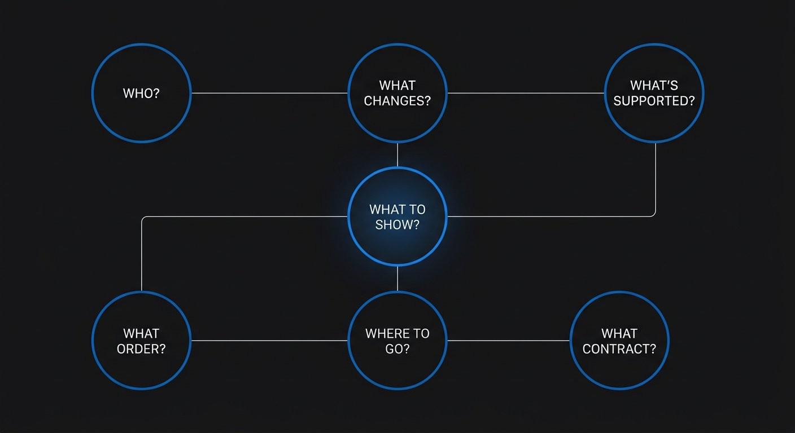
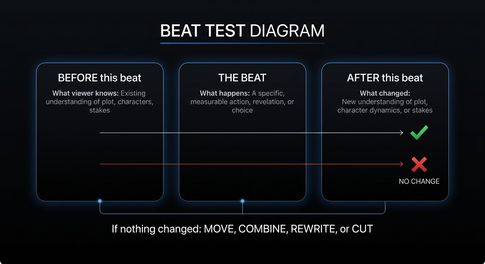

# Phase 2 — The Scripting Mindset

## YOU ARE HERE
You can state a viewer-facing idea and write it clearly. The next challenge is not finding more sentences. It is deciding which sentences deserve to exist, what order earns understanding, and what the evidence permits you to say.

## YOU ARE LEARNING
You will build a decision log around audience knowledge, proof, change, order, production, and publishing context. You will learn to cut a beautiful but unhelpful line without treating the cut as a personal failure.

## BY THE END
You will be able to explain the job of every beat in a short sequence—and remove or move material when it does not help the viewer understand, feel, decide, or act.

---

# Lesson 3 — Make the Writer’s Decisions Before You Polish the Lines

**Estimated voiceover:** 11–13 minutes · **Practice:** 30 minutes · **Audio:** [listen to Lesson 3](../audio/phase-02-lesson-03.m3u)

## What You Will Learn

- Think of scripting as a chain of decisions, not a fill-in-the-blanks format.
- Decide what the viewer needs to know now and what can wait.
- Test a beat by identifying what changes for the viewer.
- Connect a claim to proof and name what the proof cannot establish.
- Align the title, thumbnail, opening, body, ending, and production plan.

## Core Idea

A professional script is a sequence of justified choices. Every beat should earn its position by changing what the viewer knows, expects, feels, or can do.

## Why This Matters

“Intro, three points, conclusion” describes containers. It does not tell you whether the video’s idea is clear, whether a claim is supported, whether the order teaches well, or whether the visuals prove anything. A useful format can organize a script; it cannot make the decisions for you.

## Deep Explanation

Think through a draft with six questions. Together they carry the source Atlas’s twelve writing decisions without making you memorize twelve rules:

1. **Who is here, and what do they already know?** A beginner may need the problem demonstrated before a term is introduced. An experienced viewer may need the exception, not the definition.
2. **What is the viewer’s question and what change will answer it?** A beat can change information, a situation, a decision, or an emotion. If none changes, inspect whether the beat is redundant.
3. **What can I actually support?** Separate a firsthand observation, a test result, a documented external fact, and an opinion. They are different kinds of knowledge. A small test can show what happened in that setup; it cannot automatically establish a general rule.
4. **What order makes the answer easiest to understand?** A viewer gives attention in moments. Offer useful context before it becomes necessary, but do not front-load every fact you found. Move proof near the claim it supports.
5. **What should the audience see and hear?** Let narration explain meaning or cause; let a visual carry visible proof. Do not repeat the same information through every channel unless repetition is needed for accessibility or emphasis.
6. **What contract does the package make?** The title and thumbnail create expectations. The opening should clarify the promise; the body should begin paying it; the ending should answer it. Revisit the hook after the final result is known.

The beat test is simple: “Before this beat, the viewer knows ___. After it, they know ___. The next beat is necessary because ___.” If the blank stays the same, move, combine, rewrite, or cut the beat. This is a diagnostic, not a law. A deliberate pause may change how a viewer feels without adding a fact. A documentary may need a quiet moment to let evidence register. The writer must still know what that moment is doing.

Writing order does not have to be publication order. You may outline, draft the ending, and return to the opening. A messy pass can reveal what you actually mean. A structural pass gives each beat a purpose. A truth pass verifies claims and examples. A voice pass reads the draft aloud. A production pass marks what is missing. The workflow can loop when research changes the thesis.

### Professional Example — A Beat That Changes the Plan

A creator wants one coherent three-shot scene. First, the character’s appearance changes between generations. A reference image improves the visual match. That is progress, but the scene still does not explain why the character stopped. The second obstacle is deeper than the first. The writer changes the shot sequence so a letter gives the character new information, and the final action becomes a choice.

The sequence has a useful change in each beat: visible mismatch → technical correction → story problem → revised action → bounded result. The important lesson is not “always add a letter.” It is to notice when the fix solves a surface problem but leaves the viewer’s question unanswered.

### Before / After

**WEAK**  
“I tried several tools. The footage looked better. Then I edited the scene and learned a lot.”

**BETTER**  
“The reference image kept the coat consistent. The character still had no clear reason to stop. So I changed the middle shot to reveal the letter before the final choice.”

**WHY**  
The improved version distinguishes technical progress from story progress. It links the beats with a real “but” and “so,” and gives the editor something observable to show. Treat this as a model scenario unless those events are true in your own project.

## Common Mistakes

- Keeping a line because it sounds good rather than because it serves the viewer.
- Treating every idea in research notes as a required section.
- Using “but” or “therefore” as decorative transitions when no true contrast or cause exists.
- Making a claim stronger than the evidence, then adding a vague disclaimer at the end.
- Writing narration that describes the exact picture without adding cause, meaning, or access.
- Treating a retention graph as proof that a particular sentence caused a viewer to leave.
- Polishing grammar before discovering that the paragraph belongs in a different video.

## How to Apply It

For each outline beat, fill in:

- **Viewer before:** what do they know, expect, or misunderstand?
- **Beat job:** what information, decision, feeling, or action changes?
- **Evidence:** what source, shot, example, or test supports it?
- **Viewer after:** what is now clearer?
- **Next:** why is the next beat necessary?
- **Cut test:** if removed, what question, evidence, or change disappears?

Then check the whole contract: title/thumbnail → opening → first proof → progression → payoff → optional CTA. Mark [VERIFY] or [SHOOT] instead of smoothing over a gap.

## Practice Exercise — The Change Test

Use the weak six-line sequence below. Do not rewrite it yet. For each sentence, write (a) what the viewer knows before, (b) what changes after, and (c) whether the sentence should stay, move, combine, or go.

1. “I wanted to make a better video.”
2. “I opened three editing tools.”
3. “The first version looked more cinematic.”
4. “The story still did not make sense.”
5. “I changed the order of the shots.”
6. “Now I understood more about filmmaking.”

After your diagnosis, rewrite the sequence in four beats. Use only information the example actually supports. Do not claim a viewer test, number, or result that is not provided.

One defensible diagnosis — open after you attempt it

Line 1 is too broad to change the viewer’s understanding; either specify the desired result or cut it. Line 2 is a process log unless the choice among tools matters. Line 3 is a judgment without a visible criterion; show what “cinematic” means or remove it. Line 4 is the most promising turn but needs a concrete explanation. Line 5 contains a possible decision but not its reason. Line 6 is a vague summary and repeats no measurable change. A repair could be: “I changed the shot order to make the character’s direction easier to follow. The images looked polished, but the reason for the stop was still missing. I added a clue before the final shot. The sequence now has a visible cause for the choice.” This remains a model, not a claim about a real test.

## Mini Checkpoint

1. What does the “before/after” test reveal that a paragraph-by-paragraph word count cannot?
2. A small viewer test suggests two people understood the scene. What can you say—and what should you avoid saying?
3. When is narration repeating a visual useful rather than wasteful?
4. Why revise a hook after drafting the ending?

Checkpoint reasoning — reveal after answering

1. It reveals whether meaning or state changes; word count cannot show that. 2. You can report that those two people understood it in that test, with context. Do not call it proof that the method works for all viewers or caused audience retention. 3. When the image alone may be ambiguous, accessibility requires a verbal description, or deliberate emphasis is needed. Otherwise let the image do its job. 4. The final evidence may narrow or change what the video can honestly promise.

## Assignment — One Minute, Six Decisions

Write a 60–90-second script outline about a real choice, test, or explanation. Include five to seven beats and a decision log for each. At least one line must identify what the evidence does **not** prove. Remove one line you like and record why. Use the [revision and decision log](../WORKBOOK.md#8-ten-pass-revision-checklist).

## Takeaway

**Do not ask only, “What comes next?” Ask, “What changes here, what supports it, and why does the viewer need it now?”**

### VOICEOVER SCRIPT

Let’s shift from the page to the writer’s mind. Beginners often believe scriptwriting means filling a sequence of boxes: opening, three points, conclusion. That can be a helpful outline shape, but it cannot tell you which three points belong, whether the proof arrives in time, or whether the ending answers the question. A structure is a container. Your decisions put the learning inside it.

Imagine we are making a three-shot scene. The character’s face changes between shots. We create a reference image and get a much better visual match. Is the script finished? Not necessarily. The audience may still be asking, “Why did this person stop?” We solved one problem, but the deeper question remains. A writer who understands decisions does not say, “Great, add one more tool tip.” They ask what the viewer still cannot understand.

Here is a useful way to inspect every beat. Before this moment, what does the viewer know? After it, what changes? The change might be information: now we know there is a letter. It might be a decision: the character chooses to stay. It might be emotional: a quiet image makes us reconsider a confident claim. It might be practical: the viewer can now apply a test. If nothing changes, the beat may repeat, arrive too early, or have no clear purpose.

This does not mean every line must introduce a new fact. A pause can matter. A second look can matter. A simple sentence can help a listener absorb a difficult idea. But the writer should be able to explain the function. “This shot gives the viewer time to compare the two versions” is a reason. “I wanted it to feel cinematic” may be an intention, but we still need to ask what the viewer can see or understand.

Now think about proof. Writers often treat every sentence as if it came from the same source. It did not. “I noticed the jacket changed” is an observation. “The tool caused the change” is an inference. “This tool always changes jackets” is a broad claim. “I prefer the second version” is an opinion. All four may belong in a video, but they need to be identified honestly. A good writer knows which kind of sentence they are saying.

Let’s practice with a title and thumbnail. Together, they make a promise before the first spoken line. The opening does not need to repeat them word for word. It needs to clarify the contract and start paying it. If a thumbnail shows a broken scene and the title promises a fix, the first scene should help us see the break. If the video later discovers the problem is not what the writer expected, revise the hook. Do not force the evidence to preserve a more exciting premise.

A crucial part of professional writing is choosing what not to include. Your research notes may contain a fascinating fact that does not answer the video’s question. You can save it in a cut bank. Your favorite paragraph may be beautifully written but arrive before the audience understands why it matters. You can move it. Cutting a line is not saying the line is bad. You are asking whether this video needs it at this time.

Here is the removal test: if this line disappears, does the viewer lose necessary context, proof, an important objection, a decision, or the payoff? If yes, keep it or move it to a better place. If no, cut it or save it for a different script. “But I worked hard on it” is not a viewer-facing reason. We all feel that attachment. The skill is noticing it.

Now, a word about order. Often the writer knows the answer before the viewer does. If we explain every detail at the start, we may create a wall of information. If we withhold basic context, the viewer may misread the evidence. The question is not “Should I start with context or story?” The question is “What does this viewer need to understand this moment accurately?” In a sensitive or technical subject, context may need to arrive early. In a visual demonstration, the image may create the question first. The answer depends on the material.

A common transition tool is “but” and “therefore.” It helps reveal whether events connect. “The reference image fixed the coat, but the story still failed. So I changed the shot order.” That connection is real if the technical fix created a new realization or the remaining problem led to the next action. If you mechanically put “but” in every paragraph, you manufacture conflict. Use the relationship that actually happened: because, although, meanwhile, as a result, or a clean stop.

Let’s look at the weak sequence in the exercise. “I opened three editing tools” may simply report an action. “The first version looked more cinematic” may be an unsupported judgment. “The story still did not make sense” could be the important turn, but it needs an example. When we repair the sequence, we do not add stronger adjectives. We clarify the decision and what changed.

Try keeping a decision log. For every meaningful change, write what you changed, why, what evidence supports the change, what trade-off it creates, and what you will inspect later. “Moved the failed cut to the opening” might make the problem visible earlier, but it could also reduce context. The log helps you notice both. This is how you learn from revision rather than merely accumulate versions.

Your assignment asks you to build a short sequence and cut one line you like. That is uncomfortable on purpose. Then ask: did the cut make the idea harder to understand? Did it remove evidence? Or did it make the central question arrive sooner? You are not trying to produce the shortest possible script. You are trying to produce the clearest useful progression.

Let’s imagine a second review. A viewer says, “I thought this video would teach me how to choose an editing tool, but it became a story about one character.” That feedback does not automatically mean the story is wrong. It tells you the title and opening created a different contract from the body. You have two honest repairs: change the package to match the story, or change the body to answer the tool-selection question. Adding a quick list at the end may not be enough; the viewer has been following the wrong question for several minutes.

Now consider a beautiful sentence that contains no proof. It may still earn a place as an emotional pause or a transition, but ask what it contributes. Does it deepen the mood after a choice? Does it help the audience remember a distinction? Or does it repeat an idea because you like the sound? If it stays, write its job in the margin. That way, the sentence has to answer to the viewer’s experience rather than to your pride.

The principle to carry into the next phase is simple: the viewer experiences a sequence of changes, not your outline labels. Make each beat earn its place, and let the evidence—not your attachment to the draft—decide how strongly you can state the answer.

---

## MASTERED

- You can show what changes before and after every beat.
- You can distinguish proof, observation, inference, and opinion.
- You can remove or move a line and explain the viewer-facing reason.

## NEXT

Phase 3 turns those decisions into movement: story logic, cause and effect, structure, transitions, and payoff.
