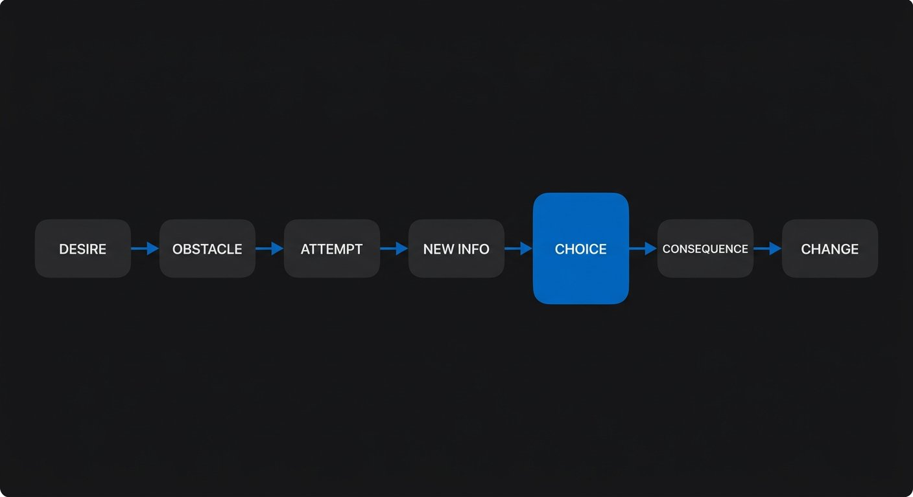
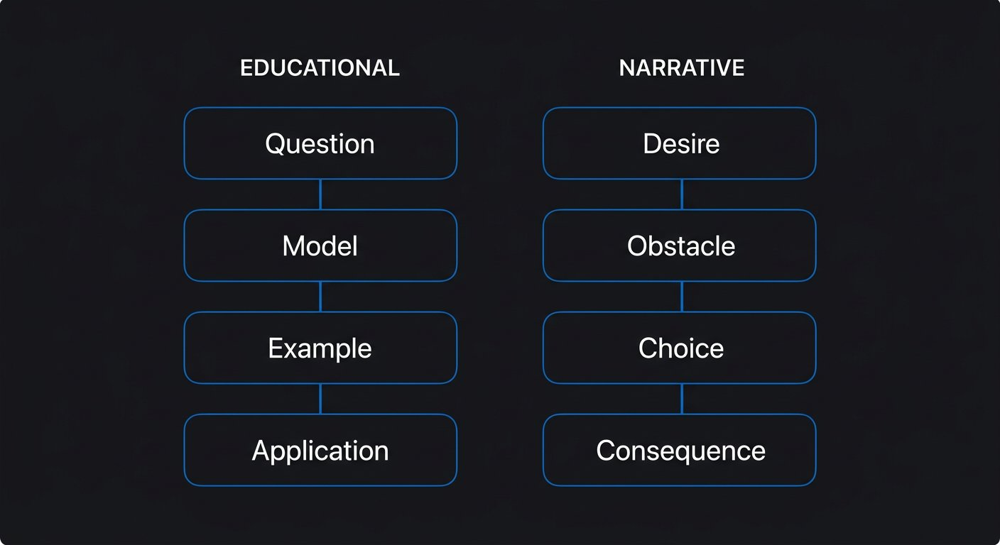

# Phase 3 — Story and Structure

## YOU ARE HERE
You can identify the question, viewer, promise, and job of a beat. Now you need to arrange those beats so the video moves rather than becoming a list of unrelated facts.

## YOU ARE LEARNING
You will learn how desire, resistance, new information, choice, and consequence create narrative movement. Then you will choose a structure that fits the material—including educational structures that are not dramatic stories.

## BY THE END
You will be able to map a real change, connect beats with honest cause-and-effect, select a fitting structure, and explain what the audience learns at each turn.

---

# Lesson 4 — Build Movement from Cause, Choice, and Consequence

**Estimated voiceover:** 12–15 minutes · **Practice:** 35 minutes · **Audio:** [listen to Lesson 4](../audio/phase-03-lesson-04.m3u)

## What You Will Learn

- Distinguish a story from a chronological list of events.
- Map a story through a want, obstacle, attempt, new information, choice, and consequence.
- Create tension from a real uncertain outcome and meaningful cost.
- Use “but / therefore” logic only when the relationship is true.
- Design a setup and payoff that give the audience a fair answer.

## Core Idea

A story makes change legible: someone or something wants a result, meets resistance, makes a choice, and lives with a consequence.

## Why This Matters

Events in order can tell us what happened. A story helps us understand why one event changed the next. This matters in documentaries, experiments, tutorials, and personal essays—not because every video needs a dramatic character arc, but because viewers need a reason to follow one beat into another.

## Deep Explanation

Use this map as a diagnostic, not a mandatory formula:

**Subject → desire → obstacle → attempt → new information → revised choice → consequence → what changed.**

The subject may be a person, a team, or a viewer trying to learn. The desire is what they want. The obstacle makes the easy route uncertain. An attempt produces new information. The choice shows what the person does with that information. The consequence makes the choice matter. The final change can be a new understanding, a visible result, or a more modest next question.

Tension is not volume or danger. It comes from a desired result, an uncertain path, and a meaningful cost. The cost might be a reshoot, wasted time, lost trust, or an opportunity missed. Do not inflate a small problem into a catastrophe. If the consequence is only “the first cut did not read,” that can still be enough for a focused lesson.

A sequence made only of “and then” can feel like a work log: I opened the file, chose a song, edited, exported. A causal sequence shows why the next beat matters: I chose the song before knowing the ending, **but** the rhythm pushed every cut forward; **so** I rebuilt the scene around the character’s decision. “But / therefore” is a test for connection, not a sentence pattern to paste everywhere. Sometimes the truthful relationship is “and then.”

A **setup** gives the audience information they will need later. A **payoff** answers an expectation created by that setup. **Foreshadowing** plants a fair clue. An **open loop** is an unresolved, relevant question the video intends to answer. A loop becomes manipulative when a known, ordinary answer is withheld only to extend watch time. Close loops as the script goes; open another only when new evidence creates a genuine next question.

### Professional Example — The Three-Shot Scene

The source Atlas’s original Script A, *I Tried Building One Cinematic AI Scene Without Faking the Story*, is a model process documentary. Its planned sequence begins with a visible mismatch, sets a small test, shows a first attempt, solves visual continuity, discovers that visual consistency is not story clarity, rebuilds the shots around a choice, and ends with a bounded result and a usable checklist.

The central turn is not “the image got better.” It is: **the image got more consistent, but I still could not tell why the character stopped.** That new information changes the plan. The model script marks unperformed results **[VERIFY]** and missing footage **[SHOOT]**; it must not be narrated as a true personal experiment until it has actually been done.

### Before / After

**WEAK — Chronology only**  
“I opened the file. Then I made a character sheet. Then I generated a new image. Then I edited.”

**BETTER — Movement**  
“The reference sheet kept the coat consistent, but the character still had no reason to stop. I changed the middle shot so a name on the letter gave them new information. Now the final shot could show a choice.”

**WHY**  
The second version connects the technical fix to a deeper problem and a revised decision. It contains a setup, a turn, and a visible payoff. Use its details only as a hypothetical or after making the footage.

## Common Mistakes

- Treating chronology as story without showing cause, resistance, or change.
- Inventing conflict because a dramatic arc seems more exciting.
- Making every problem sound life-changing.
- Showing an object as “foreshadowing” when it has no earned role later.
- Opening many loops and forgetting to close them.
- Forcing “but” or “therefore” where nothing is in conflict or caused by the prior beat.
- Calling a list a story when the options are genuinely independent.

## How to Apply It

1. Choose a true project, decision, or learning problem.
2. Write the want and the first obstacle in plain language.
3. Name the first attempt and what it taught you.
4. Identify the choice that changed the plan.
5. State the consequence and what remains uncertain.
6. Draw a causal arrow only where the next beat follows from the previous one.
7. Mark one setup, its payoff, and any open loop you will close.
8. Remove a beat if removing it changes nothing downstream.

## Practice Exercise — Draw the Causal Map

Use a real editing, study, repair, or research mistake. Fill in: **WANT / OBSTACLE / FIRST ATTEMPT / NEW INFORMATION / REVISED CHOICE / CONSEQUENCE / WHAT REMAINS UNKNOWN**. Write one “and then” version and one causal version. Do not add a setback that did not happen.

Model reasoning — open after you write

A strong map makes the revised choice necessary: the first attempt reveals something that changes the next action. If the second version is just a more dramatic retelling of the same sequence, it has not added causality. A list of steps may be the more honest form for a routine tutorial.

## Mini Checkpoint

1. What is the difference between an obstacle and an arbitrary delay?
2. When can a quiet action carry meaningful stakes?
3. What makes a payoff earned?
4. Why might a list be more truthful than a story?

Checkpoint reasoning — reveal after answering

An obstacle blocks or complicates a goal; an arbitrary delay merely withholds progress. A quiet action matters when a real choice or cost is legible. A payoff answers a question or expectation that the script fairly established. A list is better when items are independent and no honest cause-and-effect arc connects them.

## Assignment

Write a 250-word account of a real choice with a visible consequence. Underline the want, circle the new information, and box the choice. If removing the choice does not change the ending, revise the map before polishing the prose.

## Takeaway

**A story is not “something happened.” It is “something changed, and we can see why.”**

### VOICEOVER SCRIPT

Let’s begin with the difference between a sequence and a story. “I opened the file, chose a song, edited, and exported” may be completely accurate. But unless the viewer needs that order, it sounds like a log. It tells us what happened without showing what changed.

Now listen to this version: “I chose the song before I knew the ending. The rhythm pushed every cut forward, but the character needed a pause. So I rebuilt the sequence around the choice, not the track.” Here we have a conflict between the music’s momentum and the action’s meaning. The next decision follows from the conflict. That is movement.

A useful story map is: subject, desire, obstacle, attempt, new information, revised choice, consequence, change. Do not treat it like a form every video must fill. Use it to find the part of a real experience that deserves attention. The subject may be you, a team, or a viewer trying to solve a problem. The desire could be modest: make a scene understandable, pass an exam, compare tools, decide whether a claim is true.

The obstacle is not a dramatic decoration. It is resistance. Maybe the first method solves one thing and creates another. The new information matters because it alters what the person does next. If the next action would be exactly the same, ask whether the information belongs there. If changing the order changes nothing, maybe the sequence is a list, not a story.

Here is the important part: stakes do not have to be huge. A creator may lose a day to a reshoot. A small business may confuse a customer. A viewer may waste money because a claim sounded more certain than it was. The cost gives a choice weight, but it does not justify exaggeration. “I had to reshoot the opening” can be a sufficient consequence. We do not need to claim the failure changed our entire life.

Let’s walk through the model scene. In the original Script A from the source Atlas, the planned experiment is deliberately small: one character, one place, three shots, one choice. The first issue is visual continuity. A reference sheet improves the coat and face. That would be a simple solution if the only promise were matching the character. But the story question remains: why did this person stop? This is the turn. The first fix reveals that another problem exists.

That turn earns the next section. The creator changes the shot sequence so a letter provides information before the final action. Now shot two does more than look interesting; it changes what the character knows. Shot three can show a choice. Notice that the letter is not a universal answer to story problems. It is a concrete teaching example. Your own scene needs its own evidence and objects.

A setup prepares the viewer to understand a later event. A payoff answers a question or expectation we have built. Suppose the opening shows a letter but does not tell us why it matters. The letter can become a meaningful setup if a later choice depends on it. If the letter never matters again, it may be decoration—or an abandoned loop.

An open loop is a real question that remains unresolved for now. “Will the silent scene communicate the choice?” is a fair loop if the video actually tests the scene and reports what happened. “Wait eight minutes for the secret setting” is weak if the answer is ordinary and the delay adds nothing. Curiosity can be a powerful guide, but viewers are not objects to trap. Give partial answers when you have them. Let the next question arise from new information.

Think about “and then,” “but,” and “therefore.” They are useful because they expose the relationship between beats. “The coat matched, but the story still failed, so I changed the order” shows contrast and consequence. If your actual process was “I completed the character sheet, and then I filmed the scene,” that may be the honest relationship. The point is not to turn every event into a reversal. It is to stop hiding a disconnected list behind smooth transitions.

Now try the exercise. Choose an event that really happened. Write what you wanted, what blocked you, what you tried, what you learned, what you chose, and what followed. If nothing was at risk and nothing changed, you may have the seed of a tutorial or explanation rather than a personal story. That is not a failure. Pick the structure that matches the material.

A quiet close-up can carry tension if the viewer knows what choice is being delayed and why it matters. A loud sound effect cannot create meaningful stakes when none exist. Similarly, a beautiful image is not a story beat by itself. It becomes a beat when it changes what we know, expect, or feel.

Let’s test a very small beat. A person reaches for a cup, stops, and puts it back. Is that a story? Not by itself. We need context: what do they want, what makes the choice uncertain, and what changes after they put the cup back? Maybe the cup contains a note. Maybe they are avoiding a decision. Maybe it is just a hand moving across a table. The image alone does not tell us which interpretation is true. The script must either supply the context or let the ambiguity remain.

Now remove the choice from the scene. If the person picks up the cup instead of putting it back, does the next beat change? If nothing changes, the gesture may not be a story beat. If the choice changes whether someone sees the note, it has a consequence. This is a useful editing test: a beat earns its place when removing it changes the understanding, the action, or the outcome.

You can use the same thinking in an educational video. A viewer wants to understand a concept, faces a misunderstanding, tests an example, and changes their explanation. The viewer is moving from confusion toward competence. We do not need to pretend the lesson is a dramatic film. We need to make the learning change visible.

The test for an earned story is not “Does it have a twist?” Ask: can I name the desire? Is there real resistance? Does new information change the next action? Is the consequence honest? Does the ending leave us with a meaningful change? If not, keep investigating—or present the material as a clear list or tutorial.

Your takeaway is that story is change made legible. The viewer should be able to follow what was wanted, what got in the way, what decision happened, and why that decision matters. We will use that movement in the next lesson to choose a structure that fits the material rather than forcing every idea into the same shape.

---

# Lesson 5 — Choose a Structure That Fits the Material

**Estimated voiceover:** 10–12 minutes · **Practice:** 30 minutes · **Audio:** [listen to Lesson 5](../audio/phase-03-lesson-05.m3u)

## What You Will Learn

- Select a structure based on the kind of question and evidence you have.
- Distinguish an educational progression from a narrative progression.
- Use setup, payoff, transition, and open-loop logic to manage sequence.
- Recognize when a list, tutorial, essay, experiment, or case study is the more honest form.
- Avoid treating familiar structures as magic formulas.

## Core Idea

Structure is a route through the material. Choose the route that helps this viewer understand this promise—not the route that imitates a successful video’s surface.

## Why This Matters

A structure can create clarity, anticipation, comparison, or change. The wrong one makes a good idea feel padded or misleading. A list does not need a fake hero’s journey; a story does not need to be broken into “three tips” just because that template is familiar.

## Deep Explanation

Use this selector:

| Material / viewer need | A useful shape | What each move must do | Common failure |
|---|---|---|---|
| A process the viewer can repeat | Goal → steps → success check | Explain why each step exists and how to know it worked | Steps with no reason or test |
| A real attempt with uncertain outcome | Problem → attempt → obstacle → adjustment → bounded result | Let new information change the plan | Announce the solution before showing evidence |
| A transformation | Before → intervention → after → limits | Make the difference visible and avoid false causation | Claim the intervention alone caused every change |
| A research question | Question → evidence → counterevidence → answer with limits | Build context before specialized claims | Data dump before the question matters |
| An interpretation or argument | Thesis → example → objection → refined thesis | Let evidence sharpen the position | Use confidence or metaphor to hide weak proof |
| Several independent options | Categories → trade-offs → choice rule | Help viewers compare and choose | Pad the list with near-duplicates |
| A documented case | Context → decision → outcome → transfer | Separate this case from a universal rule | Treat one person’s result as everyone’s result |

Educational videos often progress through **what the viewer is confused about → a simple model → an example → application → boundary**. Narrative videos progress through **a goal → resistance → a choice → a consequence**. A hybrid can use both: the creator’s experiment gives a story line while each section teaches a reusable idea. The educational question still has to be answered; the personal journey does not replace the lesson.

A transition should reveal why the next beat belongs. “Moving on to the next tip” may help navigation, but it does not explain the relationship. “The image matched, but the decision still wasn’t clear” carries a real complication. In a long masterclass, clear chapter signposts may be more useful than dramatic transitions. Structure serves comprehension, not suspense for its own sake.

### Case Study — Kallaway’s Storytelling Tutorial (Real Video)

The source Atlas reads the accessible caption sequence as a structured lesson: introduce storytelling, illustrate connected events, contrast “and then” with “but / therefore,” use a concrete example, then move to sentence rhythm and the ending/viewer perspective. The transferable move is **principle → demonstration → practice**. Do not assume the creator’s private drafting process from the final video, and do not insert “but” into every paragraph. Watch the linked original to evaluate visuals and delivery; its source timecodes are approximate.

### Before / After

**WEAK STRUCTURE — A tutorial forced into fake drama**  
“I set out to discover the secret of captions. The first button failed. The second changed everything. At last, I found the answer.”

**BETTER STRUCTURE — A focused tutorial**  
“Here is the caption problem. Watch the line on a phone screen. First, increase contrast. Then check the text against the background. The test is simple: can you read it at normal viewing size?”

**WHY**  
The second follows a goal, action, and test. If there is no genuine uncertain outcome, do not add a false suspense arc. If the process did reveal a real obstacle, a narrative shape may be more informative.

## Common Mistakes

- Choosing a structure because a creator you admire used it.
- Calling a list a story to make it sound more exciting.
- Making a long-form video into one long intro followed by disconnected chapters.
- Making a tutorial so suspenseful that viewers do not know what to do.
- Leaving a counterargument until the end even when it changes the meaning of the opening claim.
- Treating a midpoint as a clock position; a meaningful turn depends on new information, not halfway runtime.

## How to Apply It

1. Write the viewer’s question at the top of the outline.
2. Name the available evidence and the kind of change it can show.
3. Choose two plausible structures.
4. Sketch five beats for each, without writing polished narration.
5. Compare what each structure clarifies, delays, and risks implying.
6. Keep the structure that makes the evidence easiest to understand and gives the promise a complete payoff.

## Practice Exercise — One Set of Facts, Two Routes

Take a real or clearly labeled hypothetical production problem. Write a five-beat tutorial route and a five-beat story route. For each beat, note what the viewer knows before and after. State which route you would publish and what proof it requires. Do not invent an outcome to make the story route more exciting.

Model reasoning — open after writing

A tutorial route works when the audience needs a reproducible method and the evidence shows steps plus a success check. A story route works when a real choice and consequence change what happens next. If the facts do not support a meaningful choice, use the tutorial. The best route is not the most dramatic one; it is the one that can fulfill its contract honestly.

## Mini Checkpoint

1. What is a midpoint turn, and why is “the middle of the runtime” not enough?
2. What does a tutorial need that a story sequence may not?
3. When does a list serve the audience better than an arc?
4. How can a transition do more than announce the next heading?

Checkpoint reasoning — reveal after answering

A midpoint turn is new information or a changed problem that alters the plan. A tutorial needs usable steps and a success test; a list fits genuinely independent choices; a transition can show a consequence, contrast, or question that makes the next beat necessary.

## Assignment

Choose one topic and make two outline cards: one educational, one narrative. Use the same verified material in both. Add a one-sentence promise, first proof, objection, and ending to each. Explain what each form leaves out.

## Takeaway

**A structure is a choice about order and emphasis. Use it because it fits the material—not because it promises attention by itself.**

### VOICEOVER SCRIPT

We have a story map. Now let’s make a structural choice. Think of structure as a route through material. The route can take us through a process, a question, a debate, a list of options, or a real attempt. The goal is not to decorate the video with acts. The goal is to make the viewer’s question easier to answer.

Start with the material. If the viewer needs to learn a process, the structure may be goal, steps, and success check. If the viewer needs to understand an experiment, the sequence may be question, attempt, obstacle, adjustment, and result. If the video investigates a claim, we may need context, evidence, counterevidence, and a qualified answer. If the material contains independent options, a list with a choice rule may be much clearer than a story.

Let’s compare education and narrative. In an educational video, the viewer may move from confusion to understanding. The creator may be on screen, but the lesson is not automatically the creator’s personal journey. We often need a clear question, an explanation, a specific example, a chance to apply it, and a boundary. In a narrative video, the sequence depends on a want, resistance, choice, and consequence. A hybrid can have both: the creator’s real process carries the story while each decision teaches something.

The danger is forcing the wrong shape. If you have a straightforward captioning tutorial, you probably do not need to pretend you are on a desperate search for a secret. Give the viewer the goal, the steps, and the test. If you are documenting a real experiment with an uncertain outcome, a list of tips may flatten the most useful part. The challenge, the changed plan, and the result are part of the evidence.

Now look at the case study in the source Atlas: Kallaway’s storytelling tutorial. Its transcript-based analysis sees a progression from the central topic to a concrete demonstration of connected events, then to “and then” versus “but / therefore,” and later to sentence rhythm and viewer perspective. The reusable teaching pattern is not the creator’s exact wording. It is principle, demonstration, practice. A writer can use that learning pattern for a completely different subject.

But be careful with a tool like “but / therefore.” It is not a rule that every transition must contain conflict. It helps you test whether one beat changes or causes the next. If the story has no real causal link, do not invent one. Sometimes a clean chronological step is exactly what the viewer needs.

What is a midpoint turn? It is not automatically a surprising event at the half-minute or halfway mark. It is the moment when new information changes the question, plan, or interpretation. In the model AI-scene project, visual consistency can improve, but the scene still lacks a readable choice. That discovery changes the project from “fix the image” to “make the character’s intention visible.” The turn is meaningful because it changes the next action.

This is also why an outline made only of topic nouns is weak. “Research, editing, conclusion” does not show progress. Write causal moves: “The comparison reveals that the first draft changes two variables, so the test cannot tell us which change mattered.” Now the next beat is research or a corrected test for a reason.

A list is the right structure when the items are independent and viewers need to compare them. A list can still have movement: organize options into categories, show trade-offs, and finish with a choice rule. Do not create nine tiny variations of the same idea to satisfy a number in a title. A more honest video may have four options.

A case study is useful when you have a specific documented situation. Its route might be context, decision, outcome, and transfer. The transfer is where you tell the audience what may apply elsewhere—and what may not. One person’s result can teach a question or a method without proving a universal law.

Try the exercise with one set of facts. Make a tutorial outline and a story outline. In the tutorial, what can the viewer repeat? In the story, what choice changes the outcome? If the same facts cannot support a real narrative choice, do not force one. If the tutorial has no meaningful success check, it may not yet be teachable.

As you compare the two outlines, ask what each one delays and why. Does a necessary caveat arrive too late? Does the opening create a question that the ending never closes? Does a chapter give the viewer a new idea, or merely reset the same point? These are structural decisions, not sentence-level polish.

Here is a useful prediction exercise before you choose. If your video begins with a result and then explains how you got there, what does the viewer expect? They expect the process to reveal or test the result. If you begin with a question and a source map, what do they expect? They expect an investigation, including the possibility that the original belief changes. If you begin with three labeled options, they expect a comparison and a choice rule. These expectations are created by structure even when the title says very little.

Now imagine the outline you have is an eight-item list, but item five is the moment that changes the rest of the project. You might not have a list at all. You may have an experiment or a case study with a turn. Conversely, if you have six equally independent ways to solve a problem, forcing one into a dramatic rise and fall could distort the material. Let the evidence tell you whether the sections depend on each other.

Ask one more question: what would make this structure fail for my viewer? A beginner tutorial may fail if it delays the first useful demonstration. A personal story may fail if the narrator’s experience occupies the whole video but never transfers meaning to the audience. A masterclass may fail if the viewer cannot navigate its modules. Naming the failure condition helps you choose with care.

The takeaway: a structure is a promise about how information will unfold. Choose the one that lets the viewer follow the evidence, feel the real change, and receive a complete answer. The shape should come from the material. It should not ask the material to pretend to be something else.

---

## MASTERED

- You can map desire, obstacle, attempt, new information, choice, and consequence without inventing drama.
- You can distinguish narrative movement from an educational sequence.
- You can choose a structure and name what it clarifies, delays, and must prove.

## NEXT

Phase 4 takes your structure back to the raw material: choosing worthwhile ideas, researching claims, and organizing evidence without dumping everything you found.
