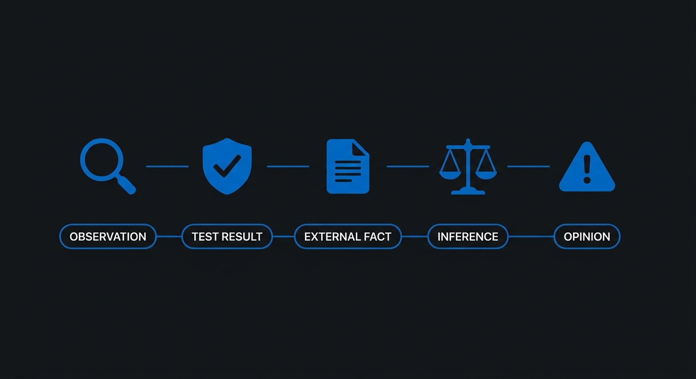
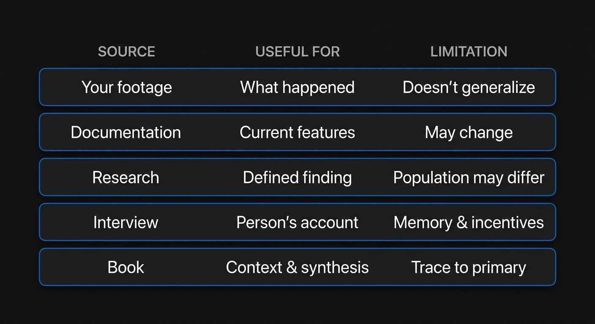
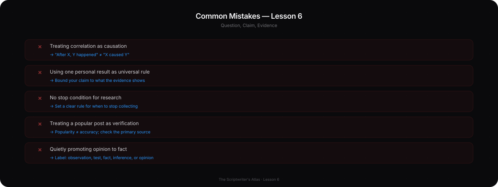

# Phase 4 — Ideas, Audience, and Research

## YOU ARE HERE
You can build a story or educational outline that moves. Now you need to choose material that can support the promise—and verify that your explanation is not stronger than its evidence.

## YOU ARE LEARNING
You will evaluate ideas, identify what a viewer needs, research efficiently, track claims, look for counterevidence, and arrange research into an understandable progression instead of a data dump.

## BY THE END
You will have a source-backed claim ledger, one credible counterpoint, and an outline that moves from the viewer’s question to a bounded answer.

---

# Lesson 6 — Find the Question, Check the Claim, Build the Evidence Path

**Estimated voiceover:** 12–15 minutes · **Practice:** 40–60 minutes · **Audio:** [listen to Lesson 6](../audio/phase-04-lesson-06.m3u)

## What You Will Learn

- Generate distinct video ideas from one topic by changing the question and evidence.
- Judge an idea by relevance, evidence access, change, and production feasibility.
- Separate observation, test result, external fact, inference, and opinion.
- Use sources according to what they can establish—and what they cannot.
- Organize research into a sequence that helps the viewer learn.

## Core Idea

Research is not collecting everything related to a subject. It is finding and checking the information that can answer a specific viewer’s question.

## Why This Matters

A researched script can still mislead if it treats correlation as cause, one personal result as a universal rule, or a popular post as verification. Research also takes time. Without a question and a stop rule, more tabs can become a way to avoid making a writing decision.

## Deep Explanation

### 1. Start with a viewer’s question, not a keyword

One topic can become many different videos. “AI filmmaking” could be: a beginner troubleshooting character continuity; a story experiment testing whether a silent scene reads; a case study rebuilding one failed sequence; a tool review under a defined production constraint; or an essay about what a generated image can and cannot document. These are not synonyms. Each needs different evidence.

### 2. Match the claim to the evidence

Label important statements in your notes:

- **Observation:** what you personally saw or recorded in a specific situation.
- **Test result:** what happened under the test conditions you can describe.
- **External fact:** a claim supported by an identifiable source.
- **Inference:** an explanation or conclusion drawn from facts; it may have alternatives.
- **Opinion:** a position or preference you own.

Do not quietly promote one category into another. “After I changed the thumbnail, click-through rate rose” reports sequence and measurement. “The thumbnail change caused the rise” is a causal claim that needs stronger evidence. Timing, title changes, impressions, audience, and topic can also matter.

### 3. Use the source for the job it can do

| Source | Useful for | Limit to name |
|---|---|---|
| Your original footage or test | What happened in your setup | Does not automatically generalize |
| Official documentation | Current stated features, terms, or rules | May change; does not demonstrate every real-world outcome |
| Peer-reviewed research | A defined finding and method | Population, sample, and setting may not match your viewer |
| Interview or testimony | A person’s account and experience | Memory, perspective, and incentives matter; get consent |
| Book or secondary reporting | Context, synthesis, and leads | Trace important or disputed claims to stronger primary evidence |
| Social post or search result | A question worth investigating | Popularity is not verification |

For health, finance, safety, law, or other high-stakes topics, the evidence standard rises. Verify dates and jurisdiction, distinguish education from personalized advice, and avoid presenting a convenient anecdote as a rule.

### 4. Use a claim ledger

For each key claim, record **claim / source / date accessed / exact support / limit / script line / on-screen citation**. Add the alternative explanation that could also fit the evidence. If a claim is not ready, mark **[VERIFY]**, qualify it, or remove it. A fact ledger is not paperwork for its own sake; it protects the audience and gives the editor a trail.

### 5. Turn research into a story of understanding

Sort evidence into **foundation / first clue / complication / counterevidence / result / application**. Put a useful example near the moment the viewer needs it. Keep interesting but irrelevant research in a cut bank. A specialist may be tempted to begin with everything they know; a beginner often needs one example before a technical term can mean anything.

The stop rule is not “stop when you have three sources” or “stop after an hour.” Stop when you can answer the question to the standard the topic requires, have checked the important counterpoint, and know what evidence would change your conclusion. Continue if a key claim remains unsupported or a safety/rights issue is unresolved.

### Professional Example — A Thumbnail Claim

**Question:** did a thumbnail change cause a video to receive more views?

**Record:** thumbnail and title versions; date; impressions; click-through rate; traffic source; audience; any other changes; the measurement window.

**Careful sentence:** “After I changed the thumbnail, click-through rate rose on this upload. I also changed the title, so I cannot isolate which change mattered.”

This may be less dramatic than “one color made my video go viral.” It is more useful because the viewer can see what was observed and what remains unknown.

### Case Study — A Beginner-Facing Investing Explainer (Real Video)

The source Atlas’s analysis of Ali Abdaal’s *How to Invest for Beginners* highlights a transferable teaching choice: start from the beginner’s uncertainty and explain why the question matters before adding investment terms. Use that as an information-order example, not as current financial advice. Financial examples, products, rates, and regulations change; verify all of them independently.

### Before / After

**WEAK**  
“Experts prove that this simple system always increases productivity.”

**BETTER**  
“In this small test, I finished the planned task after moving the phone to another room. I did not compare several weeks of work, so I cannot say the change will improve everyone’s productivity.”

**WHY**  
The better version names the scope and avoids claiming that a single result proves causation. It may still need a source or more context, but its certainty matches its evidence.

## Common Mistakes

- Searching broad keywords before defining the question.
- Using a source because it agrees with the thesis, without checking method, date, or incentives.
- Treating one case, small test, or analytics screenshot as a universal causal result.
- Using “studies show” without naming the study or what it found.
- Listing research in the order you found it instead of the order the viewer needs it.
- Hiding a counterpoint in a final disclaimer after the audience has already formed a false impression.
- Researching indefinitely because no stop rule defines what decision the next source could change.

## How to Apply It

1. State the question in one sentence.
2. List the factual claims needed to answer it.
3. Label each claim by type and identify the best source for it.
4. Record support, date, scope, uncertainty, and an alternative explanation.
5. Find one credible counterpoint—not a weak opponent you can easily dismiss.
6. Sort the evidence into a learning sequence.
7. Mark every missing source or shot **[VERIFY]** or **[SHOOT]**.
8. Write the claim in language no stronger than the evidence.

## Practice Exercise — Research One Causal Claim

Use a real claim from a project, or this model question: “A thumbnail change caused higher views.” Make a claim ledger. Identify the data you would need, the factors that could have changed at the same time, and what you can responsibly say if you do not have a controlled comparison. Then sort your notes into five beats: question, context, first evidence, alternative, bounded conclusion.

Do not open the model until you have written a careful sentence of your own.

Model answer — reveal after trying

A defensible observation might be: “After I changed the thumbnail, the video’s click-through rate increased during the next measurement window. The title also changed, and the audience mix may have changed, so the data do not isolate the thumbnail’s effect.” A stronger causal conclusion would require a credible comparison design and enough context to rule out reasonable alternatives. Do not promise that one design change will increase views for everyone.

## Mini Checkpoint

1. How does an observation differ from an inference?
2. What is wrong with “the study proves this will work for every creator” if the study used a small, specific sample?
3. When should a counterpoint appear before the end?
4. What does a source date add to a fact ledger?
5. What is a useful research stop condition?

Checkpoint reasoning — reveal after answering

An observation reports what was seen or measured; an inference explains it. A narrow sample cannot support an unlimited claim. Put the counterpoint earlier when it changes how the main evidence should be interpreted. A date helps detect stale or changed information. Stop when key claims have adequate support, limits and counterevidence are understood, and no unresolved high-risk issue remains—not when you have gathered every fact.

## Assignment

Create a research packet for the idea from Phase 1: a claim ledger, at least one alternative explanation, one counterpoint, an evidence order, and a list of what the video cannot answer. Where external research is relevant, use at least two independent sources for important disputed claims and trace them to primary material where practical. Record dates and permissions.

## Takeaway

**Research should make the script more accurate and more selective. Ask not only “What supports this?” but also “What does this not prove?”**

### VOICEOVER SCRIPT

Let’s talk about the moment when a promising idea becomes an accurate script. You have a question, and you begin searching. Soon you have thirty tabs, five videos, a study with a technical title, a thread with a bold claim, and a note that says “experts agree.” The writer’s challenge is not finding more material. It is deciding what evidence can answer the question and how much confidence the evidence allows.

First, distinguish topic from question again. “AI filmmaking” is a search category. “Can a viewer understand this three-shot scene without narration?” is a testable question. That question tells you what to look for: a real sequence, a viewer test, maybe a comparison, and a clear limit. A keyword can find material. A question gives the material a job.

Now label the claims in your notes. Suppose I say, “The jacket changed between shots.” If I can see it, that is an observation. “The image tool caused the mismatch” is an inference. Maybe the prompt changed. Maybe I used a different reference. “This tool always breaks continuity” is a broad claim. “I prefer the second output” is my opinion. You can include all of these in a script, but do not blur them together.

A useful claim ledger has seven fields: the claim, source, access date, exact support, what the source does not show, the planned script line, and how the audience can see or hear the evidence. The source should match the claim. Official documentation can tell you what a feature is supposed to do; a real test may show what happened in your setup. Neither one automatically tells you what all creators will experience.

Let’s use a familiar analytics example. I changed a thumbnail, and the click-through rate went up. Did the thumbnail cause it? We would want to know whether the title changed too, what traffic sources were involved, when the measurement happened, what the impressions looked like, and whether the audience was comparable. The sentence “After the thumbnail changed, CTR rose” reports sequence. The sentence “the thumbnail caused the rise” is a stronger causal statement. A careful script marks the difference.

This matters especially in health, finance, safety, law, and other high-stakes topics. Your audience may act on what you say. A personal example can help explain a question, but it is not a substitute for qualified evidence. Dates, regions, regulations, and product terms can change. Avoid turning a creator’s experience or one small study into a recommendation for everyone.

What counts as strong evidence depends on the question. Original footage is excellent evidence for what appears in your footage. It may not prove why a viewer reacted. An interview can tell us what one person remembers, but memory and incentives shape testimony. A peer-reviewed study may have strong methods and still use a population unlike your audience. A popular social post may point you toward a question, but popularity alone does not verify its claim.

A second job of research is sequence. Do not put the evidence in the order you found it. Imagine teaching a beginner about an unfamiliar financial concept. They may need to understand why the problem matters before hearing product names. The Atlas’s analysis of Ali Abdaal’s investing explainer points to that transferable order: begin with a beginner’s question, show why it matters, then introduce concepts and trade-offs. We are analyzing teaching architecture, not borrowing advice or treating an old example as current financial guidance.

Try sorting your material into foundation, first clue, complication, counterevidence, result, and application. A viewer may need a simple example before a technical term. A counterpoint may need to appear before the conclusion if it changes how we should interpret the first piece of evidence. Interesting facts that do not help the answer can go into a cut bank. You do not have to delete them from your life. You only have to remove them from this video.

How do you know when to stop researching? Not when you have read the whole internet. Define the decision your next source could change. If the claim is unsupported, keep going. If an important counterpoint is missing, keep going. If the evidence is adequate, the limits are clear, and the next search is merely interesting rather than useful, begin the outline. For a health or finance claim, the stop condition must include the right level of verification and any relevant professional review.

In the exercise, you will investigate whether one thumbnail change caused higher views. Do not start by defending the claim. Write down what data would distinguish the thumbnail from other changes. Then draft an accurate sentence even if it sounds less exciting. Read it aloud. Can a viewer tell what was observed, what you inferred, and what remains unknown? If yes, the script has become both clearer and more trustworthy.

Let’s slow down over the word “prove.” A source can support one sentence and fail to support the next. A screenshot of a price can show what the page displayed at a particular time. It may not show what a customer actually paid, what the offer includes in another region, or whether the price is still current. A study might support an average change in a defined group. It may not tell us what every person will experience. Ask what the evidence literally contains before you turn it into a line of narration.

Here is a practical exercise in wording. Write the strongest version of your claim. Then write the narrowest true version. Compare what evidence each version requires. If the strong version needs a controlled test, but you have a personal observation, keep the observed version and say what remains unknown. Your video can still be valuable because viewers learn how to ask the question responsibly.

A counterpoint should be concrete. “There may be other factors” is often too vague. Name the plausible factor: the title changed, the sample is small, the source is old, the person had a different goal, or the production environment was unusual. Then explain whether that factor changes the conclusion or simply limits how far it travels.

There is no need to apologize for uncertainty when the uncertainty is real. “This small test tells me whether these two viewers understood the action. It does not predict how a platform will distribute the video.” That sentence does not weaken the work. It tells the viewer exactly what the work can teach.

Your goal is not to make a script sound certain. Your goal is to make the viewer’s understanding more accurate. Research earns its place when it changes the question, supports the answer, shows a useful alternative, or helps someone act. Everything else can wait in the notes.

---

## MASTERED

- You can label a claim as observation, test result, external fact, inference, or opinion.
- You have recorded source, date, support, limit, and counterpoint for important claims.
- You can place the evidence in an order that helps a beginner understand it.

## NEXT

Phase 5 turns the viewer’s question into an opening contract—and teaches you how to hold attention by giving value, not by withholding it.
