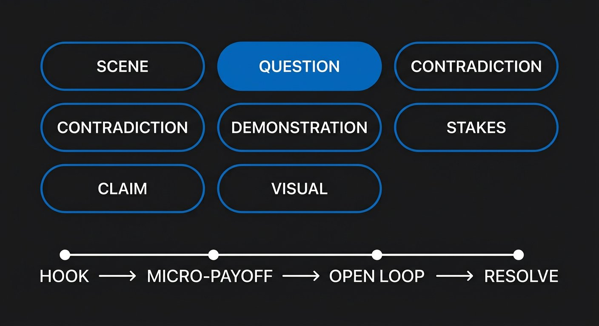

# Phase 5 — Hooks and Earned Retention

## YOU ARE HERE
You have a question, a viewer, evidence, and a structure. Now the opening must make the right viewer understand why to stay—and the rest of the script must keep earning that attention.

## YOU ARE LEARNING
You will write hooks from different mechanisms, create and close meaningful open loops, deliver early value, diagnose stalled sections, and distinguish curiosity from manipulation.

## BY THE END
You will have three genuinely different openings for one idea, a chosen opening tied to real proof, and a beat map showing where the video pays its promise.

---

# Lesson 7 — Earn Attention, Then Pay It Back

**Estimated voiceover:** 11–13 minutes · **Workshop:** 30 minutes · **Audio:** [listen to Lesson 7](../audio/phase-05-lesson-07.m3u)

## What You Will Learn

- Define a hook as a useful contract rather than a loud line.
- Write openings using scene, question, contradiction, demonstration, stakes, claim, and visual evidence.
- Use open loops and micro-payoffs without holding useful answers hostage.
- Test whether a section changes viewer understanding.
- Align opening, title, thumbnail, evidence, and ending.

## Core Idea

A hook gives the right viewer a reason to continue and a fair expectation of what the video will deliver. Retention is earned by meaningful progress, not by noise or delay.

## Why This Matters

An opening has little time to establish context, but there is no magic stopwatch that makes every quiet opening fail. If the viewer cannot tell what the video is about, intensity will not solve the confusion. If the video promises an answer and keeps postponing it, attention becomes distrust.

## Deep Explanation

A hook can work through several mechanisms. Each has a benefit and a cost:

| Mechanism | Example | What it needs | What can go wrong |
|---|---|---|---|
| **Scene** | A creator pauses over the delete key | A real, relevant moment | A personal anecdote that does not serve the promise |
| **Question** | “Why does the face match while the scene still feels broken?” | A question with a meaningful answer | A generic question with an automatic “yes” |
| **Contradiction** | “The image matched. The story still failed.” | Two true details that do not yet fit | A manufactured paradox |
| **Demonstration** | Play the old and revised cut | A real comparison that viewers can inspect | A manipulated before/after |
| **Stakes** | “If the test fails, I have to reshoot the opening.” | An honest consequence | Inflating a small cost into a crisis |
| **Claim** | “A quiet opening can be clear; a fast one can still feel slow.” | Early support and clear scope | A bold line whose proof arrives too late |
| **Visual hook** | Three shots with an inconsistent eyeline | An image that carries information | Random spectacle with no answer in the script |

An **open loop** is a relevant question that remains unresolved because the answer depends on what happens next. A **micro-payoff** is a useful partial answer delivered before the full conclusion. A healthy progression can be: question → first answer → new complication → example → refined answer → practical payoff. The viewer gets something at each step.

To diagnose a slow section, write what the viewer knows before it and after it. If nothing changes, move, combine, or remove the section—or add the proof, context, or application that makes it useful. A pattern change counts only when it changes evidence, perspective, sound, visual information, or pace for a reason. A random zoom is not a new idea.

### Professional Example — The Same Claim, Three Contracts

Assume the real, demonstrable issue is a scene that looks consistent but has no clear character choice.

- **Direct promise:** “We’ll rebuild this three-shot scene so the choice reads without narration.”
- **Visual demonstration:** play the scene, then freeze where the action stops making sense.
- **Contradiction:** “The face matches in every shot. I still cannot tell why the character stopped.”

These are different viewer contracts. Choose the one that matches the footage, audience, and amount of context needed. If the footage does not exist, write a direct teaching example or label it as a demonstration. Do not claim a test happened when it did not.

### Real-Video Case — A Thumbnail as a Question

The Atlas’s Isaac thumbnail analysis studies a useful relationship: a thumbnail can present a visible question, but the video needs to answer it. The design may attract attention; it does not guarantee virality. When studying the original, note what the image makes you expect, what the title adds, and where the video pays that expectation. Do not turn a design observation into a causal claim about views.

### Before / After

**WEAK**  
“You won’t believe what happens next. This changes everything.”

**BETTER**  
“The face stayed the same. The character’s choice disappeared. Watch the second shot, and you’ll see why.”

**WHY**  
The better opening reveals enough to make the problem concrete, then gives a precise reason to inspect the next shot. It does not conceal an ordinary answer just to force a longer watch.

## Common Mistakes

- Equating a loud opening with a strong opening.
- Opening with a question that could fit any video.
- Promising a result before the evidence exists.
- Creating a loop and never closing it.
- Delaying the first useful answer until the end.
- Using visual interruption without a new piece of information.
- Treating retention metrics as proof of the cause of a viewer’s behavior.

## How to Apply It

1. Write the viewer and the specific question in the margin.
2. Draft a direct opening, a scene or demonstration opening, and a contradiction or question opening.
3. For each, mark what is known, what remains open, first proof, and final payoff.
4. Choose the opening that is most truthful and easiest to support—not automatically the most dramatic.
5. Map every open loop to its answer. Close it or remove it.
6. Check each major section: what does the viewer know before and after?
7. Deliver one useful answer before asking for a click, subscription, or sale.

## Practice Exercise — Three Hooks, One Honest Promise

Topic: a creator’s first 30 seconds feel slow because the viewer does not know what problem the video solves. Write:

A. a direct-promise hook;  
B. a visual or scene-led hook;  
C. a question or contradiction hook.

For each, state the viewer, first proof, information you are holding, and how the ending pays the promise. Make the approaches genuinely different—not three synonym swaps.

**Pause and write all three before opening the notes below.**

One possible set — reveal after you try

- **Direct:** “Let’s move the first useful example into your opening and see whether the promise becomes clear sooner.” Proof: a real draft before and after. Payoff: the revised opening plus a viewer-read test if performed.
- **Scene:** show a draft with a long greeting before the problem. “I reached the first example, then realized you still didn’t know what this video was solving.” Use only if this is an honest experience or label it as a constructed demonstration.
- **Question/contradiction:** “Why can an opening feel slow even when the speaker talks quickly?” Proof: compare information order rather than speaking speed. Payoff: a test for clarity, not a rule that every intro must be fast.

Each is a different contract. A quiet scene works only if the image carries a relevant question.

## Mini Checkpoint

1. What makes a visual hook informative instead of random?
2. How does a micro-payoff change the relationship with an open loop?
3. What should you do with an unanswered loop that no longer supports the promise?
4. Why may context need to precede a hook’s conclusion in a sensitive subject?
5. What question helps diagnose a “dead” section?

Checkpoint reasoning — reveal after answering

A visual hook shows evidence, contradiction, stakes, or a meaningful choice. A micro-payoff gives useful value while a larger question remains open. Close or remove an abandoned loop. In sensitive topics, context may be necessary to prevent a misleading inference. Ask what the viewer knows before and after the section; if the answer is identical, revise its job.

## Assignment

Revise the first 30 seconds of your capstone idea. Keep the title/thumbnail promise in view. Mark the first question, first proof, and first paid answer. Have one person unfamiliar with the topic explain what they believe the video will deliver. Record their words without correcting them; revise if the expectation does not match your real ending.

## Takeaway

**Open a question because the answer matters. Give the viewer progress while they wait. Close every promise you create.**

### VOICEOVER SCRIPT

Let’s talk about the first seconds of a video. People often think a hook is a sentence that grabs attention. That is incomplete. A hook is a contract. It tells a particular viewer why this video may be worth their time and what kind of answer they can expect. It can be quiet, visual, funny, direct, or tense. What matters is whether it creates a meaningful expectation the rest of the video can fulfill.

Imagine two versions of the same scene. In one, the creator speaks quickly and says, “Welcome back. Today we’re talking about storytelling.” In the other, we see three shots of the same character. The face and coat match, but the character’s action changes direction. The narration says, “The face matches in every shot. I still cannot tell why the character stopped.” Which has more information? The second. It gives the viewer something to inspect and a specific question.

There are several ways to make that contract. A scene drops us into a relevant moment. A question names an uncertainty. A contradiction lets two true details collide. A demonstration shows a before and after. Stakes tell us what could be lost. A direct claim states a position and asks the video to support it. A visual hook lets an image carry the question. None is automatically best. Each depends on what material you really have and what context the audience needs.

Here is where beginners usually make a mistake: they write the boldest line first, then search for footage that makes the line appear true. Reverse that. Look at the evidence and write an opening it can support. If you did not run the test, do not say “I tested.” If you do not have the before version, do not pretend to show a before and after. A truthful demonstration can be created for teaching, but label it as a demonstration rather than personal history.

An open loop is an unresolved question that matters to the video. “Will this scene communicate its choice without narration?” is a useful loop if we will see the scene and learn what happened. A weak loop says, “Wait until the end for the secret,” then withholds a basic answer we could have received earlier. Curiosity is not a license to waste someone’s time.

A better rhythm is to pay as you go. Ask a question, offer a partial answer, introduce a genuine complication, show evidence, refine the answer, and give an application. That can sound like: the reference image fixes the character’s coat; the scene still feels unclear; a closer look shows the middle shot does not change what the character knows; we add one piece of information; now the last shot carries a choice. At each stage the viewer learns something.

Do not confuse a pattern change with an edit trick. A cut to a close-up matters if the detail reveals evidence or a decision. A change of music matters if it changes how we interpret the scene or creates room for us to judge it. A zoom inserted only because the timeline feels quiet adds motion, not meaning.

Let’s use the case material from the Atlas. One Isaac video discusses thumbnail design. The course analysis observes a useful distinction: an image can raise a visible question, but the video still has to answer it. That is a writing lesson, not proof that one thumbnail style causes high views. When you watch the original, ask what expectation the image creates, what the title adds, and where the video begins to pay that expectation back. Then notice what you can and cannot know from the captions or the visible design.

Now we will try three hooks for one idea. The direct promise might say, “Let’s move the first useful example into your opening.” The visual version might play a vague opening and then freeze before the viewer learns the problem. The contradiction might ask, “Why can an intro feel slow when the speaker talks quickly?” They are not synonyms. They invite different viewers to continue for different reasons.

For each one, name the first proof. What do we actually see? What remains unanswered? When does the video give its first useful answer? How does the ending complete the contract? If you cannot write down the final payoff, the opening is making an unsupported promise.

A quiet opening is not automatically slow. In the short-script library, one model opens with a creator pausing before deleting a scene. The silence works only if the viewer can see the decision and understand that something is being risked. Eight seconds of silence over an unrelated stock image does not become art because the editor chose not to speak. Silence is a production choice with a job.

How do you know when a section loses movement? Write what the viewer knows before and after. If both sentences are identical, ask whether the section needs a new example, a counterpoint, an application, or a cut. Do not use a universal “every seven seconds” rule. A complex idea may need a longer demonstration. A simple repeated setup may be too long after one sentence.

And when the subject is sensitive, sometimes context must come first. A dramatic clip without context can make viewers believe something the full evidence does not support. Do not optimize surprise at the cost of meaning. A hook that misleads the audience is not a strong hook; it is a broken contract.

Notice how different hook types change the viewer’s role. A direct promise says, “I will show you a method.” A scene says, “Watch this moment and decide what it means.” A question invites the viewer to predict an answer. A contradiction lets them inspect two facts that do not fit yet. None is a trick; each asks the audience to pay attention in a different way. Choose one that suits how your evidence should be experienced.

A common fear is that giving an answer early will make people leave. But what does the viewer gain by staying if the video hides every useful answer? The better question is whether the video continues to deepen the problem. The first answer may solve the surface issue and reveal a more important one. In our scene example, the coat matches, but the choice is still unclear. That is a new reason to continue because it changes the diagnosis—not because the writer refuses to tell us what the first test found.

Try writing the first useful answer as a line on its own. If it says, “The face is consistent, but the intention is not,” you have already taught something. The rest can demonstrate why, show the revised sequence, and explain the limit. A viewer can receive value and still want the full explanation.

Your assignment is to test the contract with a person who has not seen the draft. Ask them what they think the video will deliver. Do not ask “Did you like it?” That question may produce a polite opinion. You need to know what expectation they formed. If the expectation does not match your ending, revise the opening or the project.

Carry this principle forward: attention is borrowed moment by moment. Give a useful reason to continue, show progress, and close the questions you open. A good hook does not trick a viewer into staying. It helps the right viewer recognize that the video is for them.

---

## MASTERED

- You can write three different hooks from one honest idea.
- You can show first proof and locate the promise’s payoff.
- You can identify open loops and close, narrow, or remove them responsibly.

## NEXT

Phase 6 turns the script toward the human voice: specific observation, natural English, varied rhythm, and sentences made for a listener—not a page.
