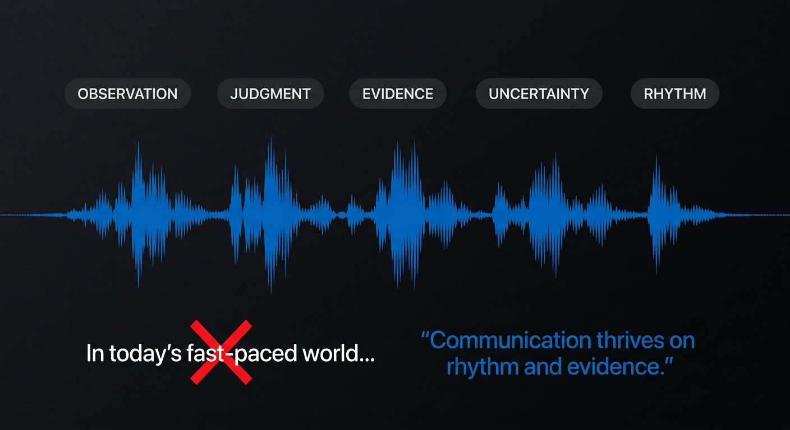
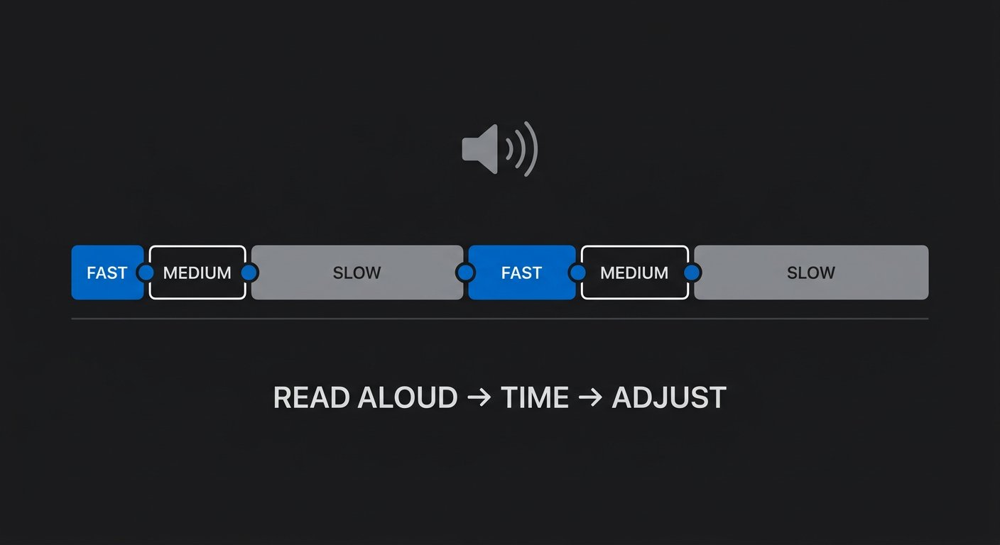

# Phase 6 — The Human Ear

## YOU ARE HERE
Your ideas and evidence have shape. Now the language must sound like a person thinking carefully for a real listener—not an essay, a sales page, or a borrowed online persona.

## YOU ARE LEARNING
You will develop an evidence-led voice, spot generic or artificial writing patterns, choose a tone for the moment, and revise for breath, rhythm, pronunciation, and comprehension.

## BY THE END
You will have a short voice bank, an authenticity edit, and a voiceover passage you can read naturally at a measured pace.

---

# Lesson 8 — Build a Human Voice Without Performing One

**Estimated voiceover:** 10–12 minutes · **Practice:** 30 minutes · **Audio:** [listen to Lesson 8](../audio/phase-06-lesson-08.m3u)

## What You Will Learn

- Tell the difference between a stable writing voice and the tone of one moment.
- Identify generic language by its lack of specific thought or evidence—not by trying to “beat” a detector.
- Replace vague claims, fake suspense, and forced empathy with concrete, defensible choices.
- Use uncertainty, humor, and personal detail only when they are true and relevant.
- Build a voice bank from your actual observations and spoken language.

## Core Idea

A human voice is not a set of casual phrases. It is a recognizable pattern of noticing, judgment, evidence, uncertainty, and rhythm.

## Why This Matters

A script can be grammatically smooth and still sound interchangeable. Adding slang or emotional adjectives does not make it personal. Specific observation and honest reasoning do.

## Deep Explanation

**Voice** is the stable set of choices a writer makes: what they notice, what they question, how they compare options, what they find funny, and how they judge evidence. **Tone** is the current stance: calm in a tutorial, cautious in a health explanation, playful while discussing a harmless mistake. One writer can change tone without losing voice.

Do not treat “AI-sounding” as a reliable authorship test. A detector cannot tell you whether a line is truthful, clear, or useful. Instead, inspect the writing. Common warning signs include:

- broad openings such as “In today’s fast-paced digital world”;
- abstract verbs and nouns (“leverage innovation to maximize engagement”);
- adjectives that declare importance without showing why;
- identical three-part rhythms in every paragraph;
- fake suspense or unsupported personal confessions;
- “we’ve all been there” when the writer has no basis to speak for everyone;
- generic transitions, repeated summaries, and a CTA that arrives before value;
- confidence that outruns the proof.

The repair is not “make it sound casual.” Ask four questions: **Who observed this? How do they know? What specific detail could they notice? What changed afterward?** If the line has no defensible answer, research it, qualify it, label it as a hypothetical, or cut it.

### Before / After

**GENERIC**  
“In today’s ever-evolving digital world, authentic storytelling is the key to creating meaningful connections.”

**CLEAR**  
“A beautiful shot is not automatically a story.”

**SPECIFIC — only if true**  
“I kept the shot with the best lighting. Then two test viewers asked why the character had stopped walking.”

The final version needs real viewer notes. If that test never happened, use the clear version or label a constructed example. An honest plain sentence is better than a cinematic invention.

### Professional Example — One Claim, Four Tones

Claim: planning can reduce avoidable rework.

- **Warm:** “Give yourself five minutes to decide what this video is about before you open the editor.”
- **Analytical:** “Without a question, every clip appears relevant; a brief gives you a reason to remove one.”
- **Candid:** “I was using more research to avoid deciding which scene had to go.” Use only if true.
- **Light humor:** “I didn’t have a shot list. I had a folder full of ambition.” Use only if it fits the moment and your natural voice.

The tone changes; the point stays recognizable. Do not copy another creator’s jokes, confidence, timing, or favorite phrases.

## Common Mistakes

- Chasing a detector score instead of improving meaning and evidence.
- Adding “honestly,” “literally,” or slang that you do not normally use.
- Inventing vulnerability or personal history to borrow trust.
- Repeating “not this, but that” as a paragraph template.
- Using “game-changing,” “unlock,” or “powerful” without naming a result.
- Calling a draft human because it has a joke, even when the reasoning is generic.
- Mistaking a calm or careful tone for a lack of personality.

## How to Apply It

1. Mark every sentence as **claim / observation / inference / example / filler / borrowed phrase**.
2. Underline the most abstract phrase in each paragraph.
3. Replace at least one abstract phrase with an action, object, comparison, or source.
4. Keep uncertainty where it is honest; do not add false confession.
5. Build a voice bank: ten lines from your natural speech, ten details you noticed, five opinions you can defend, three times you changed your mind, and five expressions you would never say.
6. Read the result aloud. If it sounds like someone else’s persona, rewrite it in your own register.

## Practice Exercise — Authenticity Audit

Take 150–200 words you wrote. Label each sentence. Replace three filler lines with one real observation, one source-backed fact, and one honest uncertainty. If you have no suitable fact or observation, mark the gap instead of inventing one.

**Pause here; make your edits before opening the notes.**

Review criteria — reveal after trying

The revision should become more specific without becoming more confident than the evidence. Each personal detail should be true or clearly hypothetical. A generic line can be useful if it introduces a definition, but it should not claim to be distinctive. Do not add slang just to change the surface.

## Mini Checkpoint

1. How does voice differ from tone?
2. Why is “three viewers preferred version B” not enough to claim a controlled audience result?
3. What is a better response to a vague sentence than adding more adjectives?
4. How can a personal detail damage rather than strengthen a script?

Checkpoint reasoning — reveal after answering

Voice is a writer’s recurring choices; tone is the stance in this moment. Three people can support a limited report of that test, not a universal conclusion. Replace vagueness with an observable action, example, or accurately sourced detail. A personal detail harms trust if it is invented, irrelevant, or used to imply more evidence than it provides.

## Assignment

Create a one-page voice bank. Then rewrite one paragraph in two tones that fit two different moments in the same video. Keep the claim constant; change warmth, pace, and emphasis. Ask a reader which wording sounds like you and what evidence makes it feel owned.

## Takeaway

**Do not try to sound human. Think specifically, tell the truth about how you know, and write in a voice you can actually speak.**

### VOICEOVER SCRIPT

Let’s talk about a frustrating feeling: you read a paragraph that is grammatically correct, has a nice rhythm, and still sounds like it could belong to any video on the internet. What is missing? Often, the writing has no particular observation behind it. It uses phrases that could fit almost any subject.

A common opening is, “In today’s fast-paced digital landscape, authentic storytelling is more important than ever.” What do we actually learn? Not who is facing a problem, what changed, or what the viewer will see. The line is not bad because a computer might have written it. It is weak because a writer has not made a specific choice.

Try this instead: “A beautiful shot is not automatically a story.” That gives us a distinction we can test. If we have real footage, we can make it more specific: “I kept the shot with the best lighting. Then two test viewers asked why the character had stopped walking.” That line has a person, an action, and a response. But it is only stronger if the test really happened. If it did not, use the clear principle or label a made-up scenario as an example.

This is the foundation of a human voice: observable thought. Someone noticed something, decided what matters, looked at the evidence, and made a judgment. Slang is optional. A joke is optional. Being direct about uncertainty is often more distinctive than pretending to know everything.

Let’s separate voice from tone. Voice is what you repeatedly notice, the questions you ask, the comparisons you make, and how you treat evidence. Tone is the temperature of this moment. You may be playful while showing a harmless mistake and cautious while discussing money or health. The tone can change because the situation changed. That does not mean you have lost your voice.

Now let’s examine the patterns that often feel generic. “Leverage innovative strategies to maximize engagement.” We can translate it into visible action: “Show the mistake before explaining the fix.” The first sentence uses abstractions instead of showing what to do. The second gives the viewer a testable instruction. If we have a real audio example, we can make the line even more useful: play the robotic sentence, then play the revised version. The sound becomes evidence. But do not tell the viewer you ran a test if you did not.

Another pattern is fake suspense: “You won’t believe what happens next.” What happens next? The line tells us nothing. Compare it with, “The face stayed the same. The story still didn’t work.” We get a partial answer and a better question. The writing gives us something to understand rather than a promise of shock.

Forced empathy is another warning sign. “We’ve all been there; we all struggle.” Maybe we have, maybe we have not. The writer is speaking for people they do not know. A more honest sentence might be, “My first draft sounded confident because it avoided the hard question.” Again, use it only if it is true. Personal detail can create trust, but invented personal detail borrows trust it did not earn.

Here is a useful paragraph audit. Ask: who observed this? How do they know? What detail could this writer notice that is not interchangeable? What changed afterward? If no answer exists, you have choices. Verify the fact. Add a limit. Make it explicitly hypothetical. Or cut it.

You can build a voice bank from ordinary material. Save sentences from recordings where you were not performing. Record details you notice that other people may overlook. Write down opinions you can defend. Keep examples of times you were wrong and changed your mind. Also write down phrases you never use. If a script keeps borrowing expressions that feel unnatural in your mouth, remove them.

Let’s test one principle in four tones: planning can reduce rework. Warm: “Give yourself five minutes to decide what this video is about before you open the editor.” Analytical: “Without a question, every clip appears relevant; a brief gives you a reason to remove one.” Candid: “I was using more research to avoid deciding which scene had to go.” Funny: “I didn’t have a shot list. I had a folder full of ambition.” The tone changes. The idea stays. The candid and funny versions require a writer who can stand behind them.

Do not fall into a fixed rhetorical rhythm. If every paragraph is “not this, but that,” the listener hears the template. If every paragraph ends with a slogan, the video starts sounding like a speech. Vary the structure because the thoughts differ. A short sentence can land a discovery. A longer sentence can unpack the reason. A quiet statement can be more confident than an exaggerated adjective.

Pause and listen to the difference between confidence and certainty. A writer can sound confident while saying, “I do not know whether the tool caused the change; I can show you what changed in this project.” The sentence is steady because the writer knows the boundary. A writer can also sound uncertain because the idea is unclear: “Maybe it somehow made the experience better.” Those are different problems. Do not remove honest uncertainty; clarify what you know and what you are still checking.

Try this with a sentence from your own work. Circle the subject, underline the action, and mark the evidence. If the line says “people loved the new version,” who are those people, what did they do or say, and how many? Maybe you have a comment, a message, or a small reader test. Name the actual evidence. If you have no evidence, use “I prefer the new version” or “I expect this version to be easier to follow,” depending on what is true.

A particular voice also comes from omission. A writer who does not use a melodramatic adjective when the event was ordinary shows judgment. A writer who admits that a test was inconclusive shows how they think. Small choices repeated over time become recognizable. That is more sustainable than adding a joke to every minute.

The assignment is to audit a paragraph you have written. Mark claim, observation, inference, example, and filler. Replace three filler lines with one real observation, one supported fact, and one honest uncertainty. You might discover that you do not have enough evidence yet. That is good diagnosis. Add research; do not create a fake story to make the paragraph feel alive.

A professional writer does not ask, “How do I fool a detector?” They ask, “Can I defend this sentence? Is it useful to this viewer? Does the wording sound like something I could say? Is the specificity real?” Those questions make the script more credible, and credibility is part of voice.

Carry this principle forward: human writing is not a costume. It is evidence of a mind making choices. Be specific where you can, honest about what you cannot know, and willing to remove a line that sounds impressive but says nothing.

---

# Lesson 9 — Write for Breath, Rhythm, and Comprehension

**Estimated voiceover:** 10–12 minutes · **Practice:** 25 minutes

## What You Will Learn

- Adjust sentence, information, narrative, and emotional pacing.
- Use contractions, punctuation, fragments, and pauses intentionally.
- Read aloud to discover unnatural syntax, ambiguous pronouns, and pronunciation problems.
- Separate spoken information from visual information without leaving audio-only viewers lost.
- Estimate runtime with a real read instead of forcing speed.

## Core Idea

A video script arrives once, in time. Write for a mouth and an ear, not only for a reader who can go back a line.

## Why This Matters

A sentence can be correct on the page and exhausting aloud. A cut can be visually fast yet cognitively confusing. A pause can help a viewer inspect evidence—or feel like empty time. Spoken pacing is the rate of understanding, not simply words per minute.

## Deep Explanation

There are at least four kinds of pace:

- **Sentence pace:** length, stress, syntax, and breath.
- **Information pace:** how many new ideas arrive before the listener can process them.
- **Narrative pace:** how long we stay with a choice versus routine activity.
- **Emotional pace:** how much room the audience has to register a consequence.

A fast voice does not fix an explanation that introduces four unfamiliar terms at once. Compress routine setup; slow down on a demonstration, difficult definition, uncertainty, or meaningful reversal. Vary sentence length. A short sentence can land the turn. A longer one can explain the reason. Repeating a phrase can orient the listener or create a motif—but repeating it only to fill time becomes a slogan.

Read the script at recording speed, not silently. Mark a breath slash where you naturally need one. Test names, dates, acronyms, and technical phrases. If you stumble twice over a phrase, change the phrase before blaming your delivery. Use contractions where they sound natural; use the full form for emphasis only when you mean to emphasize it.

A pause is a written decision. **[HOLD 2 SEC — show the comparison without VO]** asks the audience to inspect. A pause after a dense explanation can give time to think. A pause over an image that contains no question may feel like a delay. Music can tell viewers how to feel; removing it may let them judge evidence for themselves.

The spoken script and the picture should complement each other. If the viewer watches silently, captions and visuals should preserve the essential idea. If they listen without looking, narration should explain the essential relationship—not every visible click. Accessibility is a reason to repeat some information; otherwise, give each channel a distinct job.

### Before / After

**WRITTEN, NOT SPOKEN**  
“The aforementioned inconsistencies in the visual depiction of the protagonist may adversely affect narrative coherence.”

**SPOKEN**  
“The face changes between shots. So even when the action is clear, I stop believing it is the same person.”

**WHY**  
The revision uses common words, names the change, and links it to the viewer’s experience. It does not use less information; it arranges the information for listening.

### Professional Example — Rhythm as Meaning

**Flat:** “I opened the project. I selected footage. I added music. I exported the result. I noticed a problem.”

**More deliberate:** “I finished the cut before lunch. The music made it feel complete—until I watched the ending without sound. The character made a choice. I couldn’t tell what it was.”

The second compresses routine and holds on the meaningful discovery. Use it only if the silent-viewing test actually happened; otherwise identify it as a model example.

## Common Mistakes

- Reading silently and assuming the text will sound natural.
- Making every sentence short, long, or the same shape.
- Solving pacing by speaking faster rather than reducing idea density.
- Writing technical names, acronyms, or tongue-twisters without rehearsal.
- Explaining an obvious shot while leaving an audio-only listener without the cause.
- Adding music or effects to create emotion the evidence does not support.
- Treating a word-count estimate as a guaranteed runtime.

## How to Apply It

1. Record a natural read without stopping.
2. Mark stumbles, breath problems, phrases you would not say, and sentences with more than one main idea.
3. Label each line **setup / turn / proof / hold / bridge**.
4. Move proof closer to the claim; compress repeated setup.
5. Give the listener a beat after dense information or visual evidence.
6. Record again at a natural pace and time it.
7. Listen without the picture. Watch muted. Check whether each mode retains the essential meaning.

## Practice Exercise — The One-Minute Read

Write 120–150 words explaining one real decision. Record it once without stopping. Mark every stumble, every phrase you would not say to one person, and every point where a visual could carry information. Rewrite. Record again at the same natural pace. Your goal is clearer meaning—not a faster take.

Review criteria — open after your second recording

A successful revision removes or reorders words that block understanding, preserves important conditions, and sounds natural at a realistic pace. If the second take is simply faster, revisit the structure and information density.

## Mini Checkpoint

1. Which pacing type is affected when three new technical terms arrive in one sentence?
2. When can a fragment be useful in voiceover?
3. What does a two-second silent hold need in order to feel earned?
4. Why test a script audio-only and muted?

Checkpoint reasoning — reveal after answering

Information pace is overloaded. A fragment can create a deliberate rhythm when its missing action is clear. A hold needs evidence, a question, or an action to inspect. Audio-only and muted tests reveal whether each channel carries enough essential meaning without duplicating everything.

## Assignment

Create a recording copy of the first minute of your capstone. Include pronunciation notes only where needed. Record it twice. Submit the spoken words, actual time, and a short list of changes made after hearing the first take.

## Takeaway

**Pacing is controlled comprehension. Slow down where the viewer must notice or think; compress what has already done its job.**

### VOICEOVER SCRIPT

You can write a beautiful sentence and still discover that it is impossible to say naturally. This is why a video script must be heard. On the page, we can pause, scan backward, and reread a phrase. In a video, the words arrive once while an image, a sound, and an edit are happening around them.

Think of pacing as four related controls. Sentence pace is how the words move: their length, stress, and breath. Information pace is how many new ideas the viewer has to process. Narrative pace is how long we spend on a choice compared with routine travel. Emotional pace is how much room the audience has to register what just happened. You can have a fast edit and a slow explanation, or a quiet scene with a great deal of tension. These are not the same dial.

Listen to this sentence: “The aforementioned inconsistencies in the visual depiction of the protagonist may adversely affect narrative coherence.” It is grammatical. But if I say it to a camera, I hear a wall of abstract nouns. Try: “The face changes between shots. So even when the action is clear, I stop believing it is the same person.” Now I can breathe. I know what changed and why it matters.

Do not solve every sentence problem by making the sentence shorter. If I write “Same face. Same coat. Same city. New shot. New problem.” for ten minutes, the rhythm becomes predictable. Variety lets us shape attention. A longer sentence can give context. A short sentence can land a result. A fragment can mark a moment: “No sound. Just the room.” That works if the listener understands what the room means; it does not work as a substitute for a complete thought in every paragraph.

Read at the pace you plan to record, not at a whisper or an imaginary auction. Place a slash where you naturally breathe. If the sentence asks you to hold too many clauses, split it at the real idea change. Check names, dates, acronyms, and technical words. If you stumble over “approximately three theoretically identical iterations,” maybe you can say “three versions that should have matched.” Clear language often makes the technical point stronger.

Now think about a pause. “[Hold two seconds while the viewer compares the two cuts]” has a purpose. The viewer needs time to inspect evidence. A silent beat after an emotional choice may give that choice room. But a pause is not automatically powerful. If the screen contains nothing relevant, it is empty time. Write the reason for the pause in the production notes.

Music matters too. Music can create expectation, release tension, or tell the audience what emotion to feel. If you want viewers to judge a comparison independently, try playing the evidence without score. In the source Atlas’s original scripts, some holds are explicitly designed to let a viewer see the proof without narration. That is a writing choice, not a failure to fill space.

There is also a question of channel balance. Suppose we show a hand moving a letter from one side of the frame to another. The visual can prove that movement. The narration may explain why the movement changes the character’s choice. If the viewer cannot see, the narration must still explain the essential relationship. If the viewer watches without sound, captions and visual composition should preserve the key beats. Accessibility sometimes requires meaningful repetition; otherwise, avoid narrating every pixel.

Let’s do a rhythm edit. Flat version: “I opened the project. I selected the footage. I added music. I exported. I noticed a problem.” That can be a useful log, but it gives equal time to every action. More deliberate: “I finished the cut before lunch. The music made it feel complete—until I watched the ending without sound. The character made a choice. I couldn’t tell what it was.” We compress routine, slow at the discovery, and give the key problem space. Use the wording only if the test is true or label it as an example.

A useful editing code is setup, turn, proof, hold, bridge. Setup gives what we need. Turn changes the question. Proof supports a claim. Hold lets us inspect. Bridge connects to the next movement. When you mark a page this way, two setup lines in a row may be compressible. Proof that comes long after the claim may be moved closer. A bridge like “Now, onto the next tip” may be replaced with the real connection.

Record one hundred and twenty to one hundred and fifty words explaining a real decision. Do not stop when you stumble. The first recording is a diagnostic, not a performance. Mark every place your mouth resists the wording. Then listen to the audio without looking at the page. Did you understand the sentence when it came once? Where did you lose the thought? Rewrite for clarity before you record again.

A common mistake is saying more words per minute to fit an arbitrary target. If the script is too long, remove an idea or compress a repeated explanation. Do not make the listener run faster. A word-count range is a rough planning tool; your voice, silence, demonstration, and delivery decide the real timing.

Let’s imagine two viewers experiencing the same beat differently. One is watching with sound on; the other hears the video while looking away. If the scene shows a hand moving the letter but the VO says only “That changed everything,” the visual viewer may notice the action, while the audio-only listener cannot know what changed. Add the essential relation verbally: “The name on the envelope made the character stop.” You do not need to narrate every finger movement, but the core meaning should not depend on a channel some viewers may not be using.

Now listen to this pair: “I did not change the data” and “I didn’t change the data.” The contraction is usually more conversational. The full form can carry emphasis or contrast. Neither is more correct in every sentence. Hear it in context. If every line is equally emphatic, none is.

When a line includes a technical term, let the sentence around it carry the meaning. Introduce one new term, show it in an example, and give the listener a moment to classify it. A rapid list of acronyms creates information density without comprehension. You can often keep the exact technical word and simplify the structure around it.

The assignment is to record the first minute of your capstone twice. Compare the actual pace. Did you change the structure or only the wording? Did you preserve a necessary qualification? Does the emphasis land on the right word? Keep the recording note. It is evidence for your next revision.

Here is the principle: spoken pacing is not a contest to say more. It is how you control the rate at which a person can understand, notice, and feel the important parts. Let the sentence, picture, and pause share the work.

---

## MASTERED

- You can replace generic language with accurate, specific thought.
- You can adjust tone without borrowing another creator’s persona.
- You have a natural read-through, actual timing, and a marked recording copy.

## NEXT

Phase 7 moves beyond words. You will plan what the audience sees and hears, and make visuals, sound, silence, and editing contribute to the same idea.
