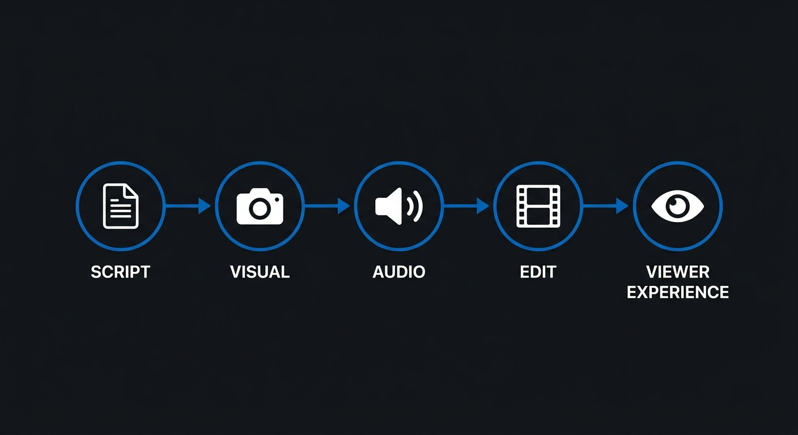
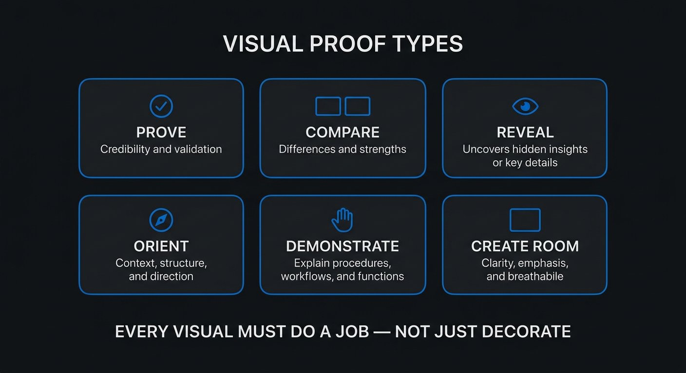
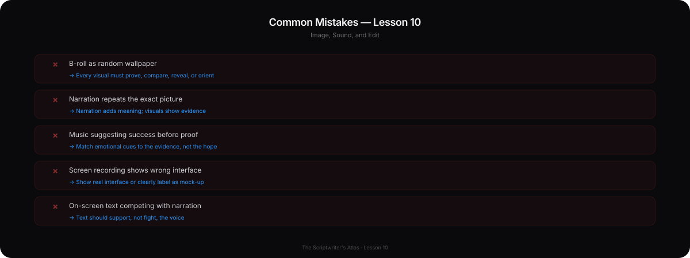

# Phase 7 — Visual and Audio Thinking

## YOU ARE HERE
You can write an idea, a sequence, and natural spoken lines. Now you will decide what the viewer should see and hear—and what the editor must know to build the intended experience.

## YOU ARE LEARNING
You will assign each channel a job, write shootable visual proof, use sound and silence intentionally, and distinguish the recording copy from the editor’s production copy.

## BY THE END
You will turn one script beat into a production-ready AV plan another person can follow without guessing what the shot is meant to prove.

---

# Lesson 10 — Write for Image, Sound, and Edit—not Just for the Page

**Estimated voiceover:** 10–12 minutes · **Practice:** 30 minutes · **Audio:** [listen to Lesson 10](../audio/phase-07-lesson-10.m3u)

## What You Will Learn

- Think through the chain **SCRIPT → VISUAL → AUDIO → EDIT → VIEWER EXPERIENCE**.
- Give A-roll, B-roll, screen recordings, graphics, text, sound effects, music, and silence a clear job.
- Use visuals to prove, compare, reveal, orient, or let the viewer inspect—not merely decorate.
- Write notes that help production without over-directing every frame.
- Prepare a clean recording copy and a useful editor copy.

## Core Idea

A video script coordinates words, evidence, images, sound, and timing so the viewer can understand and feel the intended change.

## Why This Matters

A line can be clear in text and impossible to show. A visual can be beautiful and unrelated to the claim. A music cue can suggest success before the evidence supports it. Production thinking makes the script filmable and protects the meaning through editing.

## Deep Explanation

Start with the key line and ask what the picture contributes. Each visual should do at least one job:

- **Prove** a visible detail or result.
- **Compare** two versions, options, or states.
- **Reveal** information at a useful moment.
- **Orient** the viewer in time, place, process, or interface.
- **Demonstrate** an action the viewer can repeat.
- **Create room** for the audience to observe, think, or feel.

A-roll is the main speaker or interview footage. B-roll is supporting footage, but “supporting” does not mean random wallpaper. A screen recording should show the real interface or be labeled as a mock-up. A graphic should clarify a relationship, not repeat a whole paragraph. On-screen text should be readable on a phone and should not compete with narration.

Sound also has a function. Diegetic sound belongs to the scene: room tone, footsteps, paper movement. Music can shape energy or expectation. A sound effect can focus attention, but an effect cannot make an unsupported claim true. Silence can let a viewer inspect a cut or decide what they think. Give a hold a duration and reason, then adjust it after seeing the footage.

### Professional Example — One Beat, Four Channels

**VO:** “The face matches. The character’s choice still isn’t clear.”  
**VISUAL:** Play the three real shots together; freeze on the frame where the action changes direction.  
**SOUND:** Remove the score for the comparison so the edit is judged without an emotional cue. Keep relevant room tone.  
**EDIT:** Hold long enough to inspect; add a simple arrow only if viewers cannot see the eyeline.  
**VIEWER EXPERIENCE:** The audience can identify the visible mismatch before the writer explains the diagnosis.

If the footage does not show this problem, rewrite the line or create a clearly labeled demonstration. Do not stage an image as evidence of an event that never happened.

### Before / After

**WEAK SCRIPT NOTE**  
“[B-ROLL: cinematic footage of a laptop]”

**BETTER SCRIPT NOTE**  
“[SCREEN RECORDING: show the real v1 shot order, mark the character’s eyeline in shot two, then replay v2. This comparison supports the claim that the changed order makes the choice easier to read. Confirm permission to show project files.]”

**WHY**  
The second note names the asset, action, proof, and rights question. It does not ask the editor to guess what “cinematic” means.

## Common Mistakes

- Using attractive B-roll that does not support the sentence.
- Narrating every visible action while the audience watches it happen.
- Putting a full paragraph on screen in tiny text.
- Treating a fabricated UI or reenactment as a real record.
- Using music to tell viewers a result is triumphant before they see it.
- Leaving production notes such as “make it pop” with no practical meaning.
- Mixing the performer’s spoken words with long technical tables and source notes.

## How to Apply It

For each important beat, write:

- **VO:** exact words the performer says.
- **VISUAL:** a real, obtainable shot, screen capture, diagram, or labeled demo.
- **SOUND:** useful natural sound, music, effect, or silence—and why.
- **ON-SCREEN:** only the text viewers need; check phone readability.
- **SOURCE / RIGHTS:** where the material came from and what permission is needed.
- **EDITOR NOTE:** timing, comparison, or transition only where meaning depends on it.

Then create two versions: **recording copy** (spoken words, pronunciation notes, pauses) and **editor copy** (shot IDs, sources, assets, sound, timing, verification). Do not force one document to serve two incompatible jobs.

## Practice Exercise — One Beat, Two Documents

Take one 25-second beat from your current outline. Write its recording copy and editor copy. Include one screen proof, one intentional pause, one **[VERIFY]** item, and one rights or consent note. Ask: can a performer say it naturally, and can an editor locate the evidence without guessing?

Model structure — open after you try

**Recording copy:** “The first cut looked finished. Then I watched it without the music. I still could not tell why the character stopped.” **[HOLD 2 sec after the cut.]**

**Editor copy:** Show the actual first cut, remove score for the comparison, retain room tone, freeze only if the stopping action is genuinely unclear. Confirm that both cuts come from the same project. **[VERIFY: actual test and versions.]** Use a label if the sequence is a demonstration. The exact wording must be revised to fit your evidence.

## Mini Checkpoint

1. What should a visual do besides look attractive?
2. When might VO repeat information visible on screen?
3. Why separate the recording copy from the editor copy?
4. What is the risk of using music during a proof comparison?
5. What belongs in an editor note that does not belong in spoken narration?

Checkpoint reasoning — reveal after answering

A visual can prove, compare, orient, reveal, demonstrate, or create room to observe. Repeat when accessibility or ambiguity requires it; otherwise let channels complement each other. The performer needs clean words; the editor needs assets, rights, and timing. Music can bias the viewer’s interpretation. Source, rights, shot IDs, and verification can stay in production notes.

## Assignment

Convert the first minute of your capstone into an editor-ready table. Every important claim must have a visual proof or a clear note explaining why it is verbal. Add missing shots to a **[SHOOT]** list and unverifiable facts to a **[VERIFY]** list. Have one person unfamiliar with the project read the editor copy and report what they would need to ask you.

## Takeaway

**Write the viewer experience, not just the narration. Every visual, sound, pause, and edit should clarify, prove, orient, or deliberately shape attention.**

### VOICEOVER SCRIPT

Let’s widen the frame. A video script is not an essay with camera instructions added later. It is a plan for what the viewer will hear, see, and understand over time. That gives the writer a chain to think through: script, visual, audio, edit, viewer experience.

Start with a line of narration. “The face matches. The character’s choice still isn’t clear.” If the screen shows a laptop stock shot, the picture contributes almost nothing. What could we show instead? The three actual shots. We can play them in order, freeze on the moment the action changes direction, and let the viewer inspect it. Now the image is evidence.

Visuals have different jobs. They can prove something visible, compare two versions, reveal a fact at the right time, orient a viewer in a process, demonstrate a repeatable step, or create space to observe. You do not need to invent a new visual for every sentence. One shot can carry several seconds of thought if it remains legible and meaningful.

A-roll is the main speaker or interview footage. B-roll is supporting footage. But B-roll is not a synonym for “something pretty behind the voice.” A screen recording can show the actual menu the viewer needs. A close-up can reveal a detail. A graphic can display a relationship. A chart can show a limited data set. Each should answer: what can the viewer understand from this image that they could not understand as clearly from the words alone?

Screen recordings need special care. If it is an actual interface, make sure you can show it and that the details are current. If it is a mock-up, label it. Never use a fabricated interface as if it were a real record. A diagram may simplify a concept, but do not let the simplification quietly change the claim.

On-screen text is also a visual. It must be readable on a phone, not only on a large editing monitor. Avoid placing a full paragraph over the speaker. If a phrase needs emphasis, choose the few words that help the viewer follow. Captions serve access; decorative text serves a different job. Both need contrast and safe placement.

Sound is not a finishing layer that always arrives after writing. Room tone can make a scene feel present. A paper sound may draw attention to the letter. Music can lift or unsettle. Silence can invite independent judgment. If we want to prove that two cuts differ, we might remove the score so it does not tell the audience which one to prefer. If we hold for two seconds, explain what the viewer should have time to notice.

Here is an example of coordinated channels. The voice says, “The face matches. The character’s choice still isn’t clear.” The visual plays the actual three shots and freezes on the unclear action. The sound loses the music for that comparison. The edit holds long enough to inspect. The viewer can see the problem before the writer gives a diagnosis. That is more powerful than saying “the scene is confusing” over unrelated footage.

Now compare two production notes. “[B-roll: cinematic laptop]” gives the editor a mood word and no purpose. A better note says: “[Screen recording: show the real v1 order, mark the eyeline in shot two, replay v2; confirm permission to show project files].” This is specific enough to build and leaves room for the editor’s judgment.

Do not narrate what the image already makes obvious unless there is a reason. If we watch the cursor delete a shot, the voice might explain why it matters—not say, “Now I’m deleting the shot,” while the cursor does exactly that. However, if the audience needs a verbal description or the visual is ambiguous, repetition can help. Accessibility is a strong reason to make essential information available in more than one channel.

Writers often create two useful documents. A recording copy contains the spoken words, pronunciation notes, and performance pauses. An editor copy contains shot IDs, asset paths, timing, sources, licenses, verification items, and how a comparison should work. If you give a performer a giant table full of technical instructions, they may lose the line. If you give the editor only the spoken words, they may not know what evidence to find.

The original script examples in the Atlas demonstrate the difference between “show a result” and “describe a result.” Script A asks for the actual first and revised scene, and marks unverified facts as [VERIFY]. It also warns the writer not to claim a test that has not occurred. A script is not allowed to invent a shot because the outline needs one. If the footage changes the story, revise the narration.

For practice, take one 25-second beat. Write the exact words, the picture, the sound, the on-screen text, and the rights note. Include one [VERIFY] item. Then hand it to someone and watch where they hesitate. If the editor asks “Which version?” or “Where is that clip?” the note needs more information. If the performer stumbles, the recording copy needs a spoken edit.

Let’s distinguish three kinds of image note. “Show a laptop” tells an editor an object. “Show the actual timeline” tells them a location. “Show v1, mark the moment the eyeline changes, then replay v2 at the same length” tells them what comparison supports the line. Specificity helps, but over-direction can be a problem too. You do not need to prescribe the lens, color grade, and exact camera move if they do not affect meaning. Give the creative collaborator the evidence job and the important constraint; leave room for an effective shot.

Sound should be treated with the same care. Natural sound can place us in a scene. Music can add energy, but it can also bias a comparison. A sound effect can make a detail noticeable, but it should not imply an event that did not happen. When a claim relies on what a viewer sees, give the shot enough time and avoid covering it with constant narration. When the picture is decorative or ambiguous, add context—or find a better picture.

Ask what the edit is meant to protect. A split screen may make two drafts easier to compare, but if the text becomes too small on a phone, the comparison is technically present and practically unreadable. A close-up can make an object visible, but it may remove the spatial context the viewer needs. Every production choice has a benefit and a cost.

The assignment is the first minute of your capstone. Every important claim needs a proof shot or a reason it must remain verbal. The missing shot list and verification list are not signs that you failed. They are the tasks the production must resolve before publication.

Here is the principle: the script is a plan for a viewer’s experience. Words, image, audio, and editing can carry different parts of the meaning. The strongest production script tells each collaborator what matters while leaving enough space for good choices on set and in the edit.

---

## MASTERED

- You can name the job of each key visual and sound cue.
- Your editor copy tells someone what to show, why it matters, and what must be verified.
- Your recording copy is speakable without production-table clutter.

## NEXT

Phase 8 changes the scale. You will learn why a Short is not simply a faster or smaller long-form video, and how to design each format to pay its own promise.
