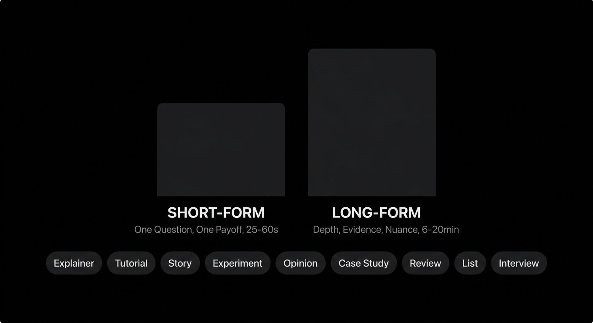
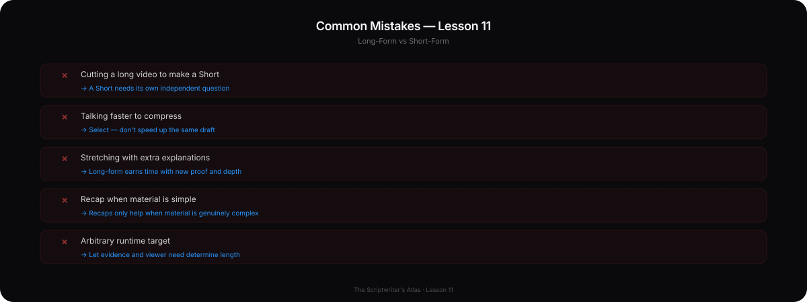

# Phase 8 — Long-Form, Short-Form, and Video Formats

## YOU ARE HERE
You can make a production plan for a beat. Now choose how much time the idea needs and what grammar fits the viewer’s expectations.

## YOU ARE LEARNING
You will design an independent Short, build a long-form progression, and choose among tutorials, explainers, stories, experiments, lists, reviews, essays, and case studies.

## BY THE END
You will create two related but complete scripts: one short piece that stands alone and one longer version that earns its extra time with proof, depth, and nuance.

---

# Lesson 11 — Change the Architecture, Not Just the Runtime

**Estimated voiceover:** 11–13 minutes · **Practice:** 45 minutes

## What You Will Learn

- Explain what changes fundamentally between long-form and short-form writing.
- Compress an idea by protecting one question and one payoff—not by talking faster.
- Expand a Short with new proof, counterexamples, context, and application—not repetition.
- Match structure to format and viewer expectation.
- Time a script from a real read and leave room for demonstrations.

## Core Idea

A Short and a long-form video need different information architecture. The Short makes one complete movement; long-form earns time by developing a larger or changing question.

## Why This Matters

A short clip cut from the middle of a longer video may depend on context the viewer never saw. A long video stretched with extra explanations may create runtime without depth. Format changes what a viewer expects, how much context is possible, and how many questions the script can responsibly answer.

## Deep Explanation

### Short-form: one independent question

A strong Short usually contains a legible first image or question, enough context to understand it, one main demonstration or piece of proof, one change in understanding, and a complete payoff. It does not need to resolve a large topic. It does need to make sense without the longer video.

Compress by selecting. Keep the central question, the proof that answers it, and the final useful thought. Move out the tool history, extra examples, background that is not required, and secondary caveats—unless removing a caveat would mislead. Do not say the same draft twice at double speed.

### Long-form: more than more minutes

Long-form can hold a fuller test, multiple examples, competing explanations, and an application. Its sections should change the question or deepen the answer. A midpoint is not automatically a surprise at half the runtime; it is a genuine turn when new information changes the plan. Use chapter signposts when they help memory. Recaps help only if the material is complex enough to need them.

A rough spoken-word estimate can help schedule: many English narrators fall near 120–160 words a minute in ordinary delivery, but pauses, demonstrations, and personal pace change the actual time. Read and time your own copy. A five-minute target does not justify a five-minute script if the idea is complete in three.

### Format selector

| Format | Core movement | What it needs | Typical failure |
|---|---|---|---|
| Educational explainer | Viewer question → model → example → application | A beginner’s point of confusion | Terms arrive before the example |
| Tutorial | Goal → steps → success check | Repeatable actions and a test | Steps with no reason or result |
| Story | Desire → obstacle → choice → consequence | Real change and meaningful cost | Invented conflict |
| Experiment | Question → method → attempt → result → limits | Actual process and honest outcome | Claiming causation from a loose test |
| Commentary / opinion | Position → context → reasons → counterpoint → boundary | A position the writer owns | Confidence used to hide missing proof |
| Case study | Context → decision → outcome → transfer | A documented example | Treating one case as universal |
| Review | Criteria → trial → trade-offs → recommendation | A clear use case and disclosure | Sponsorship shaping an undisclosed judgment |
| List | Grouped options → contrasts → choice rule | Genuinely distinct options | Near-duplicate items used to hit a number |
| Interview | Open question → follow-up → evidence | Space for an honest answer | Writing the guest’s answer in advance |

### Professional Example — Compressing the Three-Shot Scene

**Long-form question:** can consistent visuals support a readable choice in one scene? The long version may include a reference sheet, failed attempt, corrected continuity, the deeper story problem, revised order, a small comprehension check, and limitations.

**Short’s independent question:** why does this scene still feel broken? Keep the three-shot comparison, the missing cause, one changed shot, and the completed choice. Remove tool comparisons and lengthy process history. The Short is not a trailer; it should give a usable answer even if the viewer never clicks away.

### Before / After

**WEAK COMPRESSION**  
Take an eight-minute script, delete every other sentence, speak twice as fast, and end with “watch the full video for the answer.”

**BETTER COMPRESSION**  
“Same character, three shots. The face matches, but nothing changes between shots two and three. Add one clue that gives the character a reason to act. Now the last shot shows the choice. Continuity is not only the same face; it is a sequence the viewer can follow.”

**WHY**  
The second version preserves a complete question, example, turn, and payoff. It does not require the long version to make sense.

## Common Mistakes

- Treating a 60-second cut as a Short simply because it is vertical.
- Treating “shorter” as “faster delivery.”
- Cutting context that is necessary to understand a claim.
- Making every Short an advertisement for the long-form version.
- Expanding a short idea by repeating definitions or adding unrelated tips.
- Designing a 30-minute script as six copies of the same 5-minute section.
- Using runtime ranges as platform or algorithm rules.

## How to Apply It

1. State the independent question for each version.
2. Identify the minimum context required for accuracy.
3. Pick one proof and one payoff for the Short.
4. For long-form, add evidence turns, a real counterexample, context, and application.
5. Remove any chapter that does not add a new understanding or useful practice.
6. Read the Short aloud and check first-frame legibility on a phone.
7. Time the long-form script with real demonstrations and pauses.

## Practice Exercise — Expand and Compress

Take one idea. Write a 35–45-second Short with a complete payoff. Then outline an 8–12-minute version by adding a real test, a counterexample, relevant context, and an application. Finally, remove one detail from each. Explain what is lost and whether that loss matters to that version’s promise.

Model reasoning — open after you try

The Short should preserve one independently understandable question, visual or verbal proof, and a complete result. The long version should earn extra time through new evidence or decisions—not by repeating the Short at greater length. A fact that is interesting but not necessary can move to the cut bank. A caveat that changes the claim must remain, even if it makes the Short harder to fit; consider a narrower promise instead.

## Mini Checkpoint

1. What makes a Short self-contained?
2. What is a meaningful midpoint turn?
3. When should a caveat survive compression?
4. What is the difference between information density and comprehension density?
5. When is a list the right choice?

Checkpoint reasoning — reveal after answering

The Short contains enough context, evidence, and payoff to work without the long video. A turn changes the question or plan through new information. Keep a caveat if cutting it would change or mislead the claim. Comprehension density values what a viewer can understand per second, not merely how many words are packed in. A list fits genuinely independent options that viewers need to compare.

## Assignment

Create a 25–60-second independent Short from your capstone material. Write three hooks; choose one and state why. Include captions, first-frame visual, proof, full payoff, and actual read timing. Ask someone to view it without the long video. If they need missing context, rewrite it.

## Takeaway

**Short-form is compression with closure. Long-form is room for additional proof and changed understanding. Neither format earns value from runtime alone.**

### VOICEOVER SCRIPT

Let’s answer a common question: what changes when a script becomes shorter? The easy answer is that it has fewer words. The useful answer is that it has a different job. A Short often has room for one question, one piece of context, one demonstration, and one complete payoff. A long-form video can hold more evidence, competing explanations, and practice. If we simply make the speaker talk faster, we have not adapted the idea.

Imagine an eight-minute video about a three-shot scene. It explains how the character reference was made, shows several failed generations, compares two shot orders, discusses sound, includes a small viewer test, and states the limits of the result. A Short cannot preserve every step. Which elements define the useful idea? Perhaps the face matches, but the scene still feels broken. The second shot fails to change what the character knows. Add one clue, replay the sequence, show the choice. That can become a complete Short.

Notice what we did not do. We did not select the loudest line and attach “watch the full video” to the end. We designed a smaller answer. The viewer can understand the Short without owing us a click. The long-form version may offer depth, not the missing half of the answer.

Compression is a set of decisions. Keep the one question that matters in the short version. Keep the proof that lets viewers inspect the answer. Keep enough context so the result is accurate. Remove background history, optional examples, or secondary processes that do not change this small promise. But do not remove a caveat if doing so would make the claim false. If the caveat will not fit, narrow the claim or choose another idea.

Now expand in the other direction. A Short says, “Add one clue so the character’s choice becomes visible.” What earns an eight-minute version? We might compare two real cuts, show how the clue changes what the character knows, test another interpretation, show why the first fix fails, and give the viewer a scene-planning worksheet. These additions deepen the question. Repeating the same principle in five new phrases does not.

Different formats carry different expectations. A tutorial needs a goal, steps, and a success check. An explainer needs a question, a model, and an example. A story needs change through choice and consequence. An experiment needs an honest method and result, including limits. Commentary needs a position and reasons; it may also need an objection. A list needs options that are genuinely different and a rule for choosing. A review needs criteria and trade-offs, especially when money or sponsorship is involved.

A long masterclass might combine several formats, but each chapter needs a purpose. It can explain, demonstrate, ask the viewer to try, and recap. A 90-minute business video, for example, can have a sequence of local lessons rather than one continuous story. The viewer needs signposts and clear modules. Do not imitate the authority or personal claims of the source creator; borrow the navigation idea only if it suits your material.

How much can fit in a minute? A rough planning range for spoken English is about 120 to 160 words a minute. But this is not a platform rule. Your own pace, pauses, graphics, demonstrations, and scene holds all matter. Record the script. A 45-second Short that requires 190 words may be too dense, even if you can read it on time. The question is whether the viewer can understand, not whether you can race through it.

Let's compare an incomplete cut and a complete one. Incomplete: “Same face, three shots—watch the full video to find out what’s wrong.” The question opens, but the Short offers no answer. Complete: “Same character, three shots. The face matches, but nothing changes between shots two and three. Add one clue that gives the character a reason to act. Now the last shot shows the choice.” The viewer receives a principle and demonstration. The complete version may still invite them to a longer explanation, but it does not hold the useful point hostage.

Now do the exercise. Write one Short with its own question, proof, and ending. Then outline the longer version by adding evidence turns, a real counterexample, context, and application. Ask what the Short cannot responsibly include and what the long version genuinely adds. Remove one detail from each and explain the trade-off.

A first-frame image matters because the viewer may encounter the video without sound. Make the basic problem legible on a phone. Captions should be readable. If the viewer listens without looking, essential changes still need clear narration. The channels can complement each other, but the central thought should not disappear when one channel is unavailable.

Do not worship runtime. A five-minute video can be complete; a twenty-minute video can be shallow. Ask what the viewer needs to know, what evidence the idea requires, and how much time that evidence honestly takes. If the answer is short, keep it short. If a longer investigation is needed, earn every module.

One important question is what to do when the nuance does not fit. Do not speed up until the words barely register, and do not quietly delete the condition that keeps your claim honest. You have three options: narrow the Short’s claim, choose a different idea that can be complete at this length, or keep the idea in long-form. “A short video cannot say everything” is not permission to leave out the one fact that changes the recommendation.

Imagine the long version has three results: one clear improvement, one mixed result, and one failure. A Short that shows only the improvement may create the impression that the method always works. A responsible Short can focus on the one improvement and name the condition: “This fixed the eyeline in this scene; it did not fix the unclear motivation.” That is still concise, and it points to a real boundary.

For the longer version, do not add sections just because there is room. Add something that changes what the audience can conclude: an additional test, a competing explanation, a different example, or the application. If all that changes is the amount of background, the video may not need more runtime. A chapter earns its place when the viewer can say what they know now that they did not know before.

Your assignment is to make the Short from your capstone and show it to someone without the long video. Ask what they think the Short promised, what they learned, and what remains unclear. If they need the long video just to understand the example, revise the context. If the Short teaches the full point and the long video offers deeper proof, the formats are doing different jobs.

Carry this principle forward: a short script is not a long script with missing paragraphs. It is a new architecture built around one complete movement. Long-form earns its duration by adding meaningful evidence, not by extending the sentence count.

---

## MASTERED

- Your Short can be understood and used without the long-form video.
- Your long-form outline adds new proof, choices, counterevidence, or application.
- You can choose a format and name its promise, success test, and likely risk.

## NEXT

Phase 9 combines the skills so far in a repeatable production pipeline: idea → brief → research → outline → draft → revision → final script.
