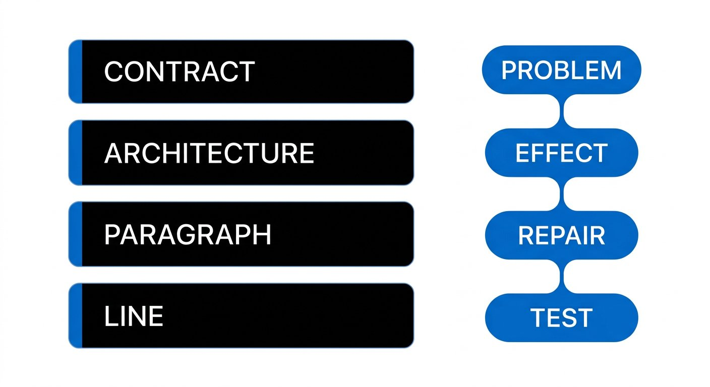
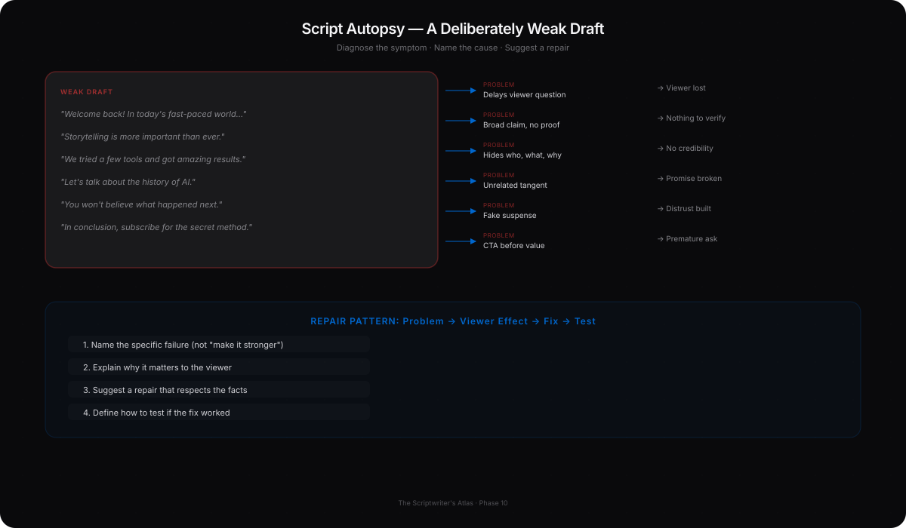
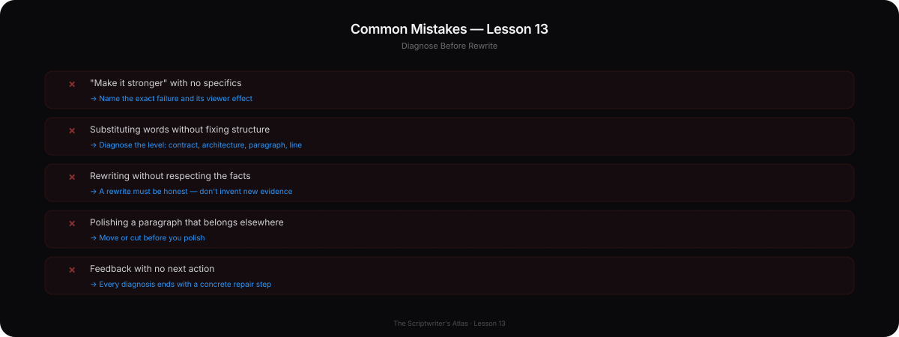
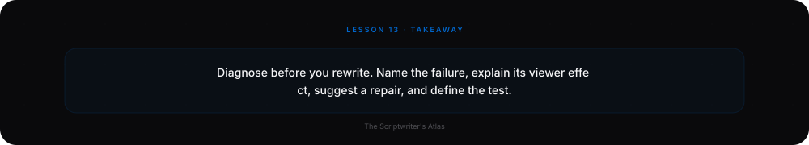
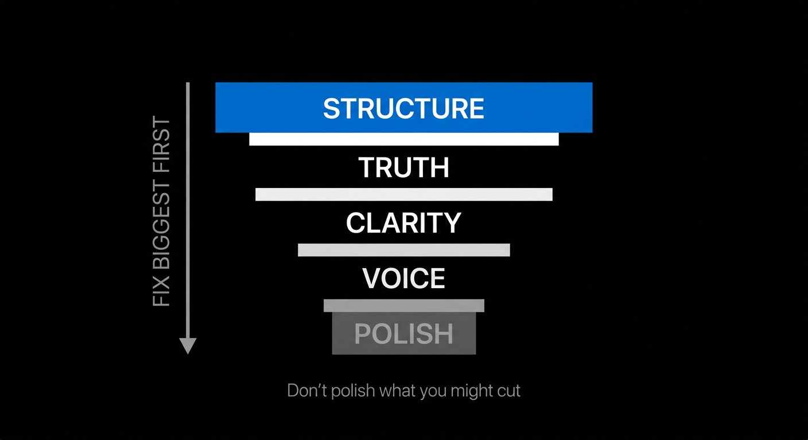
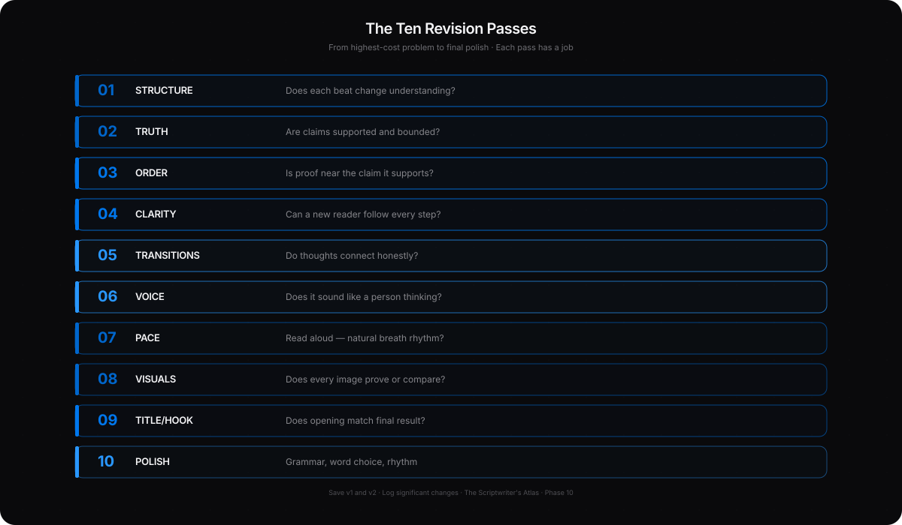
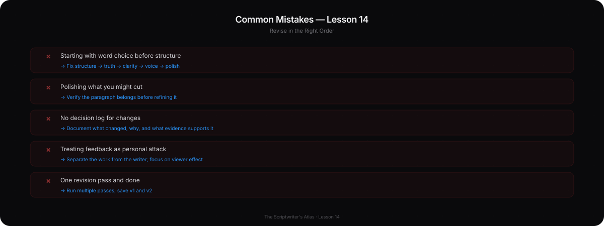
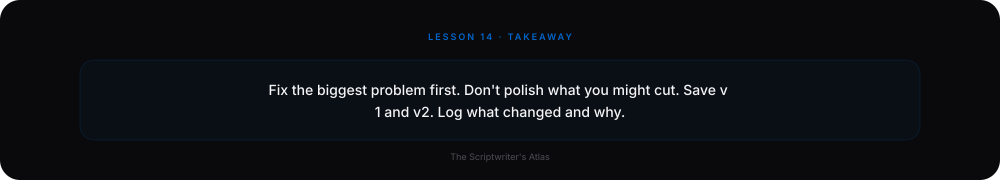

# Phase 10 — Script Autopsy and Systematic Revision

## YOU ARE HERE
You have a complete draft and a workflow. Now you need to see what is weak without relying on “I like it” or “it feels off”—and repair the real cause rather than decorating the symptom.

## YOU ARE LEARNING
You will diagnose a script at sentence, paragraph, beat, and whole-video level. Then you will revise from the highest-cost problem to final polish, using a reader test, a scorecard, and a decision log.

## BY THE END
You will produce a documented revision from one draft to a stronger one, explain what changed and why, and identify the next evidence or production test.

---

# Lesson 13 — Diagnose a Weak Script Before You Rewrite It

**Estimated voiceover:** 11–13 minutes · **Practice:** 30 minutes

## What You Will Learn

- Diagnose weak openings, promises, structure, transitions, proof, pacing, endings, and generic language.
- Separate the symptom from its cause.
- Use **problem → viewer effect → repair → test** instead of vague criticism.
- Rewrite a line without inventing history or evidence.
- Give feedback as **Needs Work / Developing / Strong / Professional** with a next action.

## Core Idea

A rewrite is useful when it repairs the viewer’s problem and respects the facts—not when it merely sounds more polished.

## Why This Matters

“Make it stronger” does not tell a writer what to change. A good diagnosis points to the exact failure, explains its effect, and suggests a repair that can be checked.

## Deep Explanation

Work at four levels:

1. **Contract:** Is the audience clear? Does the opening promise a useful answer? Does the title/thumbnail fit the finished video?
2. **Architecture:** Does each beat change understanding? Is evidence in the right order? Does the ending close the question?
3. **Paragraph and transition:** Does each thought follow from the last? Does the transition show a cause, contrast, or genuine next question?
4. **Line and performance:** Is the sentence specific, supported, natural to say, and worth the listener’s time?

Use the diagnostic chain:

- **What is wrong?** “The opening names a topic but not a viewer problem.”
- **Why does it matter?** “A new viewer cannot tell what the video will solve.”
- **How will I fix it?** “Show the draft where the first useful example arrives late.”
- **How will I test it?** “Ask an unfamiliar reader what the video promises after 20 seconds.”

A line can be technically clear but still be unnecessary. A transition can be fluent but still jump to a new topic with no relationship. A hook can be exciting but unsupported. A sentence can sound generic because it has no specific evidence or judgment. Diagnose before substituting words.

### Autopsy — A Deliberately Weak Draft

> “Welcome back! In today’s fast-paced world, storytelling is more important than ever. We tried a few tools and got amazing results. But first, let’s talk about the history of AI. There are many important things to consider. You won’t believe what happened next. In conclusion, good storytelling creates meaningful engagement. Subscribe for the secret method.”

**Diagnosis:**

- “Welcome back” and “fast-paced world” delay the viewer’s question.
- “Storytelling is more important than ever” is a broad claim with no proof.
- “We tried a few tools” hides who did what and why the comparison matters.
- “Amazing results” is a judgment without observable evidence.
- The history paragraph has no clear link to the promise.
- “You won’t believe” creates fake suspense but names no real question.
- The conclusion repeats a generic claim instead of answering the opening.
- “Subscribe for the secret” withholds the useful part and makes the CTA a toll gate.

**Possible repair, if the footage supports it:**

> “These three shots look consistent. The character’s choice still isn’t clear. Watch the second shot: nothing changes before the final action. I’ll show one way to make the choice visible, then test what the new order does—and what it still cannot prove.”

The rewrite narrows the question, points to evidence, and makes a bounded promise. If there is no footage, call it a demonstration or choose a different opening.

### Before / After — Transition

**WEAK**  
“Now let’s talk about sound.”

**BETTER**  
“The image finally read clearly, but the last pause felt rushed. When I muted the music, I could see the cut—not hear a dramatic cue telling me what to think.”

**WHY**  
The improved line connects the next topic to a specific problem. Use it only when the cut and sound test exist; otherwise write the transition your material supports.

## Common Mistakes

- Rewriting an entire page when one missing piece of evidence caused the problem.
- Treating every weakness as a word-choice problem.
- Replacing a generic claim with an invented first-person anecdote.
- Cutting a necessary caveat because it interrupts a clean sentence.
- Calling something “boring” without identifying what the viewer learns—or fails to learn.
- Scoring a script without writing any evidence or next action.
- Polishing a line before deciding whether its beat belongs.

## How to Apply It

For each weak area, write one line in this format:

> **Problem:** ___. **Viewer effect:** ___. **Repair:** ___. **Test:** ___.

Check the whole script first, then the beat, paragraph, and line. Mark claims needing support. Identify repetition by meaning, not only by repeated words. Keep a cut bank for good material that belongs elsewhere.

## Practice Exercise — Autopsy Before Rewrite

Diagnose the weak sample in the deep-explanation section. Find at least six different problems. For each one, name the viewer effect and repair. Only after the diagnosis, write a 20–30-second opening that promises one answer and shows one proof.

**Do not open the model diagnosis until your notes are complete.**

One possible opening — reveal after your attempt

“Same character, three shots. The coat matches, but the final action still feels unmotivated. Watch the middle shot. I’ll show what information is missing, then rebuild the sequence so you can test the choice.”

This is only valid if the footage shows those facts. A demonstration must be labeled. The strong part is not the exact wording; it is the visible problem, bounded promise, and named method.

## Mini Checkpoint

1. What is the difference between a symptom and a diagnosis?
2. Why does replacing “amazing” with “powerful” not fix unsupported writing?
3. What should a transition explain?
4. Why is a broad disclaimer not a substitute for careful claims throughout?
5. When is a good line still cuttable?

Checkpoint reasoning — reveal after answering

A symptom is what feels wrong; diagnosis identifies the specific cause and effect. A synonym does not add evidence or scope. A transition should reveal a real relation or next question. A disclaimer cannot undo a misleading main claim. A good line can be irrelevant to the promise or duplicate another beat.

## Assignment

Take a 250–500-word draft and mark each weakness in the four-part format. Ask one unfamiliar reader to answer: What did the video promise? Where were you confused? Which claim needed proof? What can you do or understand now? Keep their words; do not argue with them. Choose the two most important repairs for Lesson 14.

## Takeaway

**Useful feedback names the fault, the viewer effect, the repair, and how you will test it.**

### VOICEOVER SCRIPT

Let’s look at the moment when a draft feels wrong and you cannot say why. A new writer may rewrite the whole paragraph, add stronger adjectives, and end up with a more polished version of the same problem. We need a better method: diagnose before we operate.

Start with the contract. Who is this for? What does the opening promise? Does the title match the evidence? If the video promises one problem and the body spends five minutes on something else, the issue is not a sentence. It is the contract.

Then inspect architecture. What changes in each beat? Is the evidence where the viewer needs it? Does the ending answer the first question? After that, inspect paragraphs and transitions. Does one idea follow from the previous one? Finally, inspect individual lines: are they clear, supported, speakable, and necessary?

Let’s autopsy the weak sample. It begins, “Welcome back, in today’s fast-paced world, storytelling is more important than ever.” We have three lines of ceremony before we know what problem the video solves. The phrase “more important than ever” makes a broad claim without telling us what changed. Then we hear “we tried a few tools and got amazing results.” Which tools? What was tested? What does “amazing” mean? The sentence has a first-person plural but no evidence.

Then the draft changes to the history of AI. Perhaps history belongs in the video, but the line does not tell us why the history comes now. Later it says “you won’t believe what happened next”—a promise of surprise without a meaningful question. Finally, the video concludes that good storytelling creates engagement and tells the viewer to subscribe for a secret. The opening never asked a question, the ending does not answer one, and the CTA hides the useful information.

Notice that we have several different failures. Weak opening. Unclear promise. Unsupported result. Unnecessary background. Generic transition. Repetition. Fake curiosity. Weak ending. The repair is not to replace “amazing” with “powerful” and “important” with “essential.” That merely changes the vocabulary.

A better diagnostic sentence is: “The opening names a topic but not a viewer problem. A new viewer cannot tell what the video will solve. Show the draft where the example arrives late. Then ask an unfamiliar reader what the video promises after twenty seconds.” That gives us a problem, a viewer effect, a repair, and a test.

Now try rewriting the opening with the actual evidence. If you have three real shots, you might say: “These three shots look consistent. The character’s choice still isn’t clear. Watch the second shot.” If you do not have the footage yet, do not write that as a true first-person experience. Label it as a demonstration or choose an opening you can support now.

The weak sample also helps us diagnose transitions. “Now let’s talk about sound” tells us the topic changed, but not why. A causal transition might be: “The image finally read clearly, but the last pause felt rushed.” Now sound follows from a problem. We understand why the section belongs. Again, this line is valid only if the writer has a real edit and can demonstrate the timing.

What about generic language? Look for vague words, excessive abstraction, claims with confidence but no source, repeated balanced slogans, predictable transitions, and a tone that feels artificially enthusiastic. But none of those patterns proves how the text was written. The practical question is: does the script have any specific thought the writer can defend? Replace the generic claim with an observation, source, example, or honest uncertainty.

There are more failure modes to check. Poor pacing may come from too many new ideas at once. A weak ending may summarize topics instead of answering the opening. Unnecessary information may be genuinely interesting but irrelevant. Unclear audience may show up as an unexplained term or an overlong basic definition. A missing proof may be hidden by a beautiful image that proves nothing.

When you give feedback, avoid “it’s boring,” “make it punchier,” or “this line is weird.” Those reactions may be true, but they are not yet actionable. Ask what the viewer knows before and after. Name the moment of confusion. Suggest a repair that can be tested. Keep opinion separate from evidence: “I lost the argument at this point” is a useful report; “everyone will stop watching here” is an unsupported generalization.

The source Atlas’s autopsy examples use a ladder: weak, better, and excellent if evidence exists. “The process became more efficient” is vague. “The second draft took less time to edit” is clearer but still needs a measurement if you state it as fact. “I used four pickups instead of eleven” is specific only if those counts are real. Precision is not automatically truth. It is an obligation to verify.

Here is another diagnosis. The script says, “The thumbnail change made the video successful.” We may see a new thumbnail and a rise in views. The symptom is a causal claim. The viewer effect is that they may believe a design element guarantees performance. The repair is to report what changed in the data and name other variables, or to run a comparison strong enough to support the cause. The test is not simply to ask whether the sentence sounds more cautious; it is to check whether the source supports the new wording.

Now compare “The visual is boring” with “I do not know what the viewer should notice in the first five seconds.” The first is a preference. The second suggests a job the opening may be missing. Ask what evidence the viewer should notice, what question it raises, and whether the image makes the question legible. A specific observation gives the writer a repair path. A generic judgment often sends them toward random effects.

Now do the exercise. Find six different weaknesses in the sample. Do not rewrite yet. Name the problem, explain the viewer effect, propose a repair, and choose a test. Only then write an opening. This sequence protects you from polishing the first sentence while the whole video is broken.

Ask a reader four questions: What did you think the video promised? Where did you stop understanding? Which claim needs proof? What could you do after watching? “Did you like it?” usually returns a taste judgment. We need diagnostic feedback.

Carry this into your next draft: a good rewrite solves the cause, not the symptom. It respects the facts, helps the audience, and gives you a way to know whether the change worked.

---

# Lesson 14 — Revise in the Right Order and Learn from Feedback

**Estimated voiceover:** 11–13 minutes · **Practice:** 45 minutes

## What You Will Learn

- Revise from high-cost decisions to final polish.
- Use a ten-pass system without treating it as a one-way machine.
- Apply feedback categories and identify one next action for each.
- Score a script diagnostically rather than treating a total as artistic quality.
- Keep a decision log so revisions have reasons and trade-offs.

## Core Idea

Revision is a sequence of focused inspections. Fix the idea and structure before the sentence-level polish, and revisit an earlier pass whenever new evidence changes the claim.

## Why This Matters

If you perfect a paragraph and later remove the whole section, you spent effort in the wrong place. Separate passes make it easier to see the biggest problem and avoid editing every dimension at once.

## Deep Explanation — The Ten Passes

| Pass | Inspect | Ask / repair | Stop when… |
|---|---|---|---|
| **1. Idea and promise** | Audience, question, title/thumbnail contract | Is this the right idea for this viewer? Narrow or redefine it | Promise and scope are clear |
| **2. Structure** | Order, cause, missing turn, ending | Does the answer fulfill the opening? Move, add, or remove beats | Causal/learning path holds |
| **3. Clarity** | Terms, pronouns, logic, context | Can a new viewer restate the point? Add the minimum explanation/example | No major logical leap remains |
| **4. Value and retention** | Early usefulness, progress, loops | What can the viewer use before the end? Close empty loops | Every module adds a change |
| **5. Proof and truth** | Facts, sources, claims, alternatives | What is observed, inferred, or unknown? Verify or qualify | Important claims match their evidence |
| **6. Language and voice** | Vague phrases, cliches, abstractions | Replace with a specific action or example; keep owned judgment | The lines are precise and sound like you |
| **7. Spoken flow** | Breath, grammar, pronunciation, cadence | Read aloud; split or recast the lines that stumble | The recording copy is naturally speakable |
| **8. Repetition, emotion, and pace** | Duplicated ideas, false stakes, density | Cut restatement; give a real choice room; compress routine | The listener can follow without drag |
| **9. Visuals and production** | Proof shots, B-roll, sound, rights | What demonstrates the claim? Add [SHOOT], source, or permission | The editor can build the intended sequence |
| **10. Final polish** | Names, numbers, captions, CTA, files | Confirm title fit, spelling, disclosure, versions, delivery | No open production or verification task is hidden |

The order is useful, not absolute. A failed fact-check in Pass 5 may require a new idea or outline. Go back. The passes are separate questions, not locked doors.

### Professional Scorecard — Diagnostic, Not a Magic Total

Rate each dimension **0 absent / 1 fragile / 2 workable / 3 strong / 4 excellent**. For every rating, cite one example and one next action. Do not add the scores and pretend the sum measures artistic worth.

Evaluate: **Idea; Audience; Promise/Hook; Structure; Story/change; Clarity; Proof; Pacing; Voice; Visual/audio thinking; Payoff/ending; Production readiness.** Use the course feedback labels:

- **Needs Work:** the viewer cannot yet follow or trust this part. Name the missing decision or proof.
- **Developing:** the intention is visible, but a key example, transition, limit, or test is still weak.
- **Strong:** the part works for the stated viewer and has evidence; note the next refinement or boundary.
- **Professional:** the decision is precise, defensible, producible, and suited to this project; name why it works so the learner can repeat the judgment.

Every note should say **what is wrong → why it matters → how to fix it**. A score without reasoning is not feedback.

### Before / After — Decision Log

**UNHELPFUL NOTE**  
“The intro feels better now.”

**USEFUL LOG**  
“Moved the first failed cut to 0:06 so the question becomes visible sooner. Trade-off: less context about the tool. Test: ask a new viewer what problem the video will solve after the first 20 seconds.”

## Common Mistakes

- Running all ten passes at once and changing words without knowing the goal.
- Editing the spoken rhythm before the argument is stable.
- Adding a caveat at the end rather than repairing an overclaim at its source.
- Taking a score as a verdict or treating a high average as a publishing guarantee.
- Accepting vague praise or harsh criticism without asking for an example.
- Making revisions but keeping no record of what they changed or cost.
- Using post-publication analytics alone to claim that one line caused an outcome.

## How to Apply It

1. Save the draft as v1.
2. Choose the two highest-impact diagnoses from Lesson 13.
3. Run one pass at a time; do not beautify a section likely to move.
4. Log **changed / reason / evidence / trade-off / next check**.
5. Read aloud and time the new version.
6. Ask one unfamiliar viewer specific questions.
7. Run the scorecard; choose the next action, not the largest total.
8. Save v2 and note what remains unknown.

## Practice Exercise — Two Revisions, One Decision Log

Take your 250–500-word script. First revise the structure without polishing the words. Then revise one weak sentence for clarity and voice. For each change, record reason, evidence, trade-off, and next check. Have a reader review v2 using four questions: promise, confusion, proof, useful outcome.

Review example — open after your revision

“Moved the example before the definition” is a change. “Because the reader could not picture the problem from the term alone” is the reason. “In v1, the reader asked what the term meant” is evidence. “The opening is five seconds longer” is the trade-off. “Time a read with one beginner” is the next check. A good log makes revision visible and testable.

## Mini Checkpoint

1. Why is structure usually inspected before word choice?
2. When should you return to an earlier pass?
3. Why is a total score not enough to judge a script?
4. What makes a feedback comment actionable?
5. What three columns help interpret post-publication results responsibly?

Checkpoint reasoning — reveal after answering

A structural change may remove or move a polished paragraph. Return when new evidence, a reader test, or production reality changes the premise. Scores need examples and next actions; their total is not artistic worth or guaranteed performance. Feedback is actionable when it names the issue, audience effect, repair, and test. Compare predicted, observed, and cannot infer.

## Assignment

Submit v1, v2, a completed ten-pass checklist, two to four scorecard notes, your change log, and the reader’s exact responses. Explain the two revisions that mattered most. Keep one decision you deliberately did **not** make and state why.

## Takeaway

**Revise in order, record the reasoning, and treat feedback as evidence to interpret—not a command to obey.**

### VOICEOVER SCRIPT

Let’s talk about revision as a professional skill. The common advice is “edit your script.” That is not enough. What do you inspect? In what order? How do you know whether a change helped? We will use ten passes to focus the work.

The first pass is idea and promise. Is this still the right question for this viewer? Does the title ask the same thing as the script? If the promise is too broad, narrow it now. The second pass is structure. Does the order work? Is a cause missing? Does the ending fulfill the opening? If a paragraph will move, do not polish it yet.

The third pass is clarity. A new viewer should not have to guess what a pronoun means or how one claim follows the previous one. Add the smallest amount of context that makes the idea clear. The fourth pass is value and retention. What does the viewer learn or do before the final minute? Does every module add a new understanding? Close empty loops and move first proof earlier where appropriate.

The fifth pass is proof and truth. Check the claim ledger. Are the numbers current? Does the source support the exact wording? Are you describing an observation as a cause? Is there a credible alternative? A caveat is not a decoration you paste onto the ending. If the claim is too strong, fix it where it appears.

The sixth pass is language and voice. Replace vague phrases with specific thought. Remove cliches, empty adjectives, and borrowed expressions. Keep a personal detail only if it is true and relevant. The seventh pass is spoken flow. Read the script aloud and listen for breath, ambiguous phrasing, tense shifts, and words you would never say naturally.

The eighth pass checks repetition, emotion, and pacing. Repetition can help listeners compare. It can also become restatement. Emotional writing needs honest behavior and consequence, not inflated labels. Compress routine; slow at a meaningful choice. The ninth pass is production. Do we have proof shots? Is the source accessible? Are the rights clear? Does a visual duplicate narration or help explain the cause? The tenth pass is final polish: captions, names, titles, version labels, disclosures, and files.

You may need to go backward. Suppose the fact check shows that the central claim is not supported. You do not keep it and add “results may vary.” You narrow the thesis, return to the outline, and perhaps change the opening. Passes are separate questions, not a conveyor belt.

Now, scorecards. You can rate idea, audience, hook, structure, story, clarity, proof, pacing, voice, visuals, ending, and production readiness from zero to four. But do not add up the numbers and call the result a measure of talent. Use a score to locate the next revision. If visual thinking is a one, cite the missing shot. If voice is a three, identify the owned observation that makes it work. Evidence and next action make the rating useful.

The course uses four feedback levels. Needs Work means the viewer cannot yet follow or trust that part. Developing means the intention is visible but the evidence or transition remains weak. Strong means it works for the stated viewer and can be supported. Professional means the choice is precise, defensible, producible, and suited to this project. These are not labels to shame the writer. They are ways to decide what to practice next.

Let’s compare two revision notes. “The intro feels better now” tells me how the writer feels but not why. A useful note says, “Moved the first failed cut to six seconds so the question becomes visible sooner. The trade-off is less tool context. I will ask a new viewer what problem the video solves after twenty seconds.” We have a change, reason, trade-off, and test.

A decision log is one of the best tools for learning from your own edits. Write what changed, why, what evidence you used, what trade-off it created, and what you will check. Sometimes a line gets clearer but the opening becomes longer. Sometimes a caveat slows down the story but protects the audience from a false conclusion. Naming the trade-off helps you make a conscious choice.

External feedback should be specific. Instead of asking whether someone liked the script, ask: what did you think it promised? Where did you stop understanding? Which claim needs proof? What can you do after watching? Listen without defending your choices. Their misunderstanding is evidence about the draft. It does not automatically mean you must make every change they suggest. Diagnose why they responded that way.

After publication, separate predicted, observed, and cannot infer. You predicted that viewers might misunderstand one example. You observed a drop near that section. You cannot infer from one chart that one sentence caused the drop. The footage, title, audience, delivery, pacing, and many other factors may contribute. Treat analytics as clues for the next test, not final proof of causation.

Before you open the scorecard, make a prediction. Which part of your script do you expect a new viewer to misunderstand? Which part do you believe is already strong? A scorecard can challenge both predictions. Perhaps the opening is clear to you but vague to a first-time reader. Perhaps the section you hoped to cut turns out to be the clearest example. The rubric should help you discover where the draft and your intention diverge.

Do not revise ten dimensions just because ten boxes exist. Choose the highest-cost issue. If a central claim lacks support, that comes before a repeated transition. If the idea is wrong for the viewer, do not polish every sentence. The passes create focus; judgment decides what to work on first.

When you run the spoken pass, record actual time and note where you breathe. When you run the visual pass, count only shots you can really obtain. When you run the truth pass, keep a copy of any source that may change. A revision system becomes useful when it leaves the desk and changes how you work with facts, performance, and production.

For the exercise, save v1, revise structure first, then repair one sentence. Record the reason and the trade-off. Ask a reader the four questions and keep their exact words. Then choose one revision you will make and one you will not. Explain why. That final decision is important: being open to feedback does not mean surrendering judgment.

A professional writer does not ask only, “Is this better?” They ask, “Better for whom, in what way, based on what evidence, and at what cost?” The ten-pass system helps you answer those questions without trying to fix every problem at once.

Carry this forward: revision is not polishing. It is decision-making made visible. Work from the highest-cost problem to the smallest, and be ready to go back when truth or production changes the script.

---

## MASTERED

- You can diagnose a failure at the right level and propose a checkable repair.
- You have v1/v2, a ten-pass review, a reader test, and a decision log.
- You can explain what remains uncertain and which feedback you accepted or declined.

## NEXT

Phase 11 moves into advanced craft: choose the lens, control emphasis, use restraint, and persuade without cornering the viewer.
