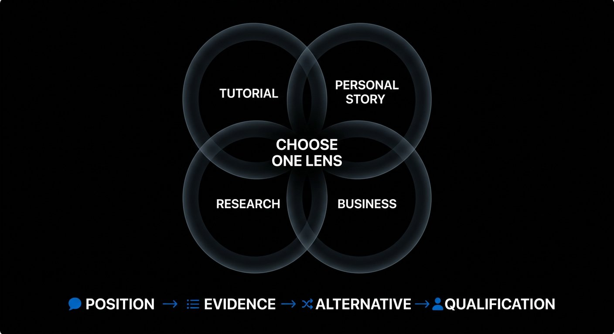
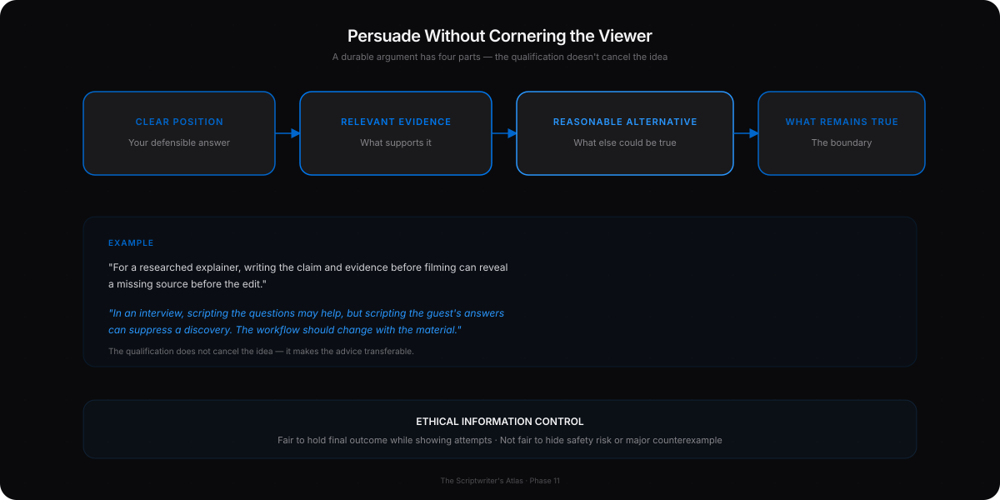
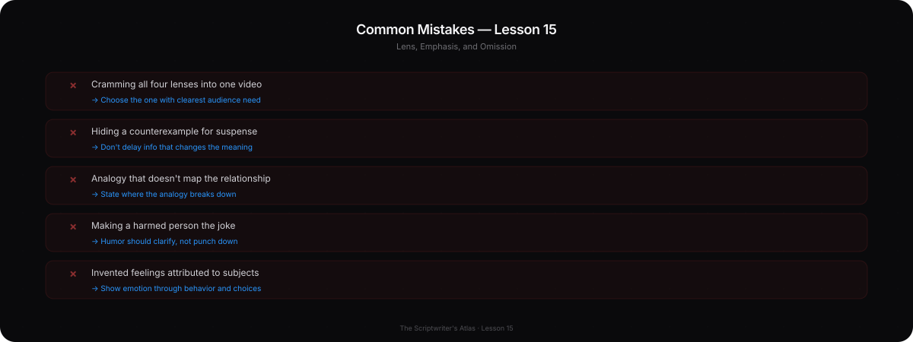

# Phase 11 — Advanced Craft

## YOU ARE HERE
You can make and revise a complete script. Now the challenge is not to add more techniques. It is to choose the right lens, evidence, emphasis, and restraint for the moment.

## YOU ARE LEARNING
You will shape perspective, make a claim that survives informed resistance, control information ethically, use analogy and humor with purpose, and reveal emotion through meaningful action rather than unsupported labels.

## BY THE END
You will be able to create different defensible versions from the same verified facts, select one, and explain both its focus and its omissions.

---

# Lesson 15 — Control the Lens, Emphasis, and Omission

**Estimated voiceover:** 12–15 minutes · **Practice:** 35 minutes

## What You Will Learn

- Choose one lens that matches the viewer’s question and available evidence.
- Persuade through a scoped claim, relevant evidence, a fair alternative, and a qualified conclusion.
- Control reveal order without withholding information that changes the meaning.
- Use example, analogy, metaphor, humor, silence, and repetition only when they clarify the beat.
- Show emotional progression through behavior and choices while avoiding invented feelings.

## Core Idea

Advanced craft is purposeful control. Every inclusion, omission, reveal, pause, and emphasis changes what the audience believes next.

## Why This Matters

A video can be factually accurate in every sentence and still lead viewers toward a distorted conclusion through order, emphasis, or omission. Sophistication is not “more layers.” It is choosing the right layer and making its boundaries visible.

## Deep Explanation

### Pick a lens before you pick every fact

One event can support several honest videos:

- **Tutorial lens:** what information does the shot communicate, and how can a viewer repair it?
- **Personal-story lens:** what did it cost to remove a favorite image, and what choice followed?
- **Research lens:** how do different viewers interpret the shot with and without a clue?
- **Business lens:** what do reshoots, deliverables, and constraints mean for the production?

The facts can remain the same while the question changes. Each lens needs different evidence and omits different details. Do not cram all four into a small promise. Choose the one with the clearest audience need and strongest support.

### Persuade without cornering the viewer

A durable argument has four parts: **clear position → relevant evidence → reasonable alternative → what remains true**. For example: “For a researched explainer, writing the claim and evidence before filming can reveal a missing source before the edit. In an interview, scripting the questions may help, but scripting the guest’s answers can suppress a discovery. The workflow should change with the material.” The qualification does not cancel the idea; it makes the advice transferable.

### Control information ethically

Ask of every fact: what does the viewer need before this? What can wait until a real question exists? What must not be delayed because the missing context would change the meaning? It is fair to hold the final outcome of a story while showing intermediate attempts. It is not fair to hide a safety risk, financial caveat, or major counterexample only to manufacture suspense.

### Use devices only when they clarify

- An **example** is an instance the viewer can inspect.
- An **analogy** maps a relationship to a familiar one; also state where the analogy breaks.
- A **metaphor** gives a sensory frame; keep it only if it sharpens a real choice.
- **Humor** can release pressure or expose the writer’s own blind spot. Do not make a harmed person the joke, especially before a serious consequence.
- **Silence** can let evidence land. It is not automatically deep.
- **Repetition** can help a listener compare a changed meaning. It becomes filler when nothing changes.

### Professional Example — The Same Event, Four Scripts

The event: a creator deletes a beautiful shot because the sequence becomes hard to follow.

- **Tutorial:** show the confusing cut, point to the direction mismatch, and give a test.
- **Personal story:** show the attachment to the shot and the moment the creator decides clarity matters more.
- **Research:** ask a small group what they infer with the shot in and out; report the limited result honestly.
- **Business case:** show the cost of a pickup and what the change does to the production schedule.

Each can be valid. None can borrow facts from another lens without checking. If no one was asked, do not write a test result. If no production cost was recorded, do not invent a number.

### Before / After

**OVERCLAIM**  
“Every creator should write the full script before filming.”

**BETTER**  
“For a researched explainer, drafting the claim and evidence before filming can expose missing support early. For an interview, plan the questions and evidence checkpoints; leave room for the guest’s real answer.”

**WHY**  
The improved advice identifies its use case and boundary. It persuades by surviving a reasonable counterexample, not by pretending one workflow fits every production.

## Common Mistakes

- Treating a strong personal voice as permission to overstate.
- Adding metaphors that sound elegant but do not clarify the decision.
- Hiding a critical caveat until after viewers have formed a misleading impression.
- Assigning a character’s emotion from one gesture as if it were proof.
- Telling the audience what to feel before letting them inspect the evidence.
- Cramming tutorial, essay, personal story, and sales argument into one promise.
- Believing a strong ending must be surprising; a precise answer can be more satisfying.

## How to Apply It

1. Write the verified facts in neutral language.
2. Draft three or four distinct one-sentence promises through different lenses.
3. For each lens, list the proof it requires, the alternative reading, and what it must omit.
4. Reject any version that needs evidence you do not have or a feeling you cannot honestly attribute.
5. Choose the version with the clearest viewer value and cleanest proof path.
6. Order the facts so the audience is not misled by what arrives late.
7. Keep each rhetorical device only if it makes the relevant decision easier to understand.

## Practice Exercise — Four Lenses, One Verified Event

Choose a real event you can document. Write a one-sentence promise as a tutorial, story, research/case-study, and production/business video. Under each, list its proof, counterpoint, and omission rule. Cross out the lens that depends on evidence you do not have. Explain why the chosen lens is fairer or more useful.

Model reasoning — open after you attempt it

A lens is not simply a different title. Each one changes what the viewer needs and what the script must show. If the research lens requires a viewer test you never ran, reject it or plan the test. If the personal story depends on a private emotion you cannot substantiate, use observable behavior and qualify what it means. The strongest choice is the one you can support without pretending to know more than you do.

## Mini Checkpoint

1. How can the same event create different honest scripts?
2. What makes an argument more durable than an absolute rule?
3. When is delaying information unfair?
4. How is a metaphor different from an example?
5. What should you do if an attractive lens requires unavailable proof?

Checkpoint reasoning — reveal after answering

A lens selects a different question, evidence, and omission rule. Scope, evidence, and a fair alternative let a claim survive resistance. Delay is unfair when omitted context changes the meaning or risk. An example is a concrete instance; a metaphor maps an idea to another image or relation. Reject the unsupported lens or gather the evidence before writing it as fact.

## Assignment

Prepare a one-page lens memo for your capstone. Include the selected lens, one-sentence thesis, evidence, strongest counterpoint, what you will not cover, and the rhetorical devices you will use sparingly. Have a skeptical reader argue against the thesis. Revise the claim so its strongest defensible version remains.

## Takeaway

**Choose a lens, show the evidence, face the best alternative, and omit only what you can afford to omit without changing the truth.**

### VOICEOVER SCRIPT

At this stage, the temptation is to add more craft. More metaphor, more suspense, more clever structure, more emotional language. Advanced writing usually asks us to choose less and choose more precisely.

Start with lens. A lens is the question through which you select and arrange facts. Imagine a creator deletes a beautiful shot because the sequence becomes hard to follow. We could make a tutorial: what does the shot imply and how do we fix it? We could tell a personal story about being attached to the image. We could run a small viewer test and compare interpretations. We could make a production case about the reshoot cost. The event is one; the scripts are different because the audience need, evidence, and omission rule are different.

This is how you find originality without inventing a story. The lens comes from the question you choose. You may be studying the same broad subject as thousands of people, but you can ask a more precise question and use evidence that belongs to your project. You do not need to claim that no one has ever discussed it before.

Now, persuasion. A strong argument does not force the viewer to agree by speaking more confidently. It states a position, shows relevant evidence, considers a reasonable alternative, and explains what remains true. “Every creator should write the full script before filming” is easy to challenge. A documentary interview may need open questions and room for an unexpected answer. A more durable version says, “For a researched explainer, drafting the claim and evidence before filming can expose a missing source early. For an interview, plan the questions and evidence checkpoints; leave room for the guest’s real answer.” We have a use case and a limit.

A counterpoint is not a decorative disclaimer. It can change the answer. If a thumbnail and title change at the same time, the result cannot isolate the thumbnail. If a small test supports comprehension for two viewers, it does not predict broad audience performance. Put the counterpoint where the viewer needs it to interpret the claim accurately.

Information order carries ethical weight. In a story, you may hold the final outcome while showing the attempts. The viewer understands there is a real test underway. But if you are discussing a safety risk or a financial limitation, hiding it until the end may change what the viewer believes and does. Ask: what must the audience know before the next claim? What can wait until a meaningful question arrives? What would become misleading if I left it out until later?

Then choose your devices. An example is an instance: a specific cut, line, object, or result. An analogy maps a relationship onto something familiar; if the audience thinks the map is literal, explain where it breaks. A metaphor frames an idea in sensory language. It earns its place when it clarifies an actual choice. “A shot list is a map of what the audience must notice, not a shopping list of pretty angles” gives us a functional distinction. A metaphor about rocket-powered treasure maps may sound energetic but explain nothing.

Humor also has a target and a placement. A joke about your own vague shot list may relieve tension after you admit a mistake. A joke about someone harmed by the event you are documenting may destroy trust. Read it aloud and ask: who pays for this joke? Does it sharpen the idea or just show off?

Emotional progression is not the same as naming emotion. “I was devastated” may be true, but if you do not have reason to claim it, choose a visible action or explain that you are describing your own feeling. A hand stopping above an envelope can suggest hesitation. It does not prove exactly what a person felt. The viewer should have enough context to interpret the behavior without pretending the camera can read minds.

Emphasis is limited attention. You can slow down at a consequential choice. You can compress the routine export. You can remove an adjective and let the viewer judge the evidence. Repetition can create a pattern—same face, same jacket, different choice—if the meaning changes. Repeating a slogan in every paragraph uses the same attention without adding a new thought.

Let’s do the four-lens exercise. Write one sentence about the event as a tutorial, a personal story, a research test, and a production case. Now list the proof each one needs. If the research version needs a viewer test you never performed, that version cannot be presented as a completed test. You can plan it. You can write a hypothetical. You cannot invent the results.

What if the most dramatic lens is not the most useful one? Choose the lens that provides a clear benefit to the viewer and has evidence you can obtain. Expert judgment often means rejecting an interesting direction because it would require unsupported claims or dilute the central promise.

One more advanced decision is how much of your reasoning to put on screen. Imagine the audience sees a comparison and reaches a different conclusion than you expected. You can tell them what you felt, but you should also show the evidence and admit that another reading is possible. Persuasion is strongest when the viewer can see the reasoning and still choose to disagree.

Consider the line, “I was devastated when I deleted the shot.” If you are describing your own feeling and know it is true, that may be appropriate. If you are interpreting someone else from a gesture, it overreaches. You could describe what is observable: “The cursor hovered over the shot for a few seconds before I removed it.” Then explain what the choice cost. Behavior gives the audience information; it does not grant us access to another person’s private mind.

The same restraint applies to humor and metaphor. If a joke interrupts a difficult disclosure, move it or remove it. If an analogy uses a familiar process, tell viewers where it stops matching the real system. An elegant metaphor is not a substitute for the evidence. These tools should carry meaning, not hide a gap.

Your capstone memo asks you to name what the video will not cover. That is an important skill. Omission is not always a weakness. A scoped video may be more trustworthy than a broad survey. But the omission must not create a false impression. If an unmentioned exception changes the recommendation, it belongs in the script.

Ask a skeptical reader to challenge your thesis. Do not pick the easiest objection. Find the strongest plausible alternative. Then revise the claim until it states what remains true. A strong script can still have a point of view; it simply does not need to corner the audience or pretend uncertainty has disappeared.

Carry this into the final project: the lens decides which question you answer, the evidence decides how strongly you can answer it, and restraint decides what you do not ask the viewer to believe. Advanced craft is not more decoration. It is control with accountability.

---

## MASTERED

- You can create different scripts from the same verified facts without changing the facts.
- Your claim includes a fair boundary and a reasonable alternative.
- Your order, emphasis, and omissions do not create a misleading impression.

## NEXT

Phase 12 is the capstone. You will build a production-ready long-form script and an independent Short, then assess both with a professional rubric and postmortem.
