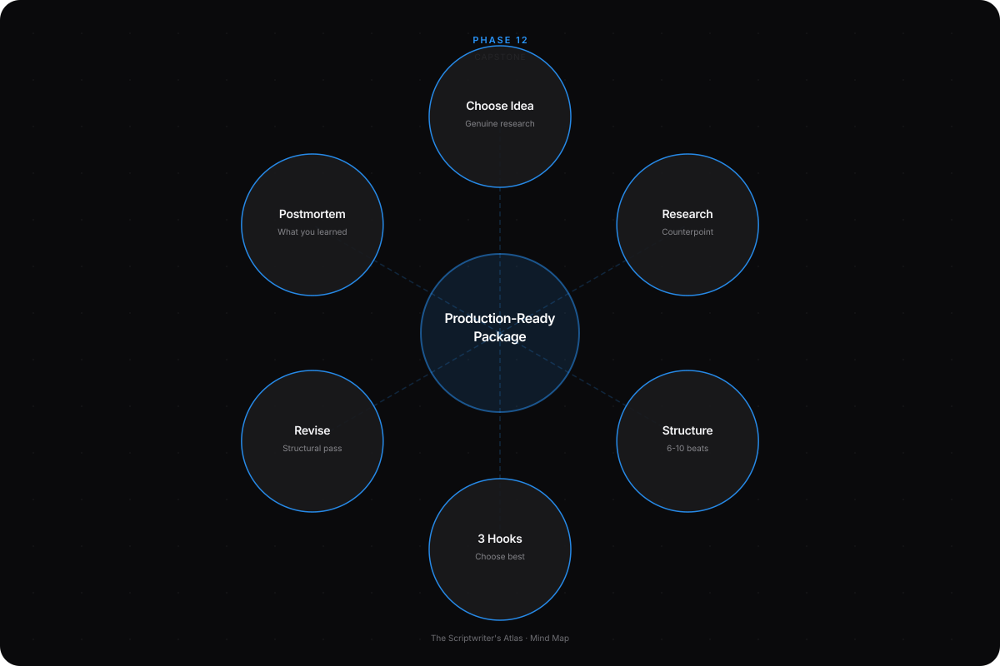
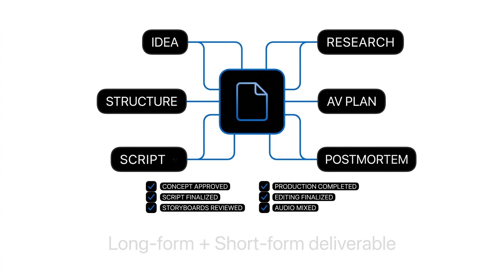
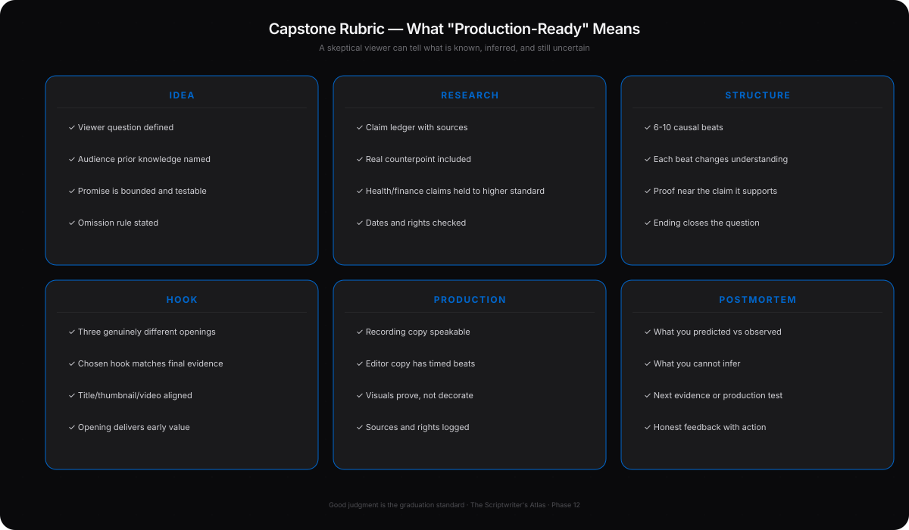
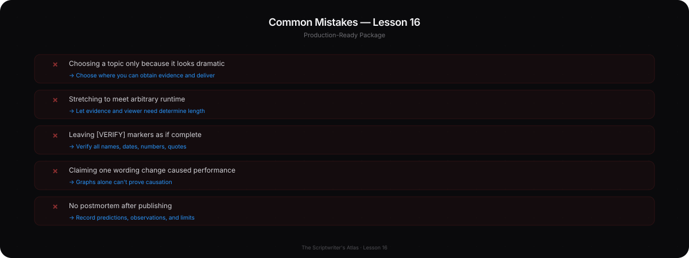
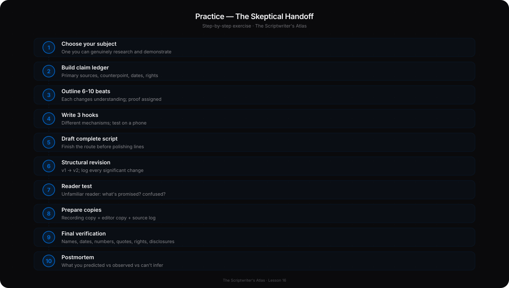

# Phase 12 — Professional Capstone

## YOU ARE HERE
You have practiced each part of the job: idea, audience, research, structure, hook, language, production, revision, and advanced judgment. Now you will combine them independently.

## YOU ARE LEARNING
You will make and defend the full set of professional decisions—from choosing a question to handing off a final script and evaluating what happens after production.

## BY THE END
You will deliver a long-form production package and an independent Short. Another person should be able to produce them without guessing, and a skeptical viewer should be able to tell what is known, inferred, and still uncertain.

---

# Lesson 16 — Build a Production-Ready Script Package

**Estimated voiceover:** 15–20 minutes · **Project time:** 5–8 hours, often spread across several days

## What You Will Learn

- Develop one idea from question to final script without relying mechanically on a template.
- Research the important claims, alternatives, dates, rights, and limitations.
- Build and test the outline before polishing the lines.
- Deliver a long-form script with AV notes, source records, and a clean recording copy.
- Create a self-contained Short from the same material.
- Evaluate the work with evidence, specific feedback, and a responsible postmortem.

## Core Idea

A professional script is not just a polished page. It is a defensible promise, supported by evidence, shaped for a viewer, and clear enough to produce.

## Why This Matters

The goal of this course is not to memorize lessons. The capstone tests whether you can independently choose the right question, make the evidence understandable, revise weak decisions, and hand off work responsibly. A viral result is not the graduation standard. Good judgment is.

## Deep Explanation — The Capstone Brief

Choose a subject you can genuinely research, demonstrate, observe, or produce. It may be an educational video, experiment, tutorial, story, commentary, review, case study, or explainer. Do not choose a story only because it looks dramatic. Choose one where you can obtain the evidence and deliver a useful answer.

### Long-form package: required steps

1. **Choose the idea.** Write the topic, viewer question, audience’s prior knowledge, angle, thesis, and one-sentence promise. Name what the video will not cover.
2. **Define success and its limit.** What would count as fulfilling the promise? What result would make you revise the thesis?
3. **Research.** Build a claim ledger. Use appropriate primary and independent sources; add a real counterpoint. For a personal experiment, log the method, versions, dates, and what actually happened. Use a stronger standard for health, finance, safety, and legal claims.
4. **Select the structure.** Choose 6–10 causal or educational beats. State what the viewer knows before and after each; assign proof and a visual where relevant.
5. **Write three hooks.** Use genuinely different approaches. Choose the one your actual evidence can support. Align title, thumbnail, opening, and ending.
6. **Draft the whole script.** Finish the route before line-polishing. Mark **[VERIFY]**, **[SHOOT]**, **[DEMO]**, rights, and open questions honestly.
7. **Revise structurally.** Run the ten passes. Save v1 and v2. Log significant changes, evidence, and trade-offs.
8. **Test the audience contract.** A reader unfamiliar with the topic explains what the video promised, where they became confused, which claim needs support, and what they can now do or understand.
9. **Prepare production copies.** Create a speakable recording copy and an editor copy with timed beats, visuals, sound, on-screen text, assets, sources, rights, and fact checks.
10. **Finalize.** Verify names, dates, numbers, quotations, current details, permissions, disclosures, title/thumbnail fit, captions, and every claim. Do not leave an unresolved [VERIFY] as if it were complete.
11. **Perform a postmortem.** Record what you predicted, what you observed, and what you cannot infer. If published, do not claim that one wording change caused performance from a graph alone.

The long-form video may be 6, 10, or 20 minutes. Let the evidence and viewer need determine the length. Do not stretch to meet an arbitrary target.

### Short-form package: required steps

Take one useful idea from the long-form work. Write its **independent question**. Choose one example, one proof, one change, and one complete payoff for a 25–60-second script. It must make sense without a click to the long video. Write three hooks, test the first frame on a phone, prepare captions, read it aloud, and record the actual timing. If the Short makes a narrower claim than the long video, keep its needed limits.

### Professional handoff

Submit these artifacts:

- idea card and brief;
- research notes and claim/source ledger;
- counterpoint and scope note;
- hook alternatives and selection reason;
- beat sheet and two outlines if you tested different structures;
- v1, v2, final, and revision log;
- recording copy and timed editor copy;
- visual/audio/shot list, including [SHOOT] items;
- rights, source, disclosure, and verification checklist;
- independent Short, captions, first-frame note, and read timing;
- reader feedback and postmortem.

## Before / After — What “Production-Ready” Means

**NOT READY**  
“Show the result. Add exciting music. I changed everything and viewers loved it.”

**READY FOR A HANDOFF**  
“[PLAY final v2 after v1. Use the same crop and playback length. Remove score during the first comparison. Confirm both versions come from this project. VO: state what is visibly different, then name one remaining limitation. [VERIFY: quote reader responses only with permission.]]”

The second is specific about what the editor needs and does not pretend to know the outcome in advance.

## Capstone Rubric

Rate each domain **Needs Work / Developing / Strong / Professional**. Include a specific example, the effect on the viewer or production, and the next action. Do not reduce the rubric to one total score.

| Domain | Needs Work | Developing | Strong | Professional |
|---|---|---|---|---|
| **Idea** | Topic only; no answerable question | Question exists but scope or evidence path is loose | Specific question with usable evidence | Distinctive, feasible angle; scope and omission rule are deliberate |
| **Audience** | “Everyone”; unknown prior knowledge | Viewer is named but needs are assumed | One viewer’s knowledge/problem shapes explanation | Every major choice respects the viewer without overexplaining or excluding them |
| **Promise / hook** | Unclear or unsupported | Clear category, weak differentiation or late proof | Honest opening with early evidence | Precise contract; visual/title/opening align and first value arrives naturally |
| **Structure / story** | Unrelated list or invented drama | Progression exists but has a weak turn or gap | Beats change understanding; ending follows | Causal or educational architecture is economical, coherent, and suited to the material |
| **Clarity** | Viewer must guess at terms or logic | Mostly understandable with avoidable friction | Claims and relationships are easy to follow | Complex ideas become simple without losing necessary nuance |
| **Proof / truth** | Unsupported claims, unclear sources, or false certainty | Some evidence, scope, or counterpoint missing | Key claims are traceable and bounded | Observation, inference, opinion, and uncertainty are distinguished throughout |
| **Pacing / retention** | Repetition, overload, or empty delay | Some useful movement; uneven density | Progress and payoffs arrive at sensible moments | Rhythm, information density, holds, and loop closures are deliberately controlled |
| **Voice / spoken flow** | Generic, unnatural, or hard to record | Mostly speakable with generic patches | Natural, specific, varied and clear aloud | Recognizable judgment and cadence without borrowed persona or inflated certainty |
| **Visual / audio thinking** | Pictures decorate or contradict the words | Some proof and AV notes; gaps remain | Visuals and sound carry distinct useful information | Every key channel choice serves proof, access, emphasis, or a deliberate viewer experience |
| **Ending / payoff** | Does not answer the opening | Partial answer or weak exit | Pays the promise and names limits | Satisfying, earned closure; optional next step does not withhold value |
| **Production readiness** | Editor must guess; claims/assets untracked | Handoff is usable but has unresolved gaps | Sources, rights, timing, and notes are present | A collaborator can produce it, verify it, and understand constraints without hidden assumptions |
| **Revision judgment** | Changes are cosmetic or unexplained | Some useful revision; weak change record | Changes address diagnosed problems | Decisions are evidence-based, trade-offs are visible, and feedback is interpreted well |

**Graduation standard:** no unresolved high-risk factual or rights issue; no unsupported central claim; the title and ending agree; the Short stands alone; and no domain is “Needs Work.” A “Developing” rating can remain if it is explicitly scoped, safe, and assigned a next action. “Professional” is demonstrated by defensible choices—not by a high view count.

## Common Mistakes

- Choosing a project that is too broad or depends on evidence you cannot obtain.
- Writing the hook as a promise of a result before conducting the test.
- Treating the first successful output as proof of a universal method.
- Submitting only the final version and hiding the reasoning and revision.
- Making the Short a trailer that withholds its answer.
- Calling a script production-ready while [VERIFY], permissions, or missing shots remain open.
- Using views or retention as the only measure of whether the writing worked.

## How to Apply It

Work in stages and keep a dated folder with `brief`, `research`, `outline`, `draft-v1`, `draft-v2`, `recording-copy`, `editor-copy`, and `postmortem`. Ask for feedback at the right moment: a brief reader checks the idea; a new viewer checks clarity; a collaborator checks production notes. Do not ask a viewer to fact-check specialist claims they cannot verify.

## Practice Exercise — The Skeptical Handoff

Before calling the project final, hand the editor copy to someone who has not heard your explanation. Ask them to mark every place where they must guess. Hand the recording copy to a performer—or record it yourself without improvising around the text. Ask a new viewer to summarize the promise and payoff. Repair any gap that changes meaning, truth, or production feasibility.

Final review guide — reveal after you run the handoff

The packet is ready when the performer can deliver the intended thought at a natural pace; the editor can locate each proof asset; the viewer can distinguish what happened from what you infer; each open loop has an answer; the Short makes sense alone; and all factual, rights, and disclosure items are closed or visibly marked as blockers. A polished PDF is not proof that the project is ready.

## Mini Checkpoint

1. What is the difference between a complete long-form script and a complete Short?
2. Which project documents allow an editor to produce without guessing?
3. How should a failed experiment affect the script?
4. What does the postmortem’s “cannot infer” column protect you from?
5. What is the graduation standard if the video receives few views?

Checkpoint reasoning — reveal after answering

A Short answers one independent question with its own context and payoff; long-form can develop more evidence and questions. The editor copy, asset/source/rights log, timing, and AV notes support production. A failed result changes the thesis or conclusion; it must not be rewritten as success. “Cannot infer” prevents causal claims from weak metrics or limited tests. Graduation depends on defensible, accurate, useful, producible writing—not popularity.

## Assignment — Final Deliverable

Complete both packages and submit the full artifact list above. Include a two-minute oral defense or written memo answering:

- Why this viewer and question?
- Why this structure and hook?
- What evidence changed or narrowed the thesis?
- What did you remove, and why?
- What is the strongest limitation?
- What would you test next?

Use the feedback framework from the [workbook](../WORKBOOK.md#9-script-scorecard-and-feedback-rubric). The [worked-script notes](../WORKED-SCRIPTS.md) are available as models, not recipes.

## Takeaway

**A professional writer can show the work, explain the choices, and tell the truth about what the work does not yet prove.**

### VOICEOVER SCRIPT

Welcome to your capstone. This is where the course stops giving you the next sentence and asks you to make the decisions. You are not being tested on whether you remember every term. You are being tested on whether you can build a promise, support it, write it clearly, revise it, and hand it to someone else responsibly.

Choose a topic you can actually research or produce. A small real project is better than a giant idea that depends on footage you do not have. It could be a tutorial, a story, an experiment, a review, an explainer, a case study, or a commentary video. Start by writing the viewer’s question. If the question is “everything about creativity,” narrow it. If the evidence is one small test, choose a promise the test can support.

Now define the audience and desired change. What does this person already know? What should become easier after watching? The answer might be a practical action, a clearer distinction, or a better question. Do not promise a life transformation if the video teaches one editing decision. A bounded promise is easier to fulfill and easier for a viewer to trust.

Research comes next. Make a ledger for every key claim. Name the source, date, exact support, limitation, and planned script line. Add a reasonable alternative. If the topic is health, money, law, safety, or another high-stakes area, use a stronger verification standard. Verify the latest facts and rules. Do not treat a creator’s opinion or an old number as current advice. If you do not have the evidence, narrow the script or mark the issue as a blocker.

Write the thesis after you have looked at the evidence. It can change. Ask what would make you change your mind. That question is not a trick; it prevents the project from becoming a search for support for a conclusion you made too early. State what the video will not cover. Omission is useful when it protects the promise. It becomes misleading when it hides an exception that changes the meaning.

Now choose a structure. Make six to ten beats. Do not write only topic labels. Write what changes: the viewer sees a problem, learns the test, watches an attempt, notices a complication, compares a revision, and hears the limits. For each beat, write what the viewer knows before and after, what evidence appears, and why the next beat follows. If two neighboring beats do the same job, combine or remove one.

Write three hooks. Try a direct promise, a scene or demonstration, and a question or contradiction. Choose the one you can actually show. Check the title and thumbnail against the final thesis. A hook written before the research is a draft, not a binding contract. After you know the result, return to it and make sure the wording still fits.

Draft the whole piece. Leave the line-level polish for later. Use [VERIFY], [SHOOT], and [DEMO] marks. If the video includes a test that has not happened, write it as a production plan—not a past-tense confession. Your first draft is an object to think with, not a public statement.

Revise in order. First check the promise and idea. Then structure and clarity. Ask whether the first proof arrives in time and the end pays the opening. Verify every claim. Read aloud. Remove repeated ideas. Give the editor real proof and source notes. Save v1 and v2, and log the meaningful changes. If a fact changes the thesis, go back to the outline. Do not preserve a dramatic hook at the cost of truth.

Now prepare the recording copy and editor copy. The performer needs the spoken words, pauses, and pronunciation. The editor needs shot IDs, sources, rights, visual proof, on-screen text, sound, timing, and open tasks. A production-ready script is clear enough to build without guessing. It still leaves room for creative collaboration.

Create an independent Short from one useful part of the long-form project. Do not pull a random loud line from the timeline. State the Short’s question. Give it its own context, one proof, and a full payoff. View it without the long video. If the viewer must click somewhere else to receive the answer, rewrite it.

Test the long form with a reader. Ask what they think it promises, where they get confused, which claim needs evidence, and what they understand at the end. Test the Short with someone who has not seen the full project. Keep the feedback in their words. Then decide what to change. Feedback is evidence, not an order. You still choose the revision and explain why.

After production, compare predicted, observed, and cannot infer. You may predict that the first example is confusing. You may observe that a few people asked what the character was holding. You cannot conclude from that alone that one line caused a retention drop. The visual, title, audience, performance, platform, and many other factors interact. Use what you observed to choose a next test.

Let’s make the oral defense concrete. You might say, “I chose a tutorial structure because the viewer needs a repeatable test. I rejected the story version because my footage did not contain a real decision. I moved the example earlier after a reader could not explain the opening. The result shows what happened in one scene; it does not show what will work in every scene.” That answer demonstrates craft because it links format, evidence, revision, and scope.

Now imagine your experiment fails. You do not need to throw away the capstone. Ask what the failure reveals. Was the question too broad? Did the visual test not isolate the change? Did viewers misunderstand the instruction? Did the result show an exception? Record what happened, then decide whether the conclusion should narrow or whether you need a different next test. The professional standard is not a preselected success. It is a defensible explanation of the result.

The capstone rubric is not a popularity scoreboard. It asks whether the idea is specific, the viewer is understood, the hook is honest, the structure moves, the claims have evidence, the voice is speakable, the visuals serve the meaning, the payoff is complete, and a collaborator can produce the work. For every “Needs Work” or “Developing” rating, write the next action. For every “Strong” or “Professional” rating, name the evidence that makes it work. That is how you learn from your own successes too.

Before you call the package complete, check the rights and permissions. Confirm names, dates, prices, quotes, and current facts. Confirm the title and image match what the video shows. Confirm disclosures and captions. Close every loop. Remove any placeholder that was never verified—or keep it as a clear blocker rather than pretending it is done.

The graduation test is this: could another editor produce the intended video without inventing facts? Could a skeptical viewer tell which parts are observed, inferred, and uncertain? Does the Short work on its own? Can you explain why each important beat exists and what you removed? If yes, you have moved beyond memorizing a guide. You have learned to make decisions.

One last reminder: strong writing does not guarantee a particular number of views. The course cannot promise platform performance. What you can control is the clarity of the idea, the integrity of the evidence, the usefulness of the structure, and the quality of the revision. That is a professional foundation you can carry to a new topic, a new client, a new format, or a project that does not go as planned.

Take a breath before you start. Choose one real question. Build the evidence path. Make the promise fair. Then write the script that the material deserves.

---

## MASTERED

- You can create two independent packages and explain the decisions behind them.
- A collaborator can produce the long-form script without guessing, and the Short works alone.
- Your claims are traceable, your scope is honest, your revisions are documented, and your postmortem does not overclaim.

## NEXT

You have completed the English course. The final item is a condensed Arabic teaching script for personal voiceover recording. It is intentionally separate from the English lessons and should be read only after the capstone.
